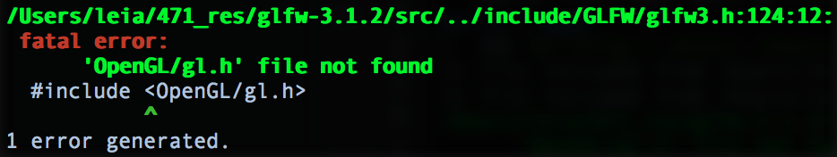

In a moment of command-blindness today, I managed to delete my entire repo of developing projects. No harm, of course — they were all git repos, and backed up on the internet. Simple matter of going to BitBucket and re-cloning, right? So, first things first — grab my last project, re-clone it, get back to working in no time.

Except when I tried to re-compile, it failed. At 5%. Looking like this.


How the hell was I not finding ‘OpenGL/gl.h’?

I still don’t know quite what I did, but it only took 20 minutes for me to go from rendering collision-detecting dogs to not being able to compile squat.

Two hours, a half dozen fix attempts, and many StackOverflow tabs later, I get to this:  [Missing OpenGL Headers on Mac](http://stackoverflow.com/questions/18647976/missing-opengl-headers-on-mac) , which linked to yet another StackOverflow question … It turns out that even if you have Xcode installed, Command Line Tools doesn’t come with it anymore. Which means the headers I was looking for didn’t even exist at this point. Bully.

At least the fix was easy. TLDR:
```
xcode-select —install
```

Running the above launches a dialogue that allows you to install CLT. And now we’re all back up and running! How did I somehow remove my Command Line Tools and OpenGL headers? Still no idea. A few misfired commands can go a long way. Thanks, version control!

---

*This article was originally [written and posted on Medium](https://medium.com/@leia.write/devmoment-1-wheres-opengl-a5239ef960f6).*
