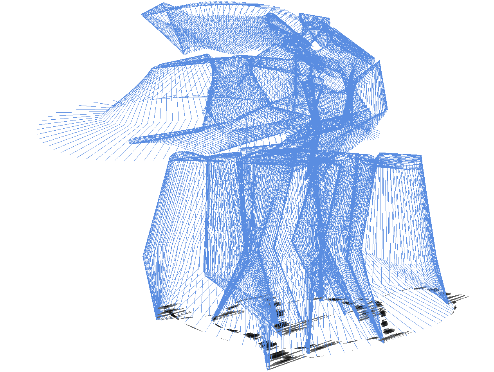
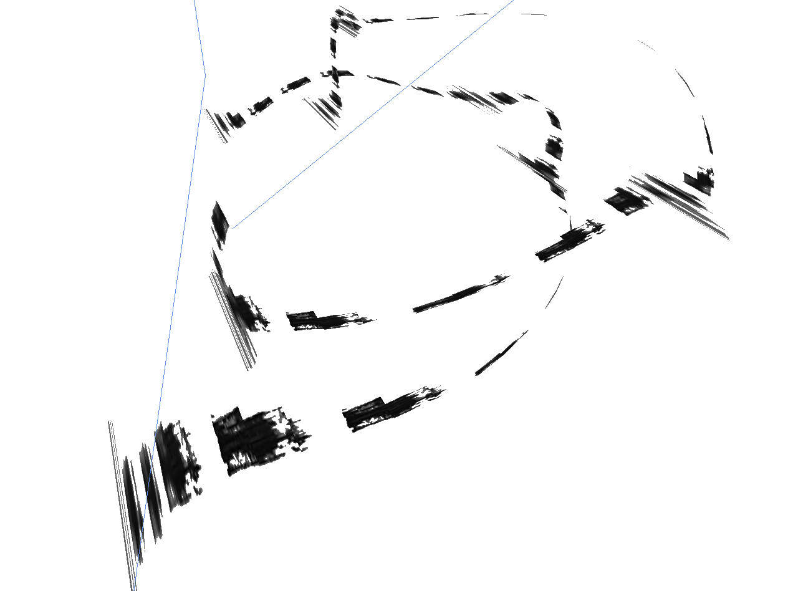
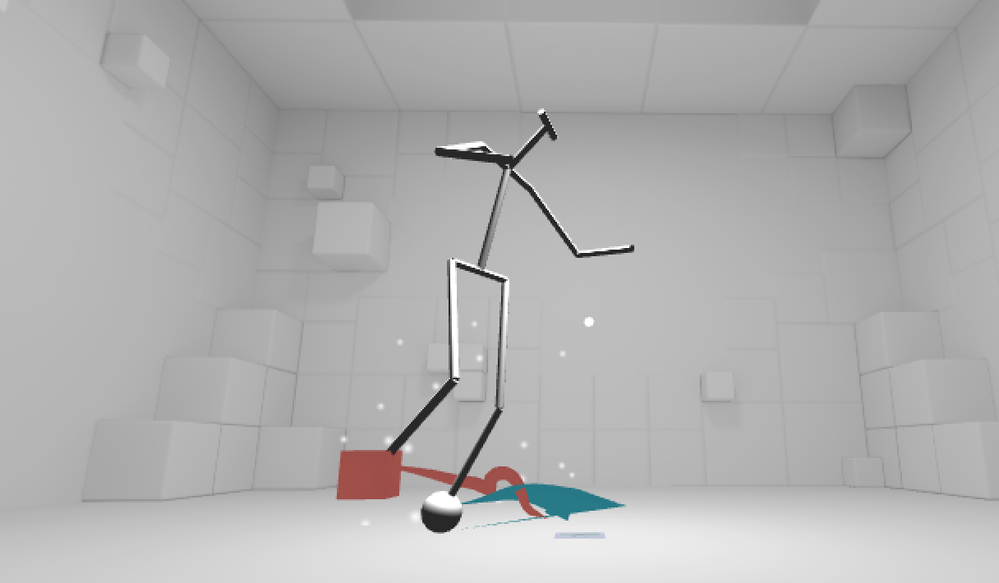

This project aims to explore different outlets for artistic rendering of dance movement. Here, motion captured dancer movement is visualized in 3d via an OpenGL graphics pipeline, portraying the dancer as a skeleton with various ribbons tracing the dancers' movements through space.

This layered image is created by allowing "snapshots" of the body at set intervals of time to be rendered all at once.

The program included multiple modes, including one where a "brushstroke" texture was used to trace the movement.

Finally, the motion-capture was ported to Unity, through which it was rendered in VR on both Android and iPhone devices.

While the project was limited to pre-recorded motion capture of swing dancers, it is feasible to imagine this same pipeline getting input from live motion capture data, encouraging even more interaction and play with the performer.
To read the full report, click [here](https://leils.github.io/dance-visualization/).

_Used in this piece: OpenCV, Unity_
