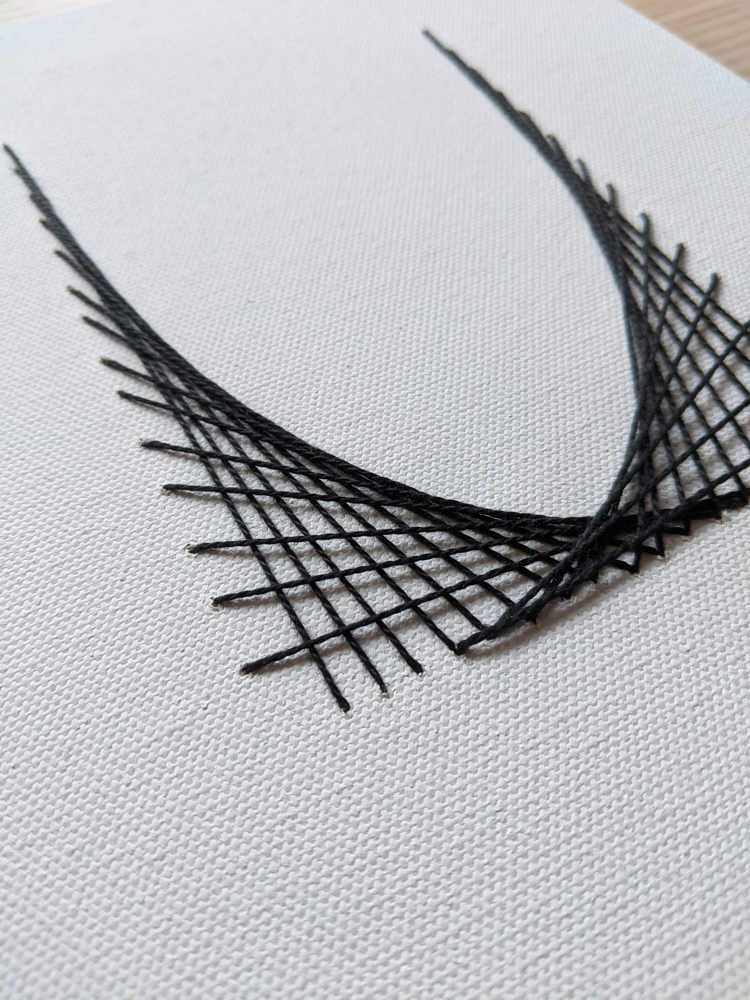
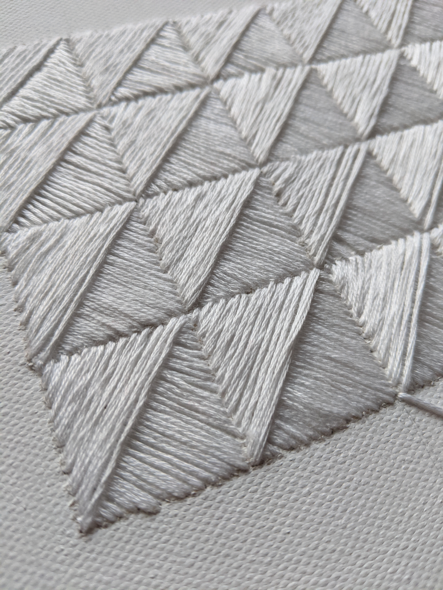

In _Stitches_, I want to take embroidery in a direction that is often not explored with the medium. Embroidery is typified by round bodies and fluffy textures, usually organic in nature, taking the form often of flowers and animals. Here, I express a more geometric form through embroidery, using straight lines and repeated patterns. The resulting lines and shadows are simultaneously geometric and soft.

_Used in this piece: canvas, thread_
