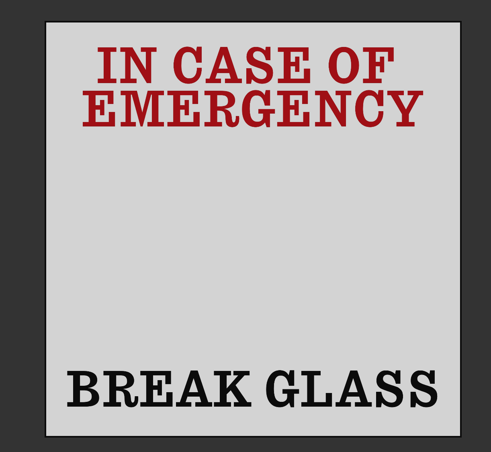

**Shatter** allows you all the anxiety of breaking your screen, with all the satisfaction of having done it on purpose.
This experiment algorithmically generates each crack, matching it in size to a pitched sound of glass breaking. The end result is a remarkably convincing simulation of glass shattering, despite the simplistic implementation.

The first version of Shatter was as seen above, white cracks on a gray background. As there are no cracks on the screen at first, this meant that the initial state of the app was a blank, gray screen. This was confusing, and didn't give the user any inclination towards what they were supposed to do. Once shown, however, it seemed to be a convincing and compelling interaction.

In order to add context to the interaction, I added this background image reading "In Case of Emergency, Break Glass". Calling out a common concept, it encourages the user to try and "break" the screen.

While convincing enough of an effect in the browser, this really shines on a touchscreen device. Try it yourself [here](https://leils.github.io/shatter-sim) (make sure your sound is on).

_Used in this piece: P5.js, tone.js_
