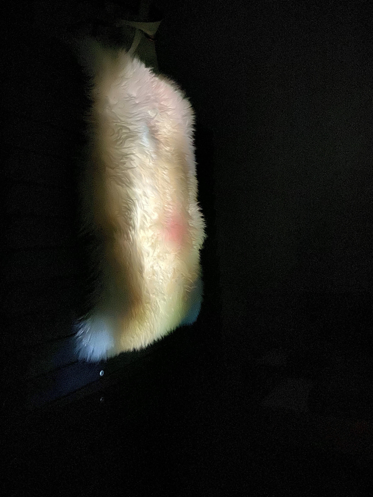
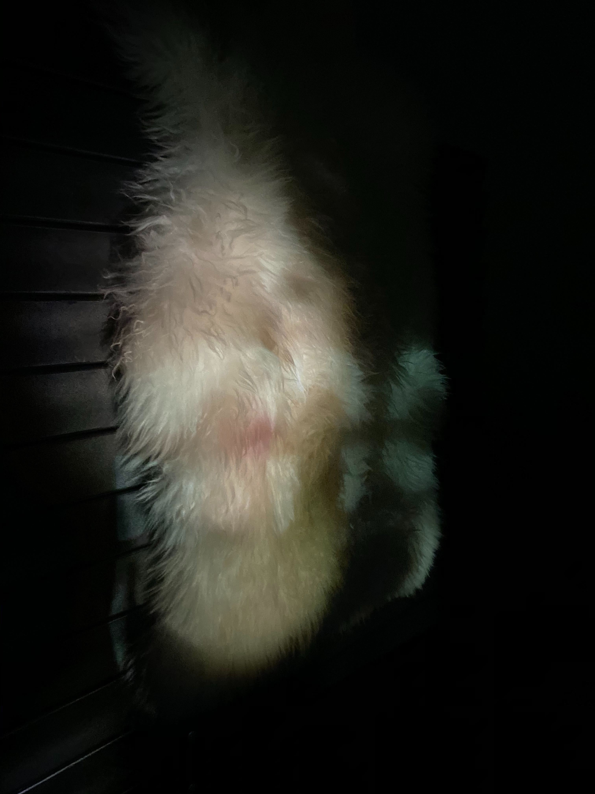

**Soft** is an exploration in projecting on soft bodies outside of geometric space.
The world of projection mapping is rectilinear. What happens when we break out of that, exploring the softer and more organic areas?

There are two phases to the piece, both projected onto the soft background texture.

1. **Like Water**, a geometric circle pattern, reminiscent of smoke or moving water. This phase contrasts the geometric lines of the projection with the softness of the background, creating a culmination that is intriguing to both see and touch.

2. **And Me** turns the piece into an altered mirror. In **And Me**, the viewer will see a projection of themselves, morphed by both the texture of the projection surface and an added layer of partial blur. This phase provides a space for exploration on the clarity of self-image.

<iframe src="https://player.vimeo.com/video/380180663" width="640" height="360" frameborder="0" allow="autoplay; fullscreen" allowfullscreen></iframe>

_Used in this piece: MadMapper, UO Smartbeam Laser Projector, Webcam & Sheepskin_
