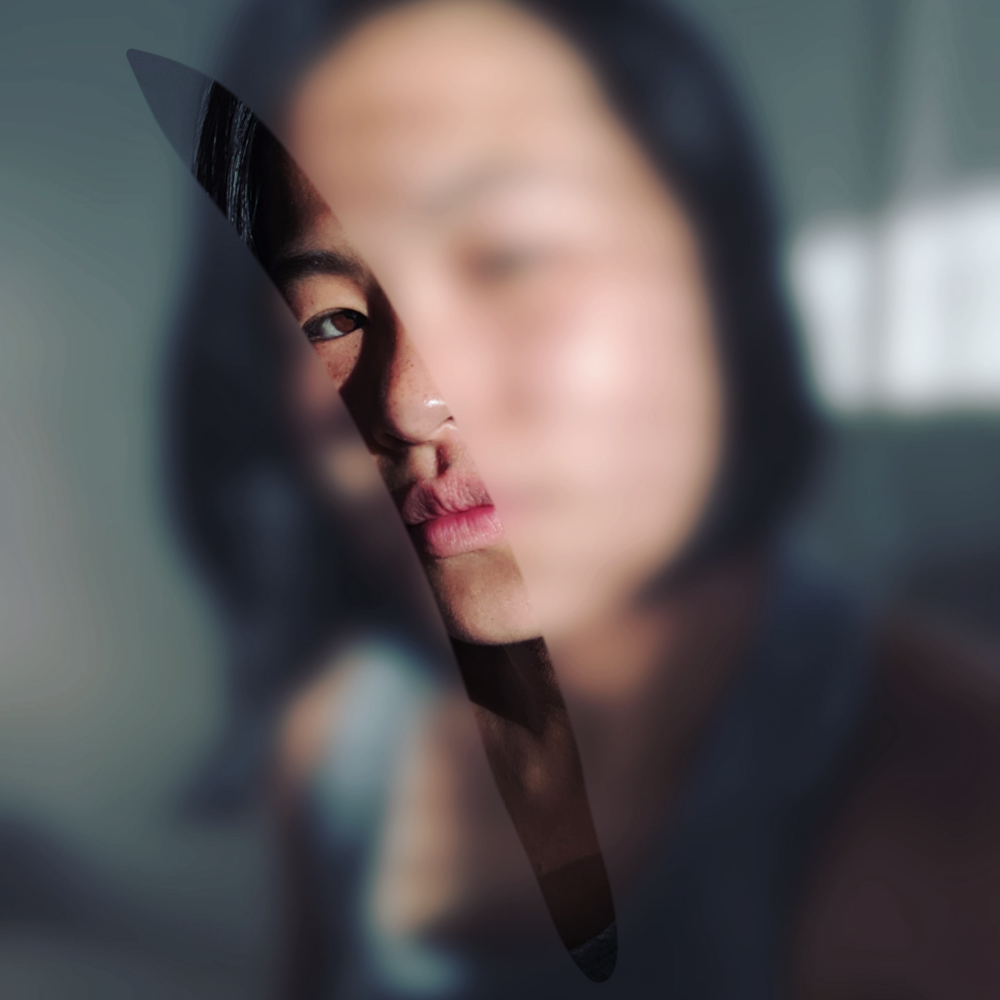

_Fog_ is a series of photos exploring things half-seen, as if through a foggy window or a pane of frosted glass. Sometimes, things that are only partially visible can be more intriguing than if they were unobscured.

_Used in this piece: Nikon 70D, Lightroom, Procreate_
