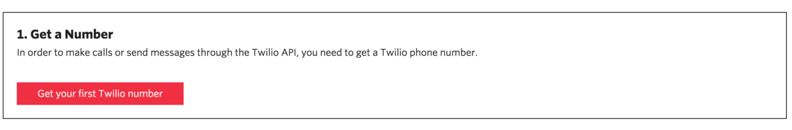
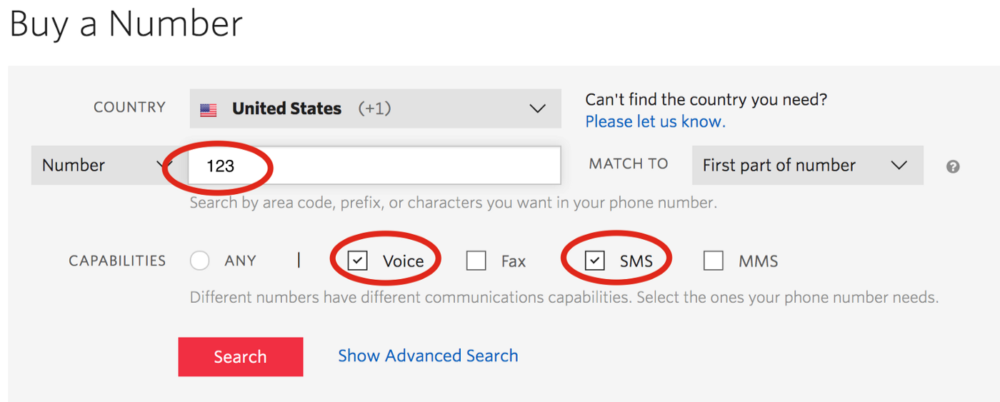
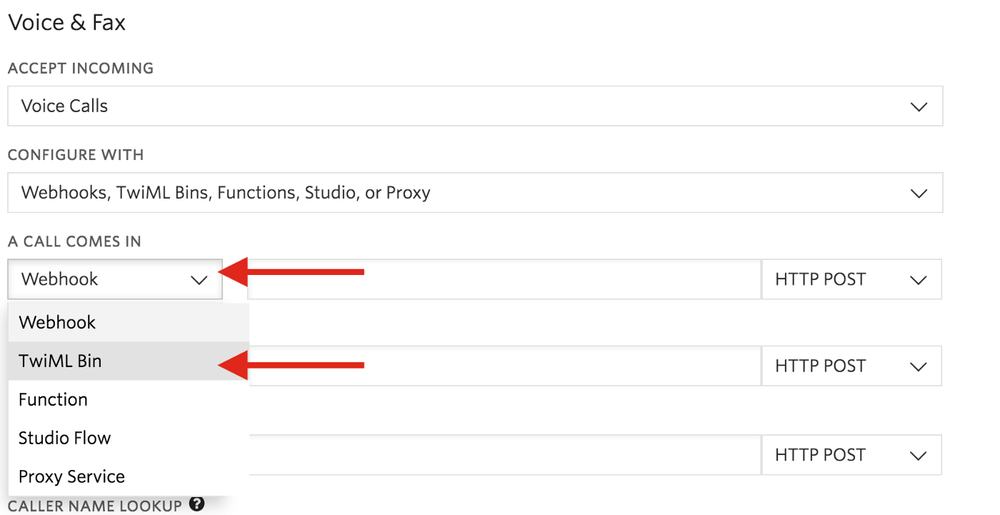
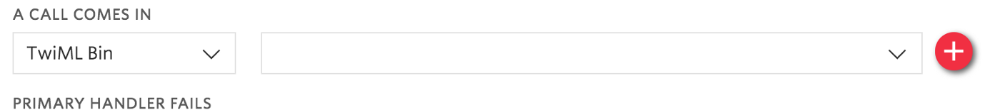

*Photo by Bernard Hermant on Unsplash*

Long story short, the apartment building I moved into has a rather old intercom, and doesn’t support any numbers outside of my local area code. I tried Google Voice and a series of other fake-number apps, but the type of call forwarding used still registered as a long-distance call. The following is a step-by-step guide for what worked: setting up a Twilio number to forward the call for me.

*Note: This will cost a very small amount of money. A Twilio phone number costs $1/mo plus a small charge per-call. I think I spend a total of about $2 per month, but YMMV.*

## Step 1: Get a Twilio Number
First, follow the instructions to create an Twilio account (with my \*[referral code, if you like: www.twilio.com/referral/r27yz0](www.twilio.com/referral/r27yz0) ). Then, buy a phone number with your local area code.


Click **Search for a different number**, and make sure to at least check the box for **Voice**. (SMS is nice too).

## Step 2: Configure your number to forward calls
Set up the number! Under **Voice & Fax**, change **A call comes in** from **Webhook** to **TwiML Bin**.

Click the red plus sign to create a new Bin.

Give the Bin a name, and copy the following code into it, replacing the `your-action-number` with the number you want your intercom to call, and save.
```
<Response>
 <Say>Contacting Resident</Say>
 <Dial>+1-your-actual-number</Dial>
</Response>
```
Save your project, and try it out! Call the Intercom phone number using a **different phone** (not the one you told it to call). Press a key to run the code, and if it calls your phone, it works.

In order to use this in the long term & remove the trial message, you’ll need to upgrade the project.
## Step 3: Profit
Get your new Intercom phone number (the local number) set up on the Intercom, and it should now call your phone when dialed. Now it should work as if the intercom directly called you, so you can hit the assigned button to let people in, or chat with them through while they’re at the door.

Congrats! You’re all set up! Enjoy your new working intercom.

\* *This referral code gives both myself and the referred person a $10 credit later. That’s 10 months worth of a phone number, so not bad!*

*This article was originally [written and posted on Medium](https://medium.com/@leia.write/twilio-for-door-intercoms-b43416ddd69b).*
