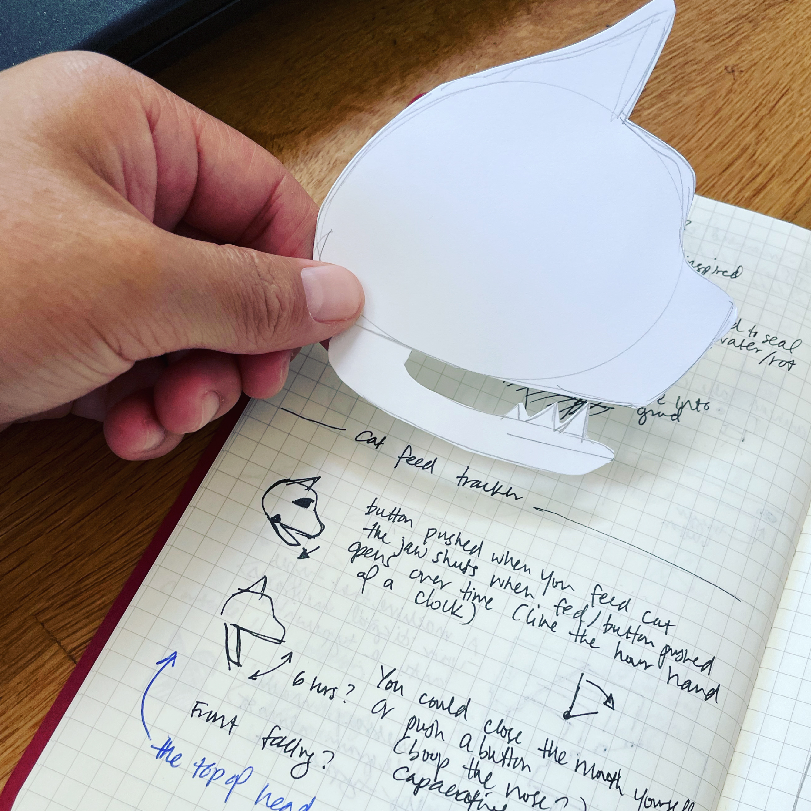
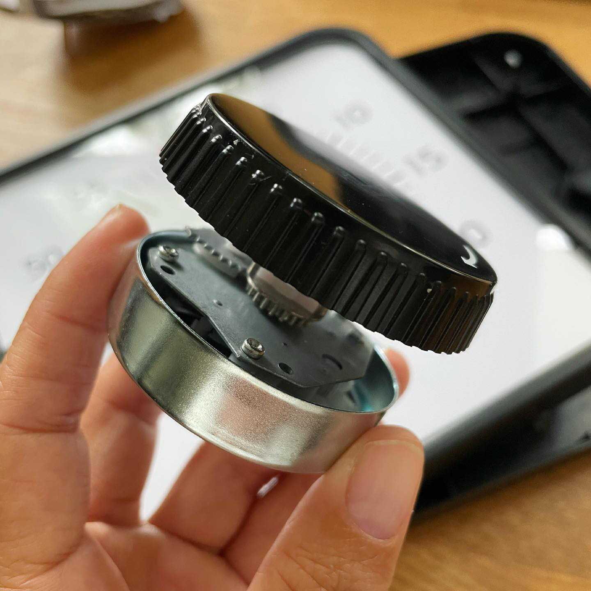
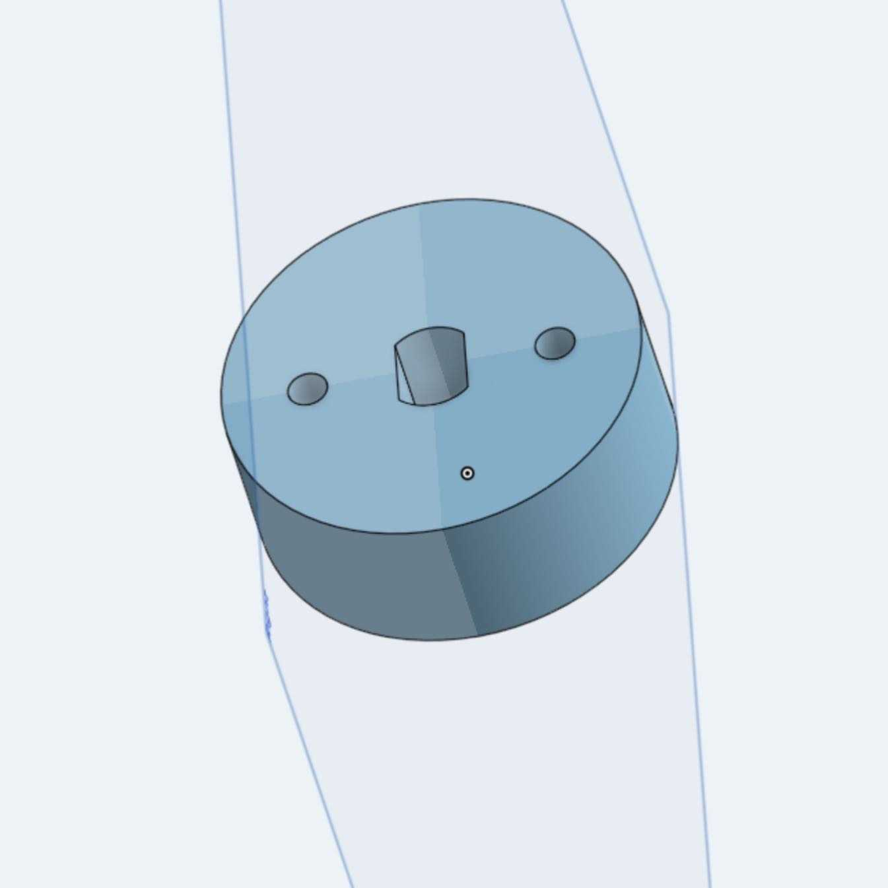
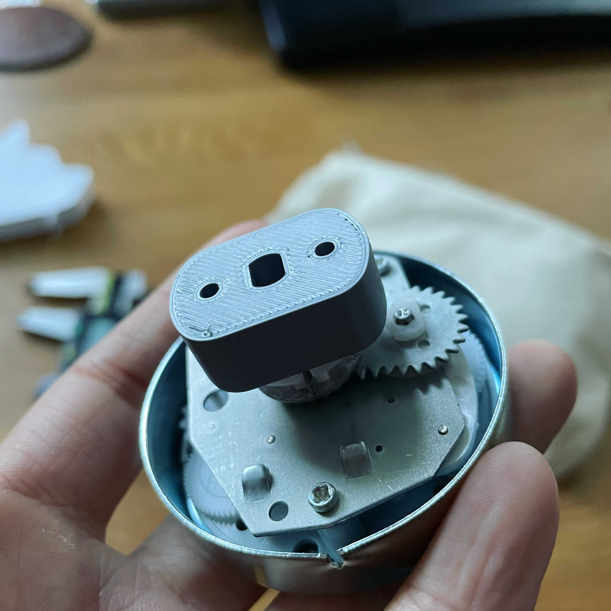
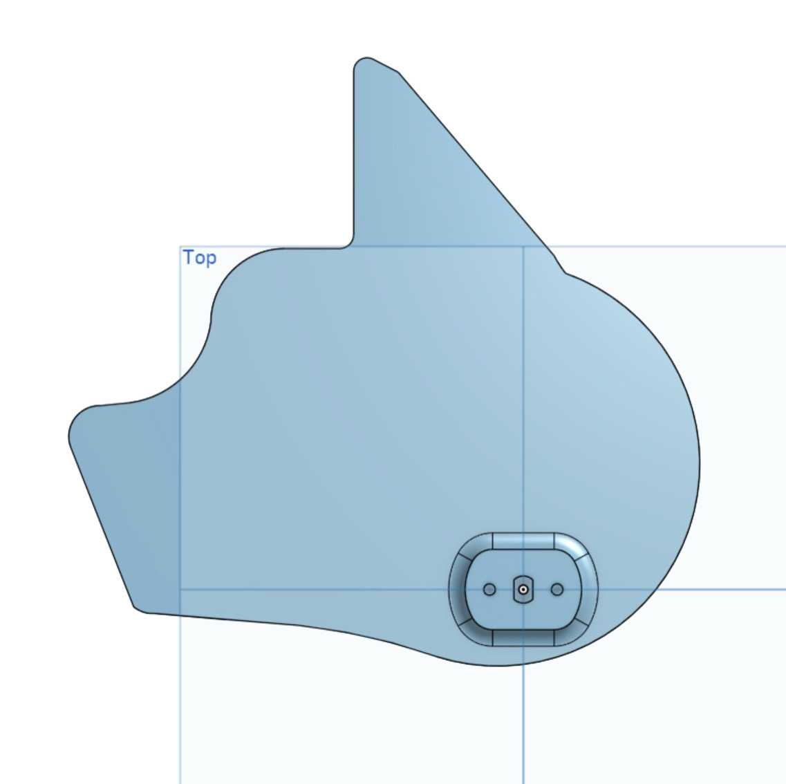
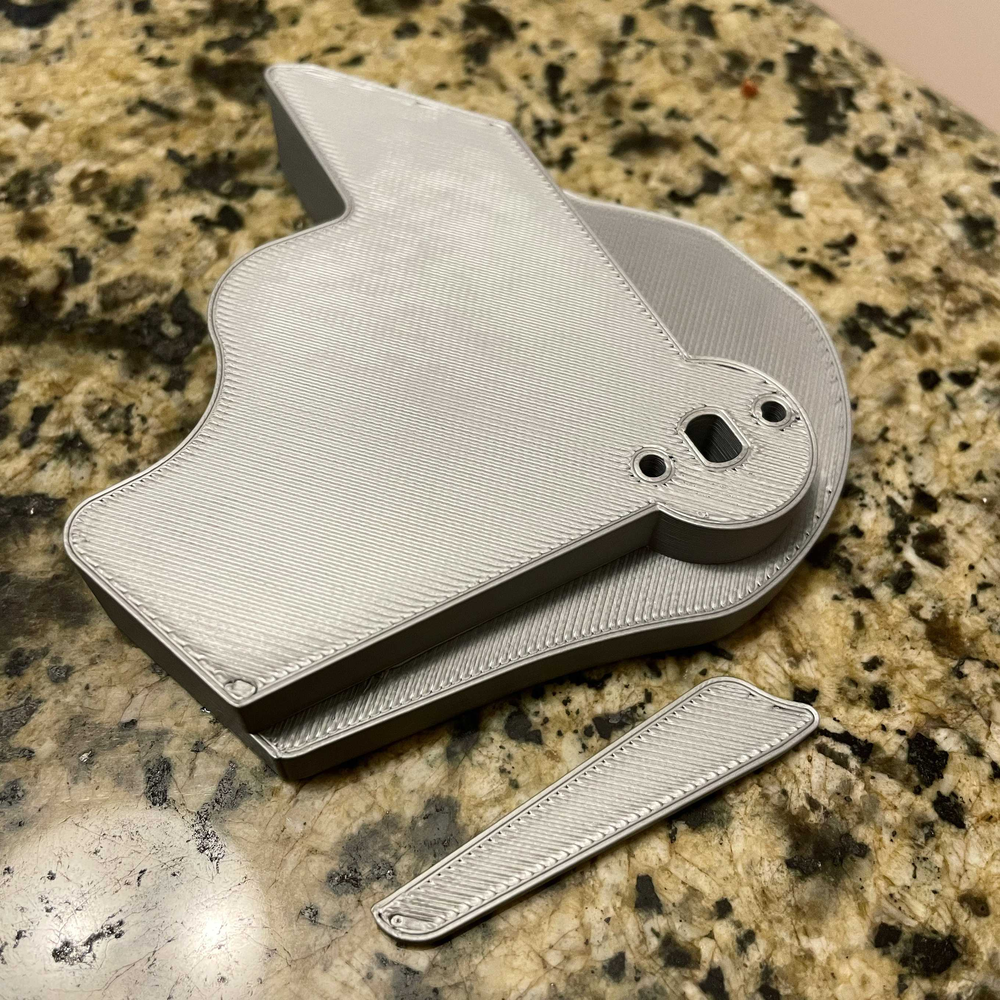
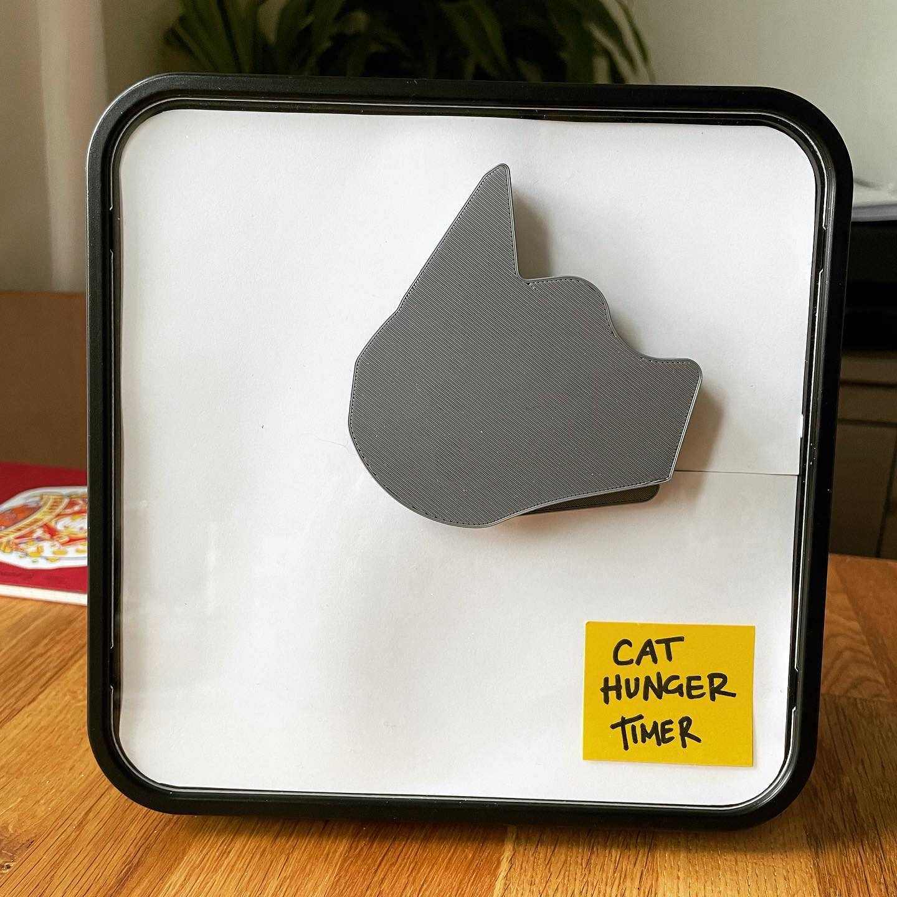
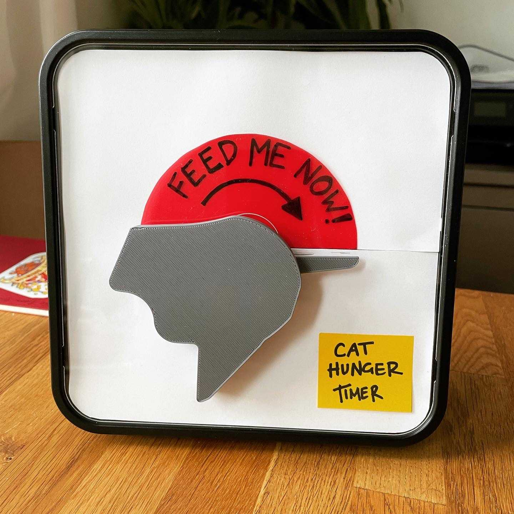
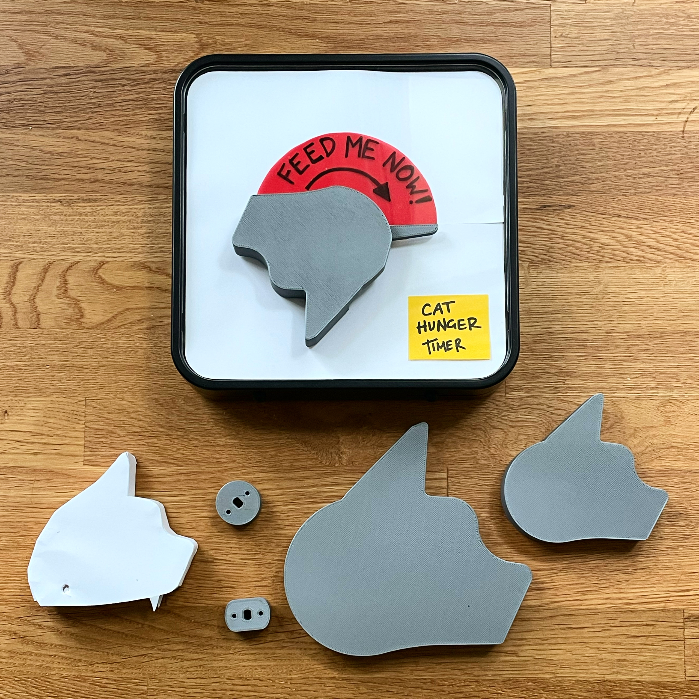

Earlier this month I moved across the country to attend NYU ITP, the 2-year Interactive Telecommunications Program. This has meant leaving a darling, snuggly cat behind in San Francisco.

To make missing this fuzzy friend a little easier, I made a little timer to simulate her constant need for food.

`vimeo: https://vimeo.com/596205642`

It all started here: 

I wanted this piece to:

1. Be **physically interactive**
2. Run **mechanically**, not digitally
3. Have a sense of **whimsy** (which is ... uh ... hard to quantify)

A couple of desired interactions:

- The audience gets to "push down" the nose to reset the timer
- The timer "yells" when it's "hungry"

I tore the core out of a [60 minute focus timer](https://amazon.com/gp/product/B07PRZ5BXS) to see how it works. Turns out, it's almost exactly the same as an egg timer: a series of springs and pendulums, attached to a dial (and a hammer to ring the alarm).

Lucky for me, the dial was a press-fit onto the mechanism, so I could easily replace it with something custom.

I spent some time learning about 3d printing, using **OnShape** to create the CAD elements, and a **Prusa3d** to print. These are some pretty basic shapes, but they had to be modeled to fit the pre-existing parts on the timer itself.

It took a few tries to make sure the two pieces mated well; between the tolerances on the print and the errors in my measuring, things needed some adjusting along the way.

Now that the fit seemed snug, I could move on to translating the shape I imagined onto the part itself. I freehanded the shape of the head and placed the mount onto the back.

A few iterations later ...

A few tweaks, some final touches, and we got ...

### The Final Product

In order to _"feed"_ the cat, you push the nose down, effectively closing the cat's mouth.
30 minutes later, the cat _"yells"_ for more food.

And the whole family together:

