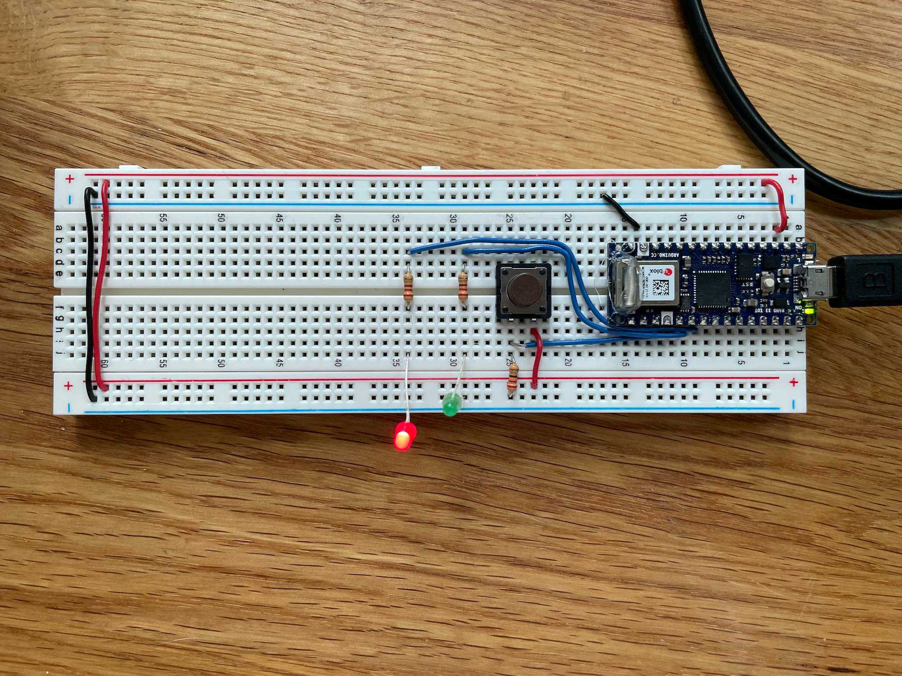
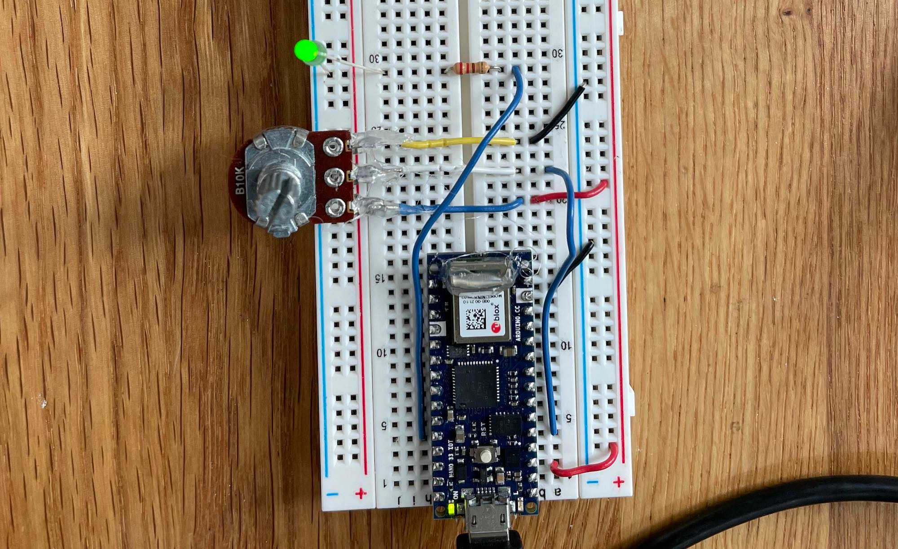
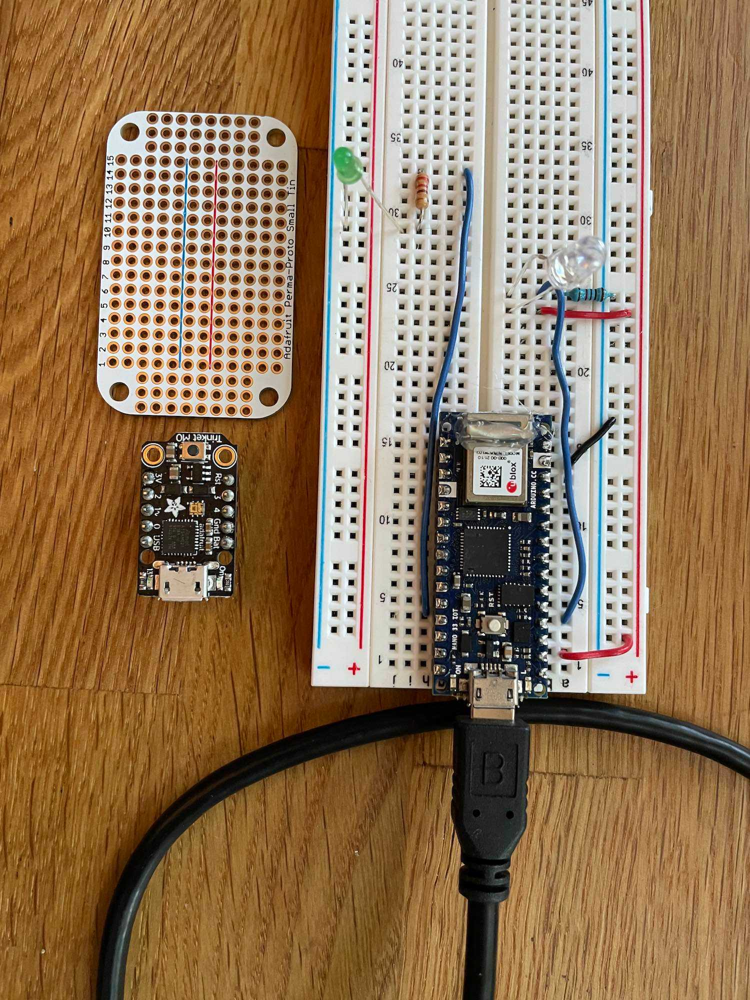
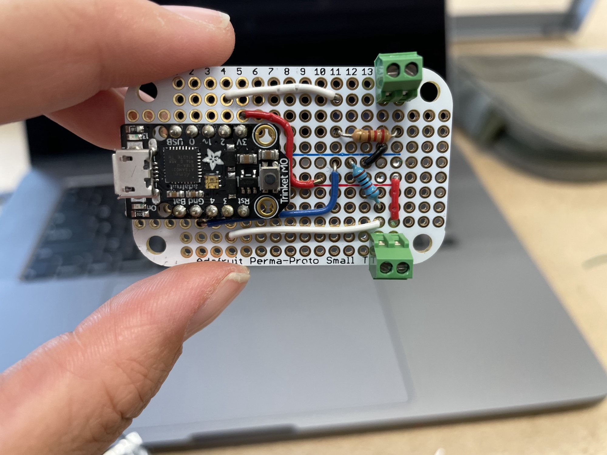
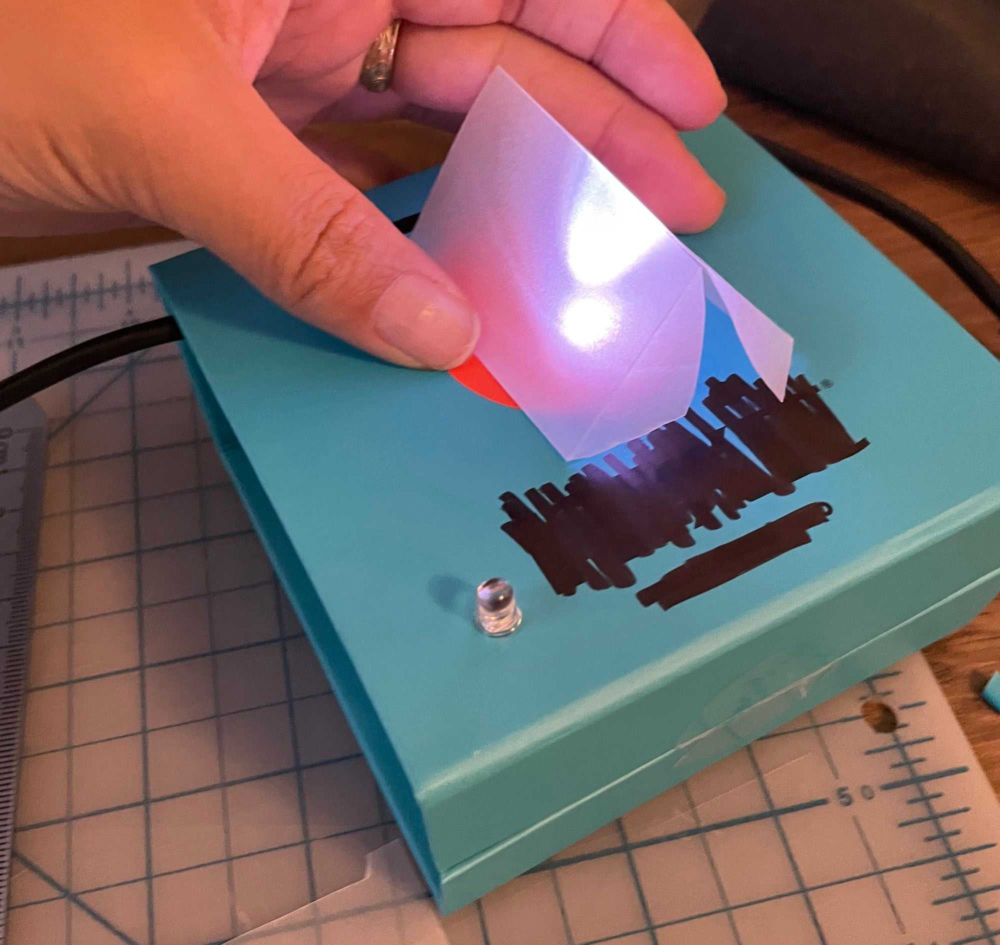
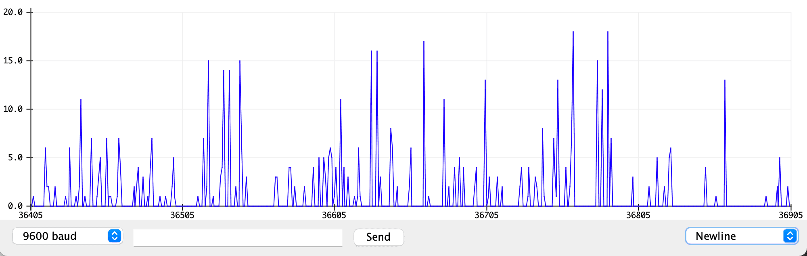
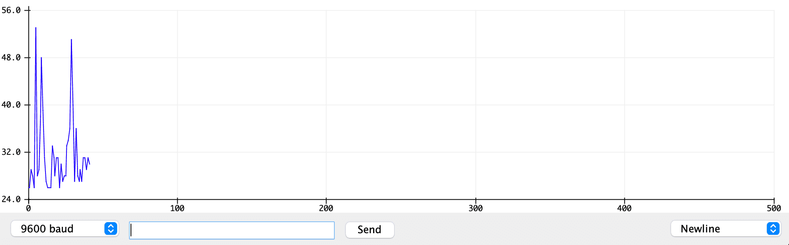
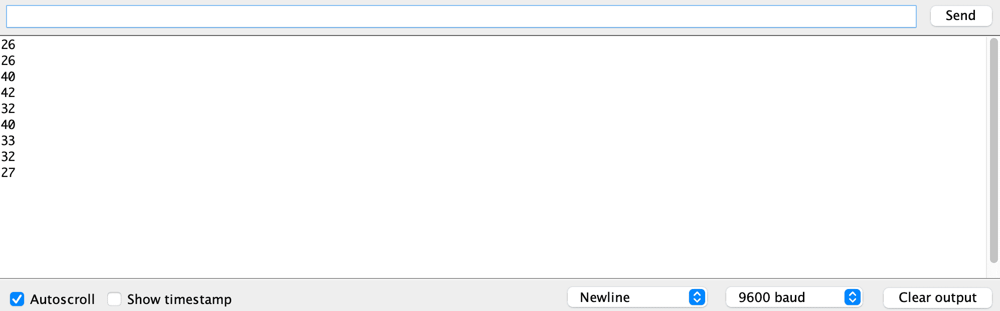

This week, we introduce basic I/O with Arduino programming! It sounds funny, but
this week's work is way more intuitive to me than last week's. Let's start off with
the basics.

First up, let's make a button that switches between LEDs.



This basic circuit allows a button to control which of two LEDs are lit.
See a little demo below:
`youtube: https://youtu.be/huugGcWJD0U`

Ok, so that's a pretty simple digital input.
Onward to analog input! First up, something we're already familiar with: a
potentiometer.



`youtube: https://youtu.be/De6hdBnsRFc`
And now, a new analog input. I chose to use a phototransistor for my explorations here.
This actually made some things way more difficult ... phototransistors measure
light, which means ambient light can affect your readings as time goes by (for
example, when the sun goes down, or when I moved the board from my well-lit desk
to my dark couch).

I had a little inkling of an idea about things occurring only when it's night, so
I hooked up a circuit to light up an LED when it gets too dark.
`youtube: https://youtu.be/qloSASxM07Y`
This is where I go down a bit of a rabbit-hole ... I want to make a cute little
forest scene piece where a miniature tent lights up at night. A sketch of this:


In order to make this physically, I needed to move off the breadboard. I also sought
a smaller, less powerful microcontroller to run this off of, and my partner Paul
recommended using a Trinket M0 as a nice alternative. As you can see below, the Trinket
has a much smaller footprint (and far fewer pins!).



So I re-built the circuit using the Trinket! The trinket came with CircuitPython on it,
so I had to put Arduino on it instead, following the [instructions here](https://www.notion.so/PCOMP-Week2-HW-b18840d9398e43249ec5c22eee4bd06d#cf5cbfda2c2a436f93144c324e6103e2).
`youtube: https://youtu.be/t9tXw4suKr4`

Next, I soldered this all to a PCB. This is the first time I've done this, so I learned
the hard way that:

1. the type of solder you use greatly affects how easy it is to solder
2. holding things together is hard, but tape is pretty nice
3. make sure you know what you want to solder to the board _before you solder to the board_



I also used a pair of screw terminals for the first time, which lets me connect
the LEDs onto stranded wire to be loosely coiled inside of a box. The terminals also
let me swap out the LEDs at will, since they don't get soldered to the board.

A quick test:
`youtube: https://youtu.be/Np_jfTaCvCM`

I didn't have time to put together a final product, so this is just a prototype.
I grabbed a spare box, cut two holes in it for the LED and the phototransistor,
and put together this!



---

A little side note, the Trinket M0 comes with a nice LED built-in on the board! This
LED is used to represent board statuses, but also by default is left on. In trying
to figure out how to turn off the LED, I got a very brief introduction to the DotStar
library and learned that there is a difference between a DotStar and a Neopixel LED.

- [https://hackaday.io/project/9017-skywalker-lightsaber/log/72354-adafruit-trinket-m0-controlling-the-onboard-dotstar-led-via-arduino-ide](https://hackaday.io/project/9017-skywalker-lightsaber/log/72354-adafruit-trinket-m0-controlling-the-onboard-dotstar-led-via-arduino-ide)
- [https://forums.adafruit.com/viewtopic.php?f=25&t=124501&sid=21195cd2275abc7ba8a32912d47cff6f](https://forums.adafruit.com/viewtopic.php?f=25&t=124501&sid=21195cd2275abc7ba8a32912d47cff6f)

---

Ok, back into the third lab; debouncing and noise!

The phototransistor made for a bit of difficulty here; there was a lot of noise
in the raw data, and my numbers needed to be re-calibrated based on each of the ambient
light states (day, night, on the floor, at home).

Here's the raw data over <1s from the sensor


And here's the peaks grabbed after de-noiseing, over >30s


Maybe a better representation of the de-noised peaks:


Code run:

```
int peakValue = 0;
int threshold = 20;   //set your own value based on your sensors
int noise = 5;        //set a noise value based on your particular sensor

void setup() {
  Serial.begin(9600);
}

void loop() {
  //read sensor on pin A0:
  int sensorValue = analogRead(A0);
  // check if it's higher than the current peak:
  if (sensorValue > peakValue) {
    peakValue = sensorValue;
  }
  if (sensorValue <= threshold - noise ) {
    if (peakValue > threshold + noise) {
      // you have a peak value:
      Serial.println(peakValue);
      // reset the peak value:
      peakValue = 0;
    }
  }
}
```

I'll admit that despite my background in code, I rarely have had to do de-noising. I know that it's extremely useful, but I still don't quite grok it. I'll have to do a bit more of this
to understand it.
