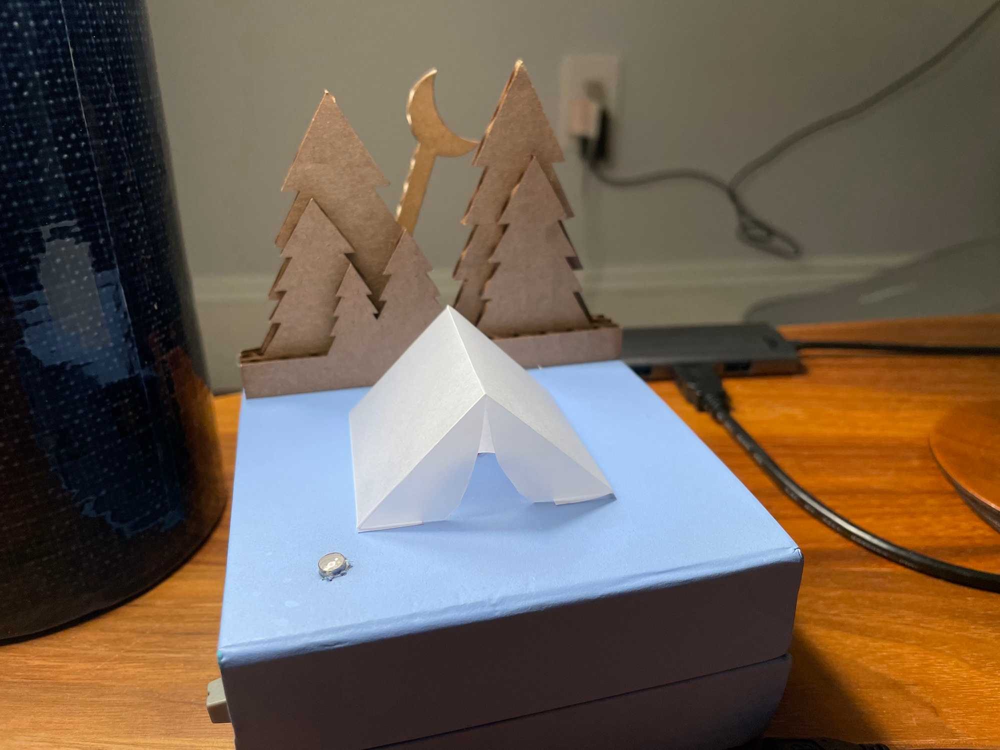
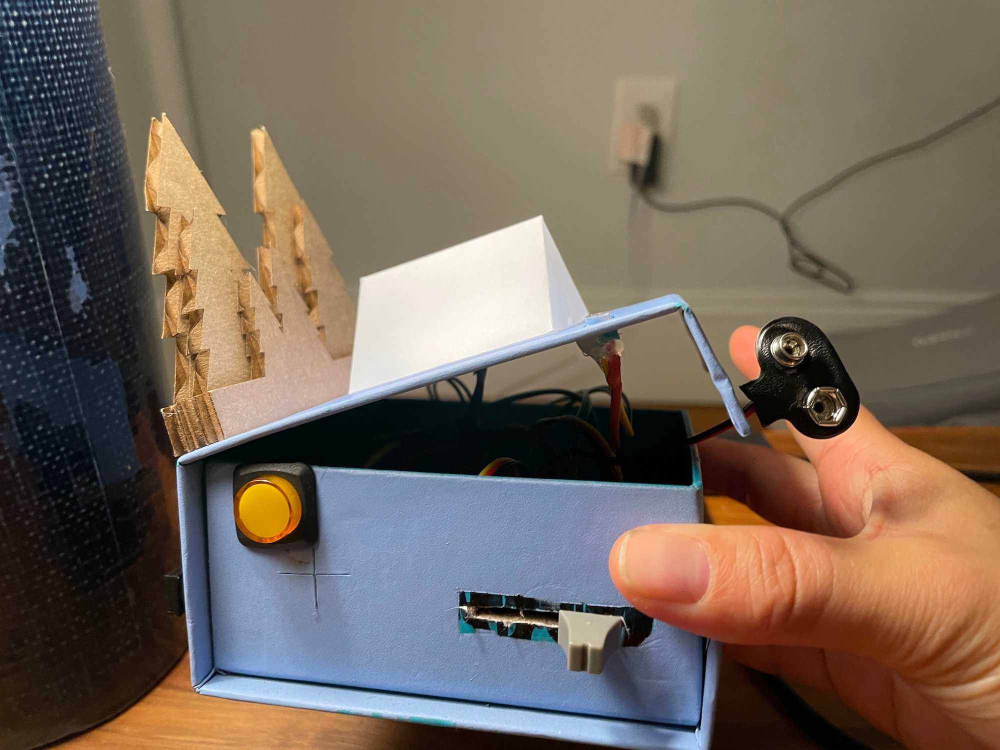
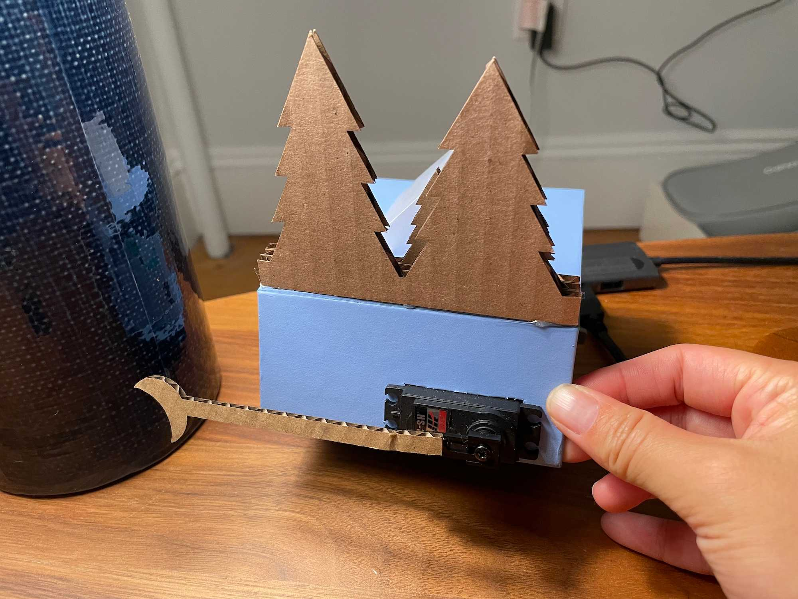
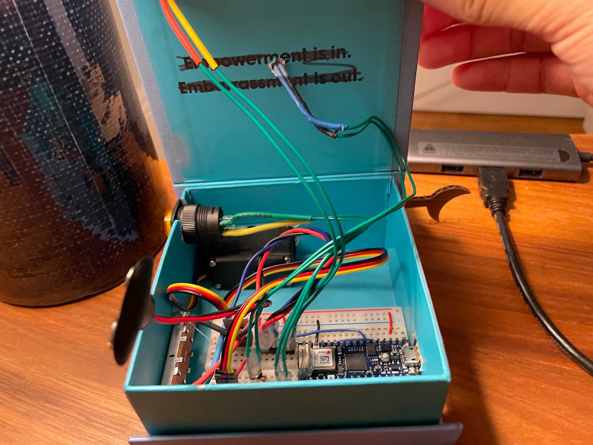

And here it is! Project 1; a sweet little nighttime diorama! It might be a bit of a little escape for me, living here in a big city. See some [prior work & thoughts here](https://www.leiac.me/2021/2021-09-28_PCOMP-Week-3/).

This little tent lights up in the dark, the moon rising behind it. It's tuned to the ambient light on my mantle, which is where it's intended to live.

It also has a manual interaction mode, turned on via an orange latching button. This allows all movement and light to be controlled via a slide transistor.

A quick video of it working, including in the dark and light.

https://youtu.be/nzfTEQDWv7M

## Build notes:

- For the automatic mode, I was able to add some hysteresis (stickyness) to the threshold, reducing the amount of noisiness when the amount of light is barely dark enough to toe the edge of the switch point. This prevents the piece from turning on & off rapidly during this darkening stage.
- For the manual mode, I added some amount of stickiness as well to prevent noise in the potentiometer data from flickering the lights & stuttering the servo.
- I replaced the previous phototransistor with one that had a flat top, as it presumably has a wider angle of sensing.
- The piece acts a little funny on camera, and I suspect there's some IR or other invisible light coming from my phone that affects the phototransistor. I might have to take another camera to this, one without AR or other capability.
- The servo was lowering the voltage of the circuit when it ran, making the readings from the phototransitor unreliable. To fix this, I added a 9V battery connected to a 5V voltage reducer and am running the servo off of that.
- I got to experiment with a bit of fabrication technique as well, which I'm quite proud of. The box is salvaged packaging primed and spraypainted. Trees and moon are salvaged and laser-cut cardboard. The tent is translucent tracing paper, cut and scored using an exacto knife. There are actually two layers of tracing paper, with an inner arced layer serving to diffuse the light from the LED before it hits the outer tent.

## Some issues and  things to revisit at some point:

- The 9V battery loses charge extremely quickly, and I learned the hard way that usually you don't run servos off of them for very long. I'd like to replace the 9V battery with a series of AA batteries, which should hold their charge for longer.
- During the transition from Automatic to Manual mode or vice versa, the servo and lights can sometimes quickly "shoot" to the desired stage. This is a little jarring, and I'd like to make all the movement happen at the same rate.
- I didn't get around to slowing down the moon's rise during the automatic mode.
- At some point I'd like it to play the sound of crickets once the moon has fully risen.

A few more shots, inside and out:

[Code is on GitHub here.](https://github.com/leils/PCOMP_Fall_2021/blob/main/slide-pot-scene/slide-pot-scene.ino)
