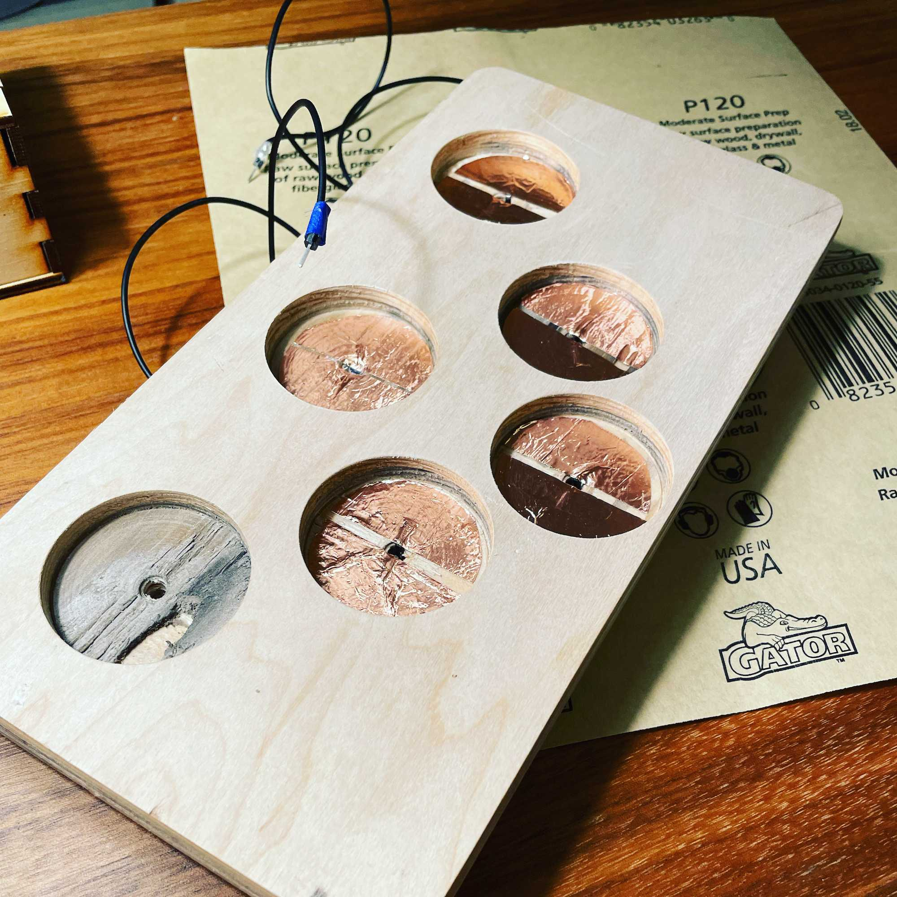
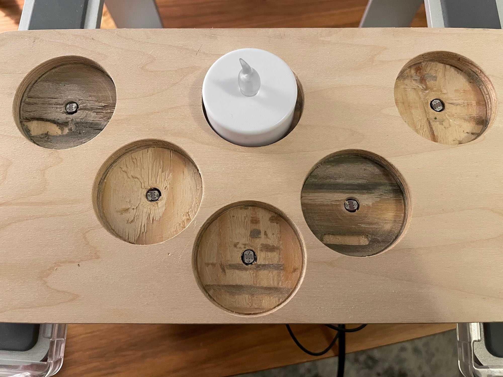
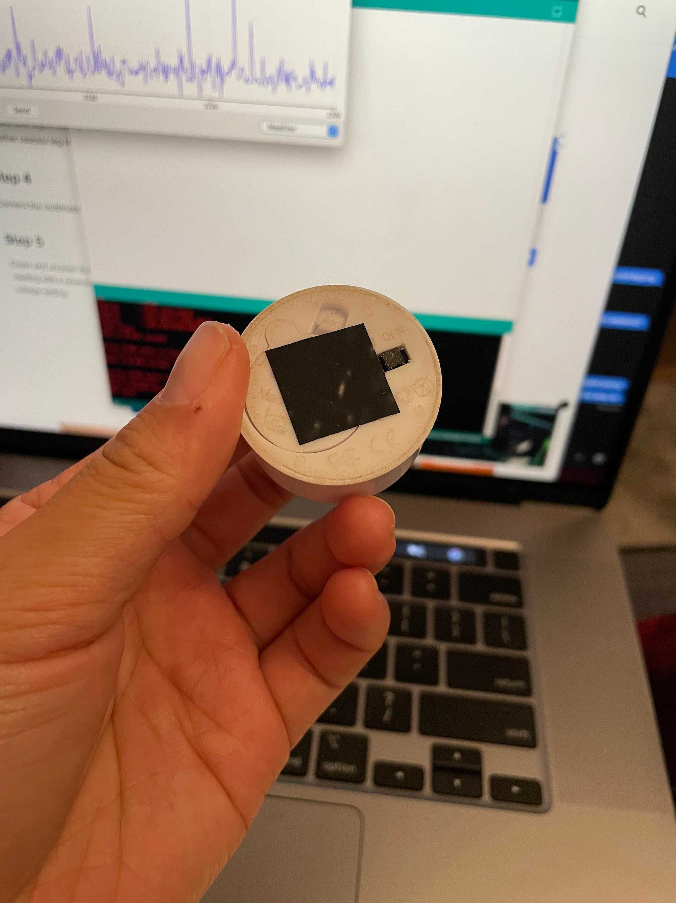

## Getting Everyone Talking

This week was a dip into serial communication. Still wired, but much more talkative.

Getting basic serial communication was pretty trivial, though it took me a minute to get back up to speed in P5. I also needed serial communication for a project in *Out of Order Storytelling* with Mia Rovegno and Kio Stark, so this was a perfect week to dive into making this work.

## P5 to Arduino

A quick and simple test to get P5 output into the Arduino. Here, keyboard and mouse input directly control the LED brightness. (0-9 keys, and up/down mouse drags)

`video: https://www.youtube.com/watch?v=6EB-KhKskao&feature=youtu.be`

## Arduino to P5: The Candleholder

For *Out of Order Storytelling*, our task was to retell the story of Icarus. My partner (Abigail Faelnar) and I approached the presentation of this story as a wake. For this presentation, we wanted the finale to be an interactive piece surrounding the memorial portrait. The idea here was to make the placing of the candle meaningful, pulling the audience in as a participant in the story rather than just an observer.

I fabricated this candle holder to serve as a base, and for the first pass at this used copper tape to create a switch between the candles and the wood. While it wasn't terrible at first, I soon discovered how finicky it could be to make a solid contact.

### Copper Tape

`video: https://www.youtube.com/watch?v=NnHmhBABSkI&feature=youtu.be`

### Photoresistors

After some strong frustration, I pivoted to photoresistors instead. Here's a first test:

`video: https://www.youtube.com/watch?v=fhLs3NNMP9Y`

This gave me a much clearer signal, and I was able to salvage the candle holder. Here's it is, un-taped and photoresistors installed:

`video: https://www.youtube.com/watch?v=FMOVWQwnjI4`

To give an even better reading, I cut off the legs of the candles and taped the bottoms with electrical tape.

And here it is, in its full glory during the presentation.

`video: https://www.youtube.com/watch?v=8fhWKUTtaE8`

We learned a lot about groupthink and directing attention during this run, but it turned out even better than I expected. There’s a lot more work here that could be done to polish and refine the experience, but I’m really pleased with how this interaction tested. Using photoresistors under the candles worked really well, and I’m hoping to iterate on this setup with a few different outputs.
