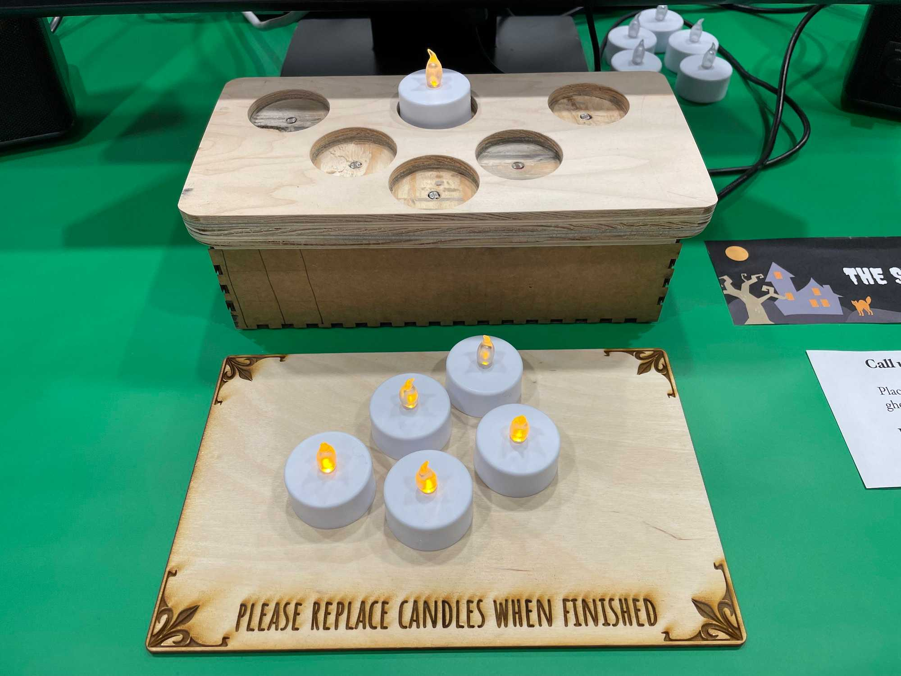
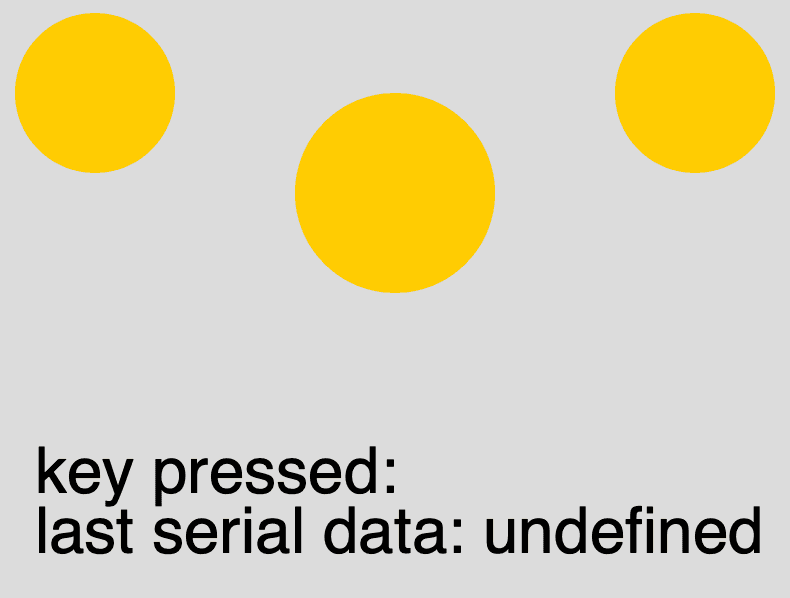
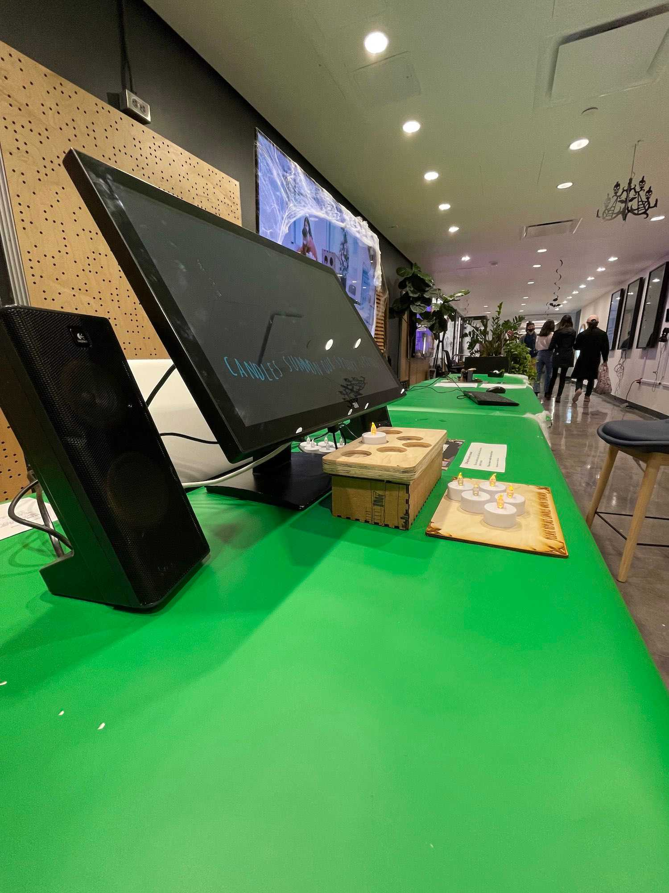
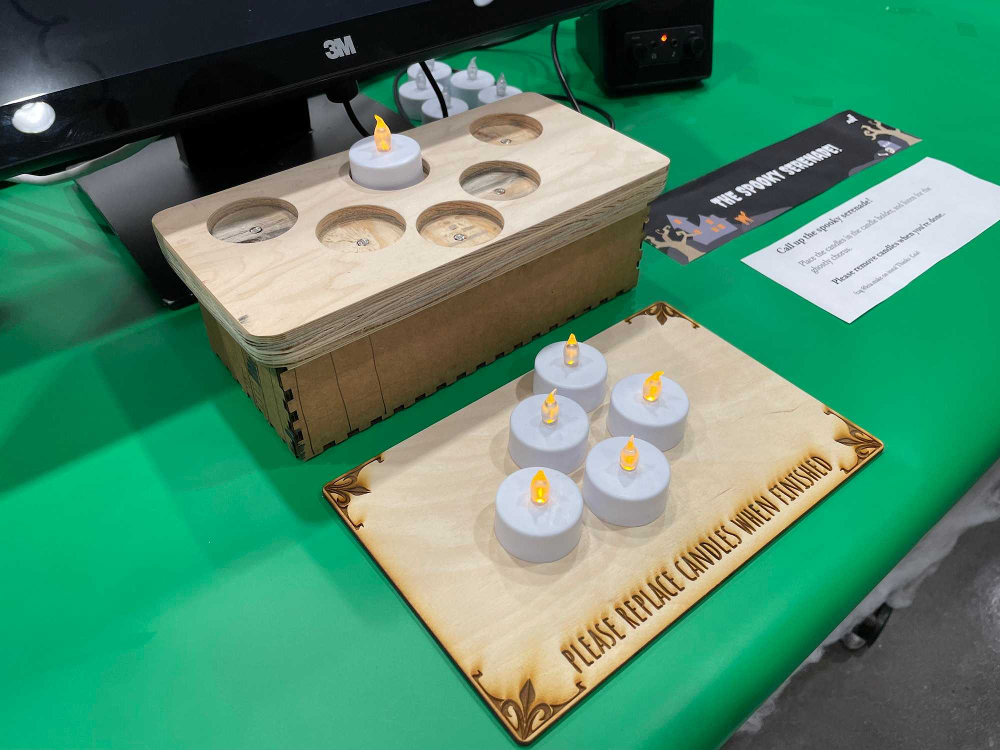

This piece evolved into my larger project, [Grim Grinning Ghosts](https://www.leiac.me/content/2022/2022-02-01_Grim-Grinning-Ghosts/).
Read more about that piece as it was created for the ITP 2021 Winter Showcase.

---
This week, I took a bit of a detour. A spooky detour.

https://media.giphy.com/media/Ne9STnE70KnuYilRP3/giphy.gif

https://youtu.be/sCgfHm83ieI  

This was created for the Social Genius Halloween Experience Event, taking place on the NYU ITP floor. Pulled from my fondness for Disneyland and Imagineering, I re-imagined the Singing Busts from the Haunted Mansion as an interactive choir, a ghostly chorus that you could all up with candles. The ghosts are a 4k fan-generated video, created for Halloween projections. You can find the [video here on Youtube](https://youtu.be/HECrCf73Jv8).

It's a pretty simple execution: each of the ghosts are obscured by a black box, which fades away when a candle is placed on the candle holder. In addition, the volume gets louder with each added candle. A simple end-screen effect of lightning and text is added when all 5 candles are placed in the holder.

You might recognize this candle holder from my Out of Order Storytelling project. It is, in fact, repurposed from that project, though slightly updated and with a fresh new base. I laser cut a temporary cardboard base, as well as a tray for candles. I also cleaned up the wiring a bit, re-programing the Arduino to report which of the photoresistors were covered or uncovered, rather than the number of photoresistors that were reading below the threshold.

The other side of this is all P5. I started by [prototyping a simple fade-in fade-out program using key inputs](https://editor.p5js.org/leils/sketches/hVpZ-QWi4). This program just renders three circles (used to represent three of the ghosts), using keystrokes as input. By pressing the keys 1-3, you can "reveal" a ghost.

After that, it was time to hook up the Arduino. I set up [a very simple serial input with the same circle-ghosts](https://editor.p5js.org/leils/sketches/xMh3R0dUP), just to prove that I could read serial and parse the output.

Then, it was on to video. It took a while to get the video to play at the right resolution and size (especially with the web editor's 5mb upload limit), so I ended up prototyping further with a heavily compressed version of the final video. With this, I was able to run some user tests and get good feedback to iterate on.

https://youtu.be/JgJaLWfyUz4

In order to play the actual video, I moved off the web editor onto the desktop. This local version let me play a high resolution video and iterate a little faster for the final details. Below are some photos of the final install.

All of the P5 code and relevant files are [available here on Github](https://github.com/leils/grinning-ghosts), including the Arduino code.
