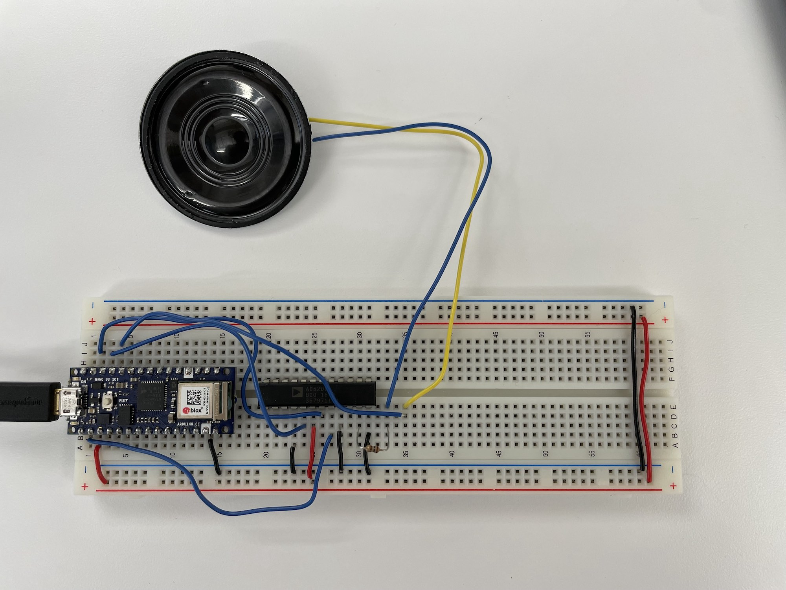

This week, our PCOMP class learned about synchronous serial communication.
It was pretty straightforward to use I2C to connect with and control an OLED
screen. Not too different from drawing to a Javascript canvas, the tiny screen was
surprisingly clear and easy to use. However, I had some issues with rendering a
QR code ... more specifically, I found that the framerate didn't play well with my
camera. When I tried to take a picture of it, I could only capture part of the QR
code at any time. This video below shows what my phone camera sees:

`youtube: https://youtu.be/oQtItf5R9LU`

---

As for SPI, I had a lot of trouble. Setting up the circuit as shown in the
diagram, I managed to get the speaker to play the tone, but not respond to the
digital potentiometer. After looking at the datasheet, I found myself a bit confused
as to why A5 was connected to Ground instead of 3V, though I think viewing this as only
half of the potentiometer being used started to make a little sense.

I'll need to take a multimeter to this and check out what's actually happening, but
I'd like to figure this out and try out a few of the other SPI sensors out there.
