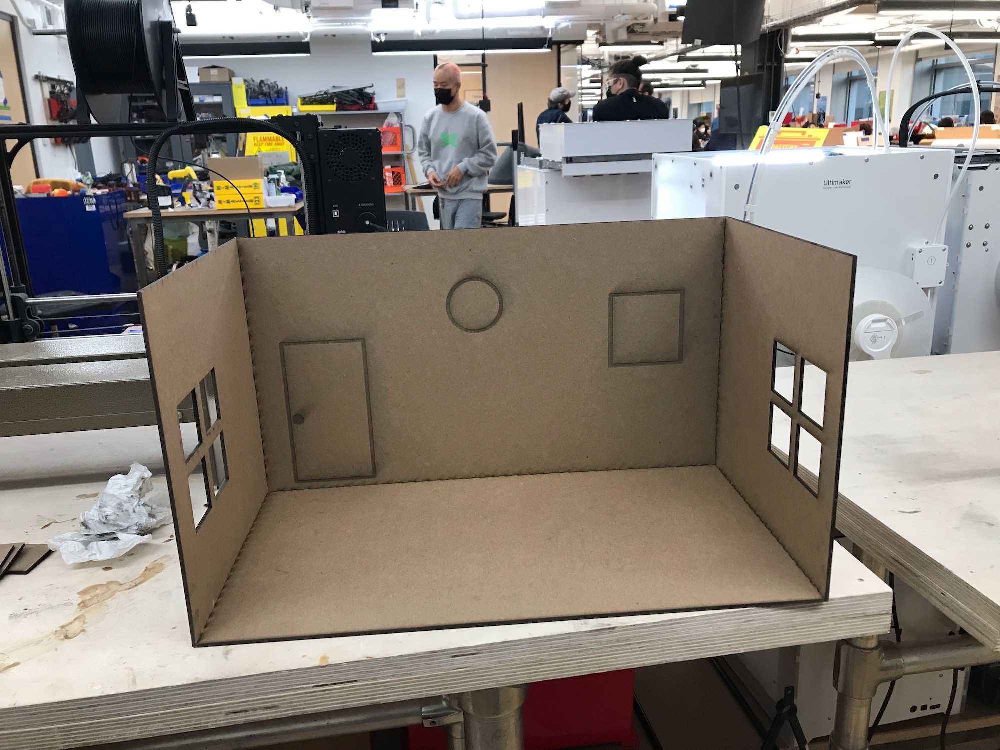
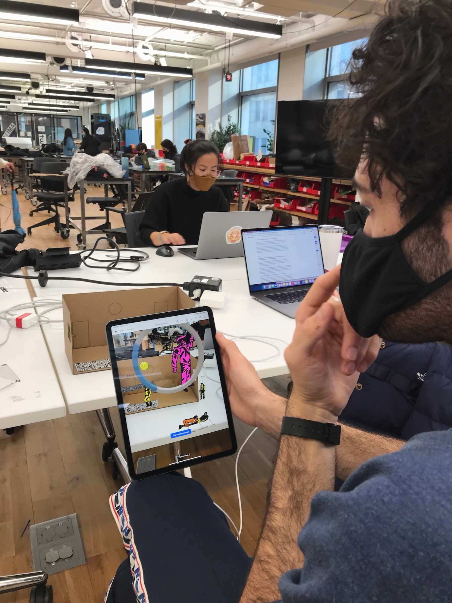

*Collaborators: Francisco Navas and Josephine Wang*

Original Art: [Gabriel Alcala](http://www.gabrielalcala.com/shop/sister-ray-a-diagram-print)

Artist Gabriel Alcala created this beautiful piece, a diagram of Sister Ray by the Velvet Underground. Here, we bring this piece to life, drawing the characters out into the physical world and allowing you to get up close and personal with them.

`video:https://youtu.be/cYpEcoGBH9Y`

We were able to get the original file from the artist, from which we separated out each of the characters and grouped their parts for animation. Each of the characters had backgrounds added to them, and colors picked from the artists' pallate. Then, they were ported into AfterEffects for individual animation, and then out to Aero for placement in AR.

The housing is fabricated from chipboard, designed in Illustrator and laser cut. Below is a picture of the smaller version of the diorama.

We had a few issues at this stage; Aero's ability to use an image anchor is impressive, but still gave us a lot of trouble. Where a large QR code works well, a smaller one (sized to fit on the original rug) seemed to register in the middle of the air. In the end, the large QR code outside of the diorama is a compromise that we'd like to move past.

Overall, AR was both a harder and easier of a process than I expected.
