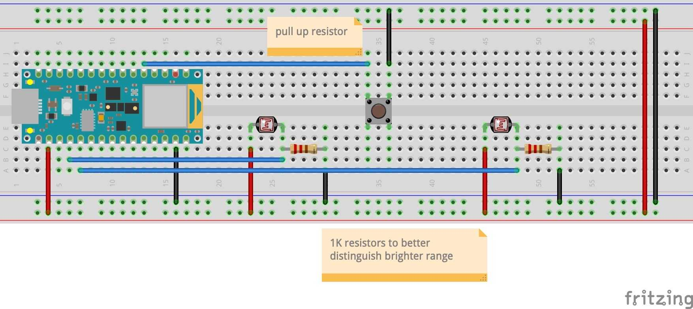
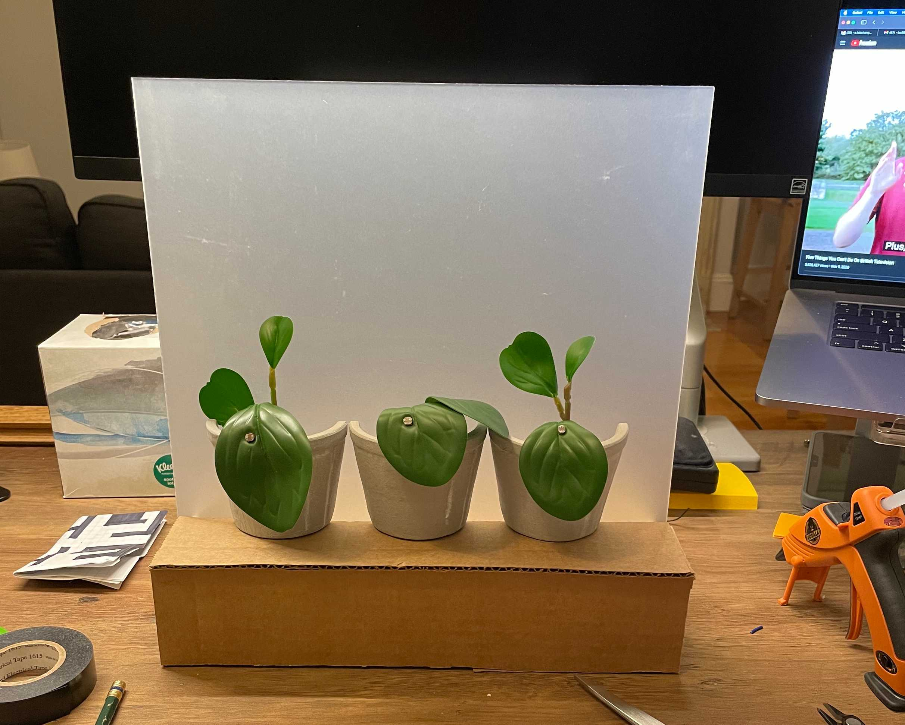

*Bloom Together* is a collaboration with [Shirley Wu](https://shirleywu.studio) exploring the use of light as an interaction tool. Roughly fabricated to resemble a small window, the inside sill supports three potted plants that await the attention and care of the viewer.

With this piece, we provide the viewers with two flashlights with narrow beams. When the viewer shines the lights on the plant pots, the projected flowers bloom.

`https://youtu.be/lWxl4aIA5CY`

## Concept

This idea went through several iterations before we settled on this version. We used this version to test out the concept of using a physical light to create digital change, and hope to explore this further in the future. The blooming flowers are intended as a metaphor for attention and care; you as the viewer can only take care of a few things at once, but with the collaboration of others, it’s possible to provide care and attention to the whole community. We intentionally only provide two flashlights when there are three flowers, making the flowers’ growth a challenge for a single-person interaction.

## Build

The Arduino part of this project is somewhat simple; a Nano Iot 33 is connected to three photoresistors, which are in turn embedded into the surface that we want the viewer to shine a light on. Below is the Fritzing sketch for two resistors and a reset button. (However, note that these resistors are labelled incorrectly as pull-up resistors, when they are actually pull-down resistors).

The digital portion of the project includes a set of flowers blooming based on the light available to that "plant".  For demonstration purposes, we used video of real flowers blooming in timelapse and rendered them in a simple browser site.

These images are rear-projected onto a satin ice acrylic sheet. While we originally intended to use a milky white acrylic, some initial testing showed that satin ice acrylic created a much crisper image with brighter colors.

`https://youtu.be/HWSiiLwIZkY`

With a simple fabricated housing of cardboard, this prototype is physically ready for testing. We created the housing for this acrylic to mimic a window sill from the viewer’s perspective, placing halved plant pots on the sill to hide the wiring and sensors. The original faux plants from the pots underwent a little surgery and were placed back into the pots, sensors embedded into the forefront leaf.

This prototype was also created with material reuse in mind; the acrylic panel sits inside of a slot in the base and is held up without any fixative, so it may be removed and reused in future projects.

Later, Shirley ported the digital portion of the project to Unity and smoothed out the video playback by cutting the video into frames. This version allowed for more control of the aesthetic through Unity's lighting and effect controls.

## Retrospective thoughts

- Rear projection is a medium that holds a lot of potential, and I'd like to continue to explore it.
- This is my 4th project in a row that's dealt with photoresistors and lights ... perhaps it's time to change it up.
- This project definitely proved the interaction of physical light and digital change to hold some potential.
