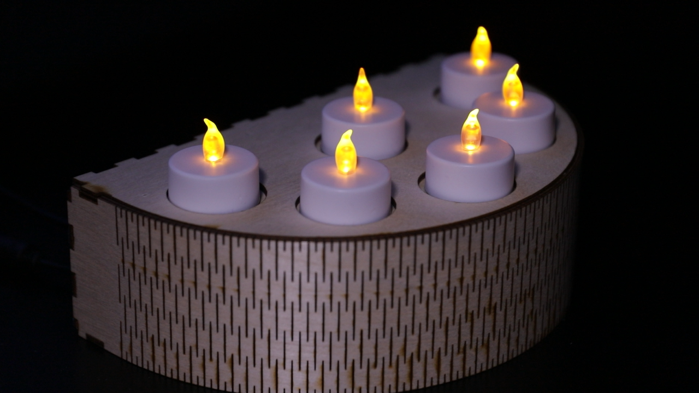
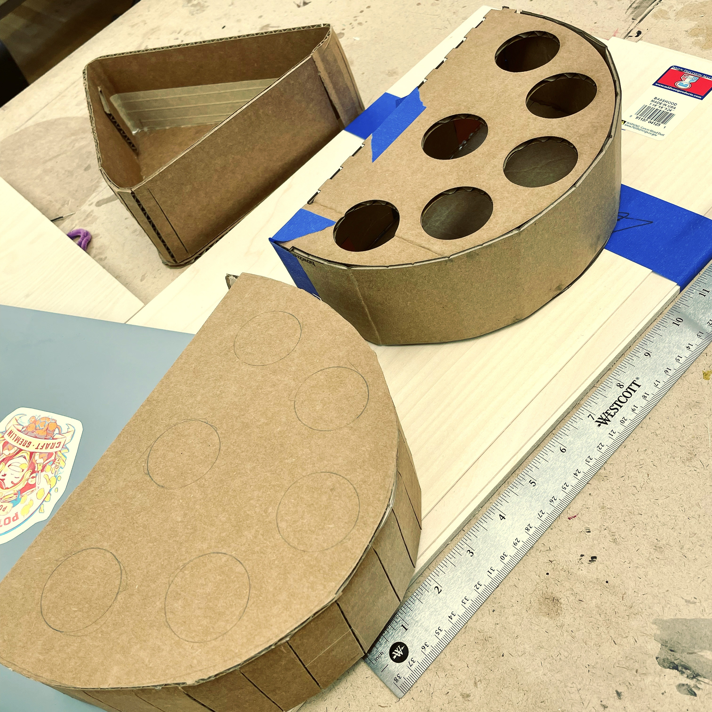
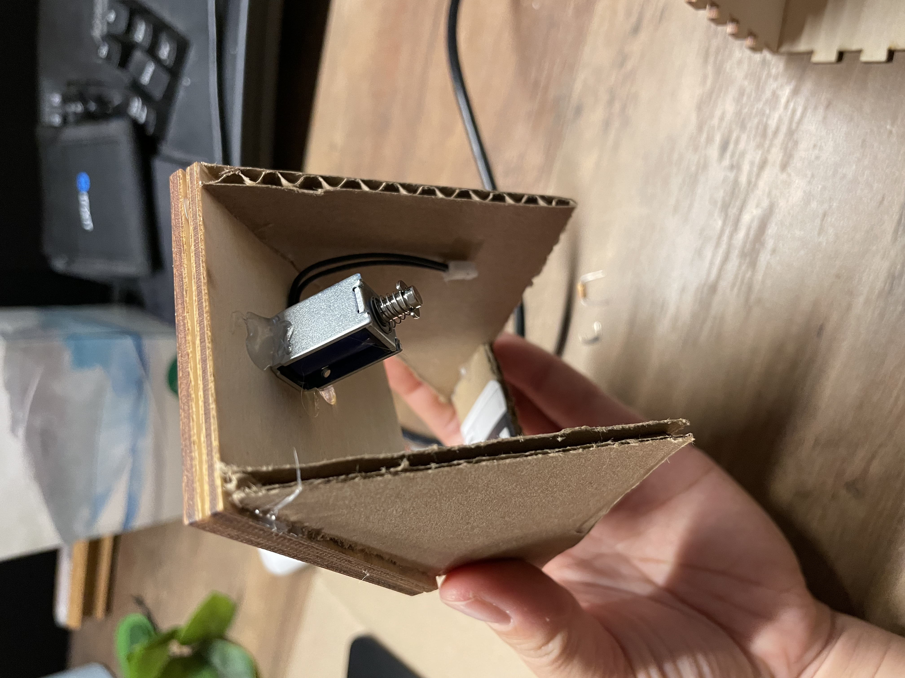
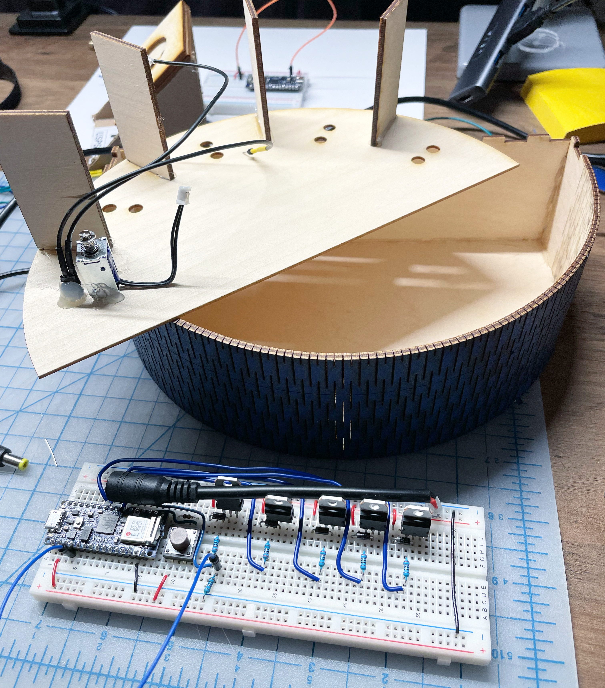
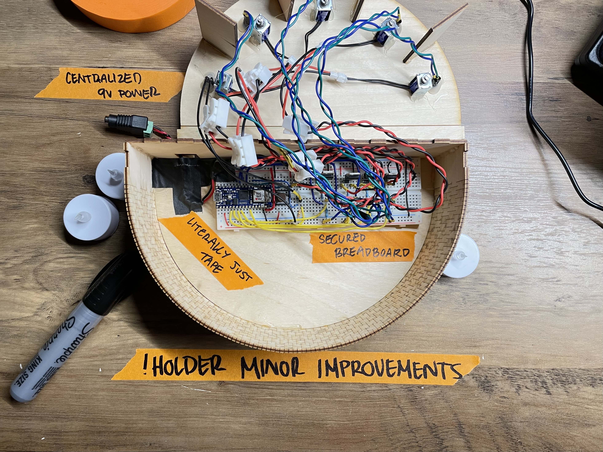

Inspired by my love for Disney Imagineering, this piece brings a taste of The Haunted Mansion to life. The experience surrounds a piece of floating text behind a wooden candle holder, as well as a set of (LED flameless) candles. As the viewer places candles into the holder, corresponding ghosts appear, singing more and more loudly. Once all candles are placed, the viewer gets a surprise as the ghosts fling those candles back out.  

`https://youtu.be/Jm6Aruuc6bE`

This project was originally conceived for the ITP Halloween Experience event, [where a lower fidelity version was showcased](https://www.leiac.me/2021/2021-10-26_spooky-serenade/). This updated version was moved from a small monitor onto a larger [VNTANA Z Hologram Display](https://www.vntanahologram.com). This allowed for the text and ghosts to "float" in front of the viewer, and appear to be hovering in space when the installation is placed in semi-bright rooms or around other props. Note that this effect is difficult to document and therefore does not appear much in the video above.

Within the candle holder is housed a series of photo resistors used to detect candle placement. Additionally, tiny 5V solenoids are placed underneath each candle and are triggered on the completion event. These solenoids are actually run for only a few milliseconds at 12V in order to get the impact necessary to eject the candles.

---
## Process Documentation 

Cardboard mockup to test form.

Detect-and-eject proof of concept for solenoid plus photo resistor. 

https://youtu.be/kEDEbDJSnUY

---
## Updated April 2023

The ghosts are a 4k fan-generated video, created for Halloween projections. You can find the [video here on Youtube](https://youtu.be/HECrCf73Jv8).
