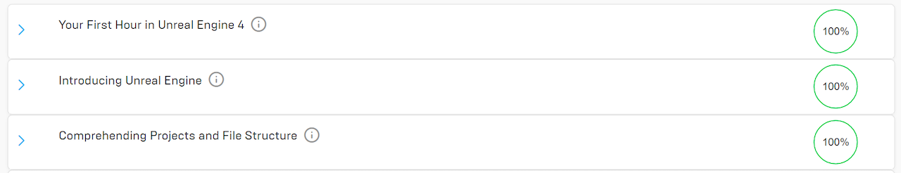
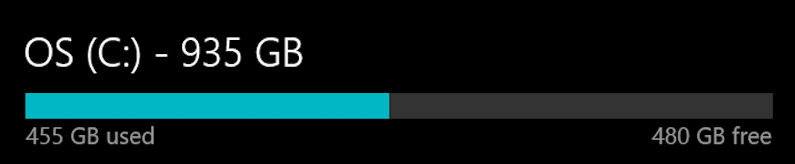
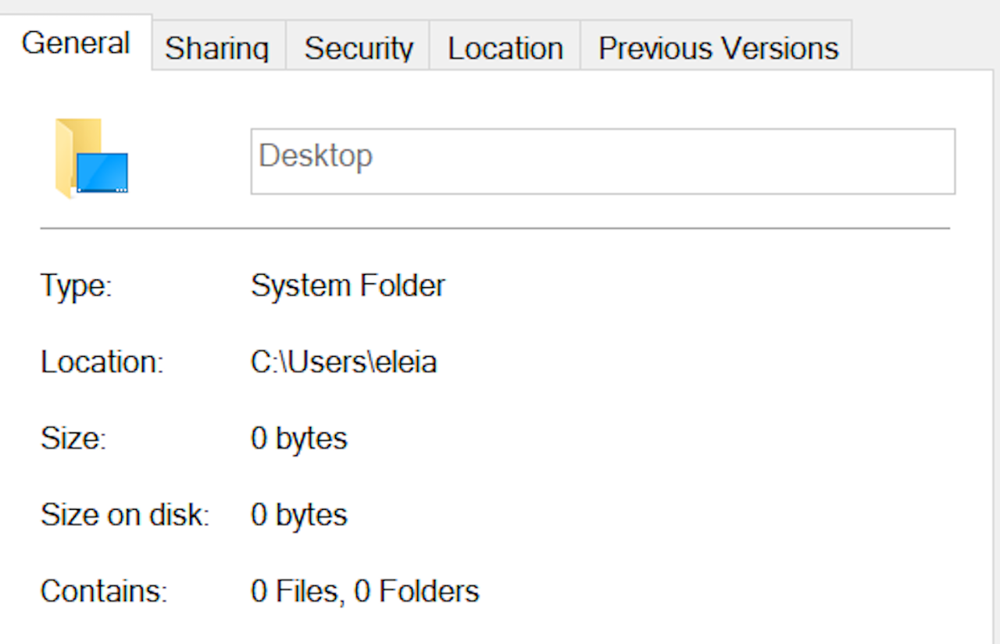
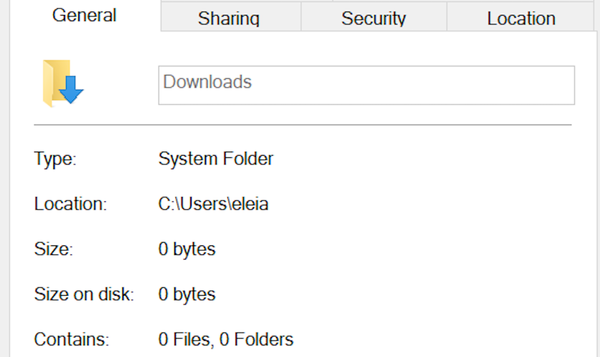

## VR Funhouse
I played the Oculus version on a Rift 2 (note to future self: it also works on a Quest 2, so no need to fiddle with the cameras and space issues in the future).

VR Funhouse was a fun set of experiments to play with. A familiar setting, these carnival games gave very clear expectations and instructions for interaction. Some things were remarkably easy to do in VR; shooting places with a revolver, spraying water at a target. Overall I'm pretty impressed with aim-and-shoot interactions in the demo. However, I found many more things quite difficult without other forms of feedback;

- In the first scene, both a baseball bat and a baseball are available as items to play with. I had a tremendously hard time attempting to toss the baseball and hit it; I had no intuition as to how the baseball would fly through the air without a sense of how heavy it was. This was true for anything that required a throwing motion.
- I had little to no proprioception for any long instrument I had to hold (a sword, a bat, an arrow, a mallet).
- Having no feedback on my hands meant hitting things with boxing gloves was very dissatisfying.

Additionally, for games with a tossing or throwing action, I found it really difficult to release the trigger while holding on to the controller. I guess those wrist straps are really key.

## Other Logistical Tasks
[x] Complete the first three Unreal lessons

[x] Clear up desktop, downloads, and confirm free space
I bought this computer like 6 months ago, how am I already down 500GB?

See y'all in class. 
---
