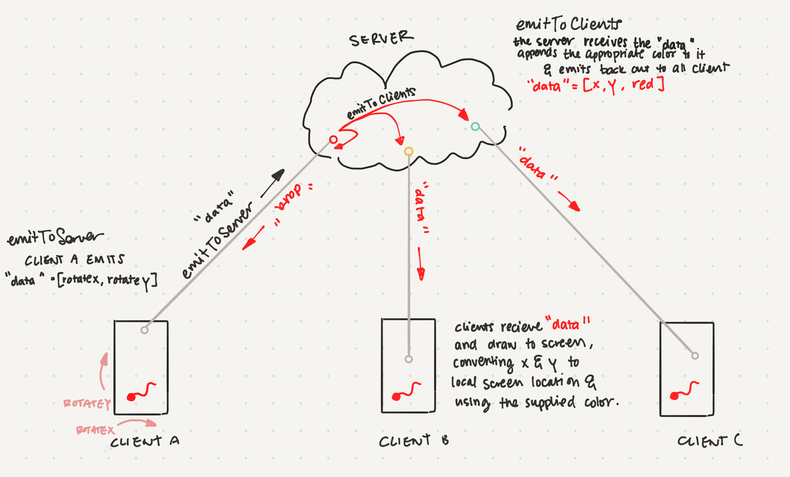

## A simple socket test

A created this site that allows multiple people to use their phones (or other portable devices) to draw on a shared canvas. Each person visiting the site gets a color, and a little dot that is moved around the screen by tilting their device.

[Visit the site here](https://leils-polka-dot-party.glitch.me) or [click here to take a look at the code](https://glitch.com/edit/#!/leils-polka-dot-party). Note that this only works with mobile devices (because it takes advantage of rotation detection).

See the following diagram of how this works:

---

## Absurd
*Write a short description of something you do that is absurd.*

This prompt sent me in a bit of a spiral, since everything that I do I consider a bit absurd from one point of view or another. After a few days of debating, I came out with this;

It’s absurd that I spent 4 days considering what “answer” could be “correct” to this question that clearly doesn’t have a right answer. I think I do this a lot; I’m predisposed to act as if there are right answers, to try and walk the “correct” path. I spent time chatting with other people, asking them what they might do that is absurd, asking them what I might do that they consider absurd. I got answers on everything from the way that I eat potato chips, to the fact that I sometimes hurdle across the atmosphere in a tin can. But none of those answers felt correct enough, so I spent more time thinking about it.

So there, that’s it. It’s absurd to spend so much time worrying that I’ll be wrong.
