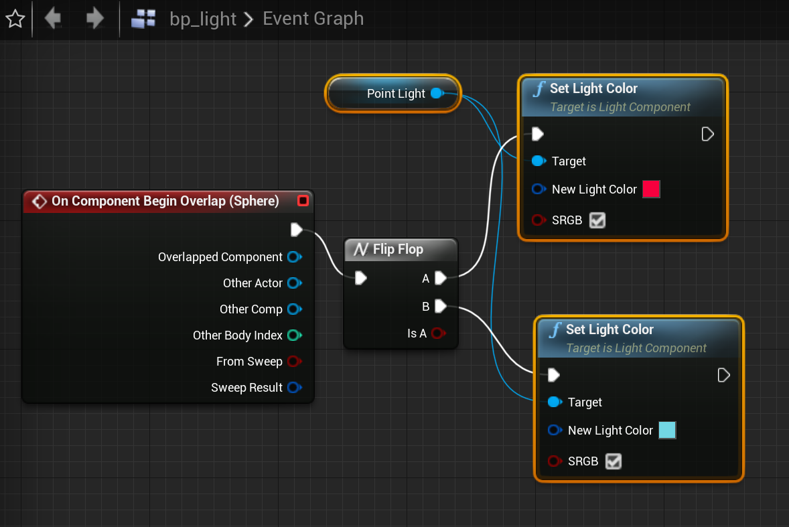
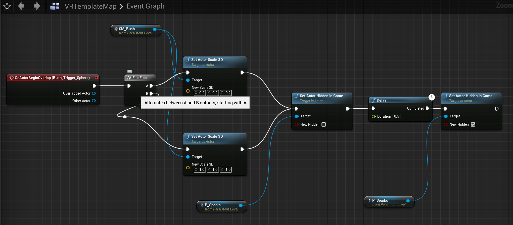
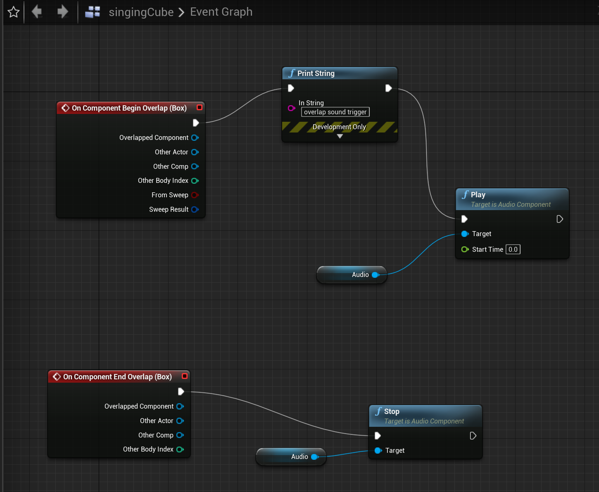

## Dear Angelica

I really enjoyed Angelica. Though it was a little unsettling to have the entire scene move with my head, once I got used to the rules of engagement I thought it was extremely well directed. The use of VR allowed for a very intense experience, where I could get up close to the characters. At times it felt too close, like I was getting swallowed up with Angelica herself. This use of space was strikingly effective. I thought this piece was well directed; lots of little lines and movements to draw the eye, sounds to make you turn your head. One thing that stood out in particular was the shuttle-explosion moment. That scene had to have been written such that the viewers’ choices were valid no matter what, and I think they executed this well. If I looked away quickly from the shuttle and towards Angelica, I got a heartwrenchingly long moment seeing her drift away. If I instead lingered on the shuttle and turned around later, Angelica would be unexpectedly far away, and I (a stand-in for the main character) would see her loss as a horrible surprise. Two takeaways; to draw the audience’s eyes and ears with interest, and to make multiple paths of engagement for the viewer.

---

## 3+ interactives in Unreal

Unfortunately, I learned the hard way that Airlink requires your desktop to be hardwired to the router, so I didn’t get a chance to test these interactions in VR. All videos are stand-ins with pawn game character collision.

### Toggle Light

A simple light that toggles between red and blue when it detects collision.
`youtube:https://youtu.be/D30axX8GxeI`

### A Button and a Bush

This interaction was built on the level blueprint rather than an individual one, to see what level triggers might look like. In this case, the trigger causes the bush to either grow or shrink, and briefly shows a “sparks” particle effect for some pizzaz.
`youtube:https://youtu.be/i67QJ0hQEyI`

### SoundCube

A pretty simple interaction, this trigger causes a sound to be played a single time.
`youtube:https://youtu.be/Nt6QHyd0nIE`

### GlowCube

This one I wasn’t able to test, but look forward to doing so when my tether cable gets shipped. This cube should glow when grabbed, and stop glowing when dropped.

---
## Unreal Materials

