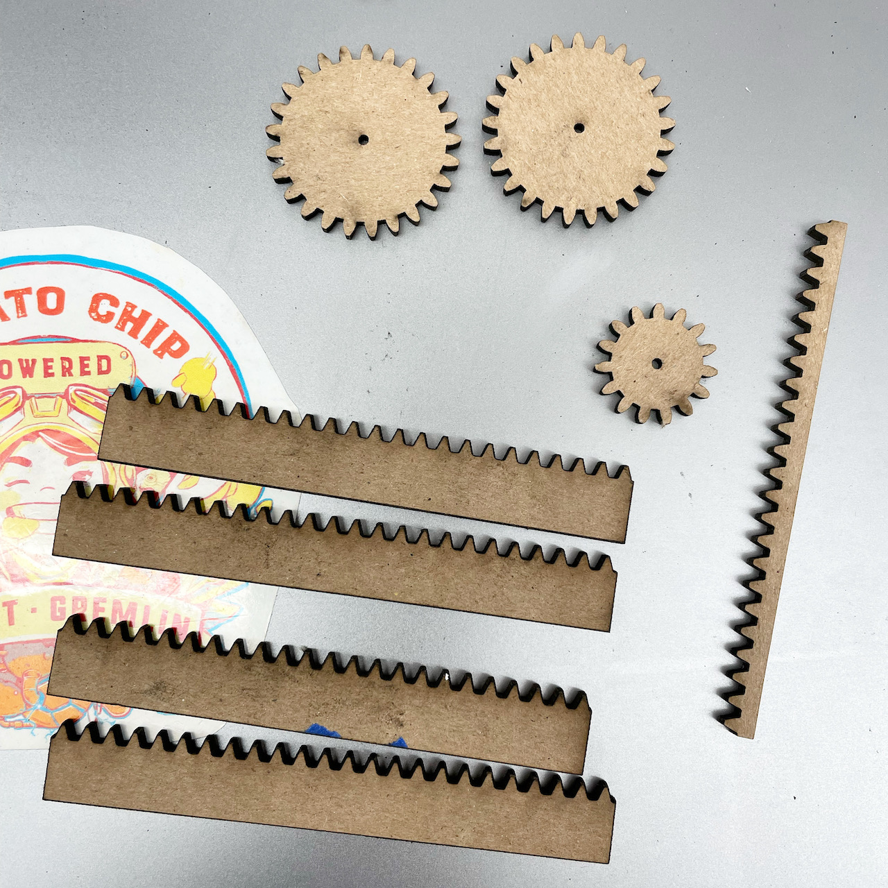

This week's prompt: _"Make an ... object that expresses emotion towards a person"._

Sneaky Houdini is a cute little rabbit with a big personality. A magician's assistant, he's decided that it's time to take the stage himself! Houdini has snuck off with the magician's wand in an attempt to steal the show. We've finally found him hidden in the magician's hat, but he's not going to give up the wand that easily!

https://youtu.be/6FTiz0JwXf0

Each time you reach for him on his wand, he ducks back down into the hat! He'll stay there as long as you hover ... but when you leave, he'll pop right back out again.

### What's he made of?

This little piece is made up of a Huzzah ESP32 Feather, a micro servo, and a VL6180X time-of-flight sensor. It's got one of the first rack-and-pinion systems that I've built from scratch as well. I laser cut all gears out of thick matboard, which was rigid enough to stand up to the light wear, and easy (and cheap) enough to source.

A nice intro that I (vaguely) followed is [available on Instructables](https://www.instructables.com/Linear-Motion-by-Rack-and-Pinion/).

The system is pretty simple, and self-explanatory via a breadboard diagram.

Code for this little guy is [available on GitHub](https://github.com/leils/spring_2022_theme_park_eng/blob/main/bunny_hat/retreating_bunny/retreating_bunny.ino).

### Some behind-the-scenes video:
https://youtu.be/HjDcO6MhkaU
