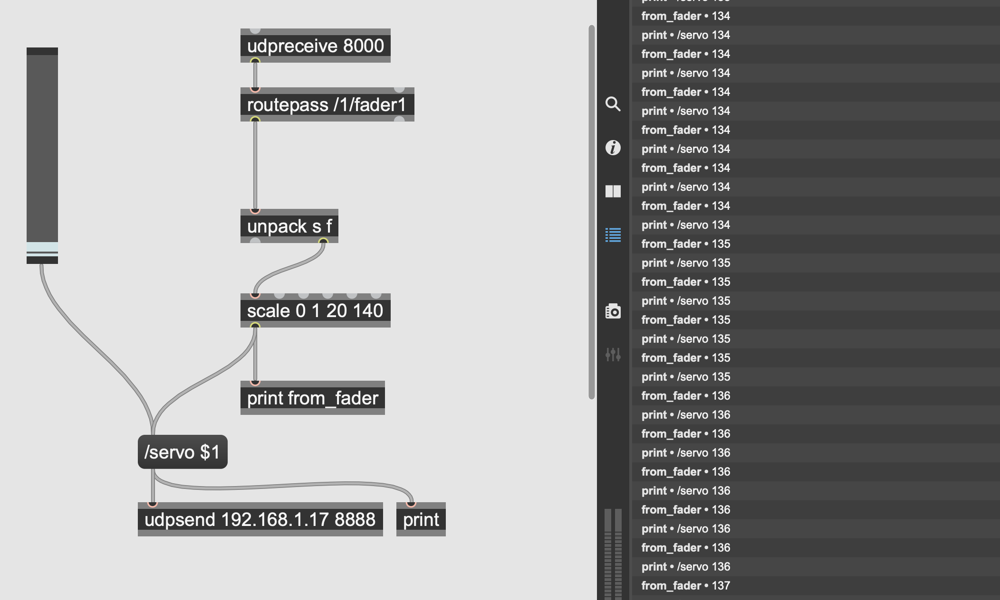

`https://youtu.be/A-_FIqZES1U`

The slider works upside-down because the servo was placed that way (0 is with the bunny highest, 180 lowest). For this setup, I used [TouchOSC](https://hexler.net/touchosc) on my phone to send commands to Max, which I then used to convert the data to reasonable numbers and forward them to the Arduino. This could have been simplified by sending commands directly to Arduino through OSC, but it was interesting to get a dual-input setup (being able to use both the computer and the phone as control).

A few tweaks to make in the future:
- Ensure that numbers coming from Max and TouchOSC stay synced; ie a slider moved in TouchOSC should be reflected in Max.
- Choose a single place to sanitize numbers
- Something about ServoEase disagreed with this transition (or I simply messed up the code and need more time to debug).
