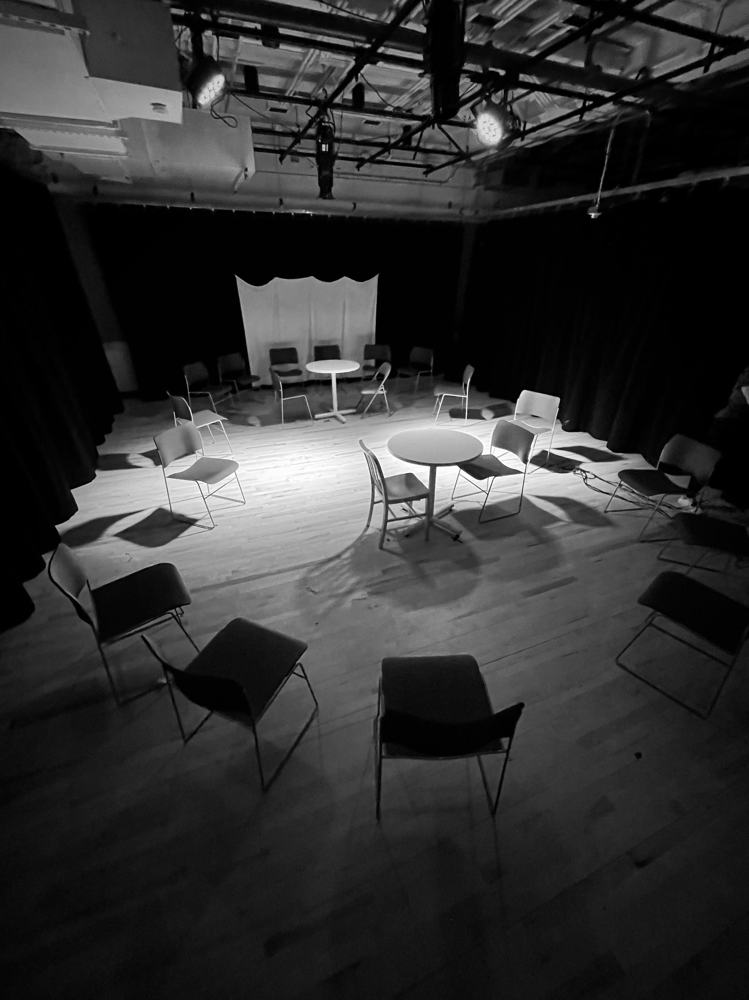
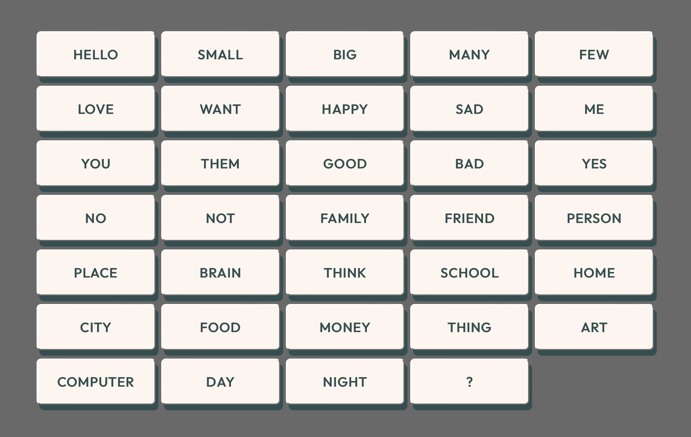

*In & Against Conversation* was an experience created for [Andrew Schneider](http://www.andrewjs.com/)’s Performing Reality class at ITP NYU, in collaboration with [Megha Goel](https://meghag.com/).

An expression of internal frustration, this piece simulates a conversation where one participant is extremely limited in vocabulary. Inspired by the creators’ struggles with fluency in their cultural tongues, the audience is invited to experience (either as participant or spectator) what it’s like to try and communicate when you can’t find, or use, the words. Moments of frustration are abundant, but so are moments of joy, and humor, and discovery.

The space is curated to provide both a sense of intimacy and alienation; the room begins fully lit, the conversationalists entering after the audience has already taken their seats.

The audience is seated to surround the conversations at close proximity; they are simultaneous audience, and an inherent part of the conversation. The chairs are set so that no audience member is behind, or physically separated from the conversation.

The conversation participants are volunteers from the group. They enter and are seated, four in total, two per conversation. As the conversation begins, the lights dim and spotlights are drawn up toward the tables. They are on stage, but also still intimate. From there, they decide how the conversation will go.

---

This piece is in continued development and will likely never be “complete”. If you would like to try out a conversation for yourself, the [limited vocabulary is available via webapp](https://brave-perlman-661180.netlify.app) (intended for use on a tablet).

The vocabulary chosen is specific to the creators’ own vocabularies, the context of the class, and the following guiding questions:

- How are you doing today?
- What makes you feel alone?
- What makes you feel joy?
- Do you feel at home?
