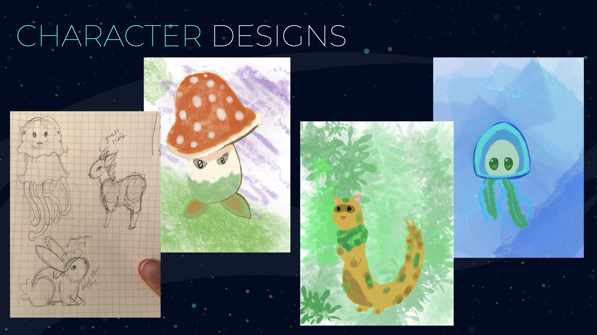
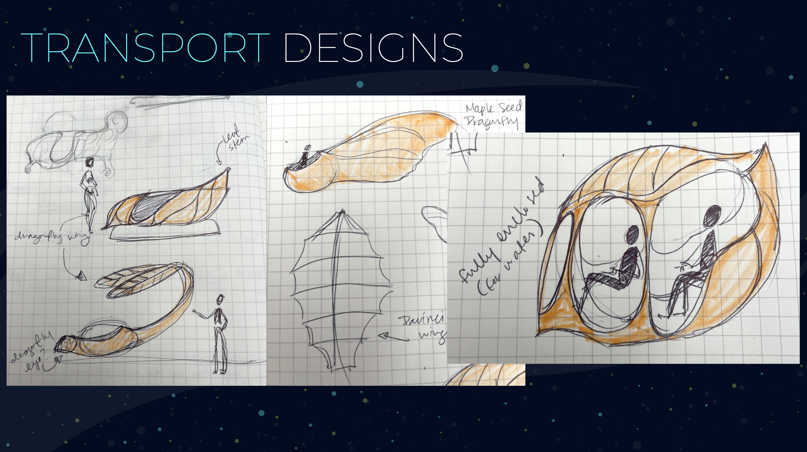

I’ve once again teamed up with Leigh and Linnette, this time to bring you a proposal for Expedition Earth, a thrilling dark ride set on Earth 400 years in the future. The prompt for this exploration is as follows:

> It has been over 400 years since humans left the Earth on a trip to the moon - [landing squarely in its eye](https://upload.wikimedia.org/wikipedia/commons/0/04/Le_Voyage_dans_la_lune.jpg). If any humans were left on the planet, they would consider this to be the year 2302. In the absence of any people, the natural world has reclaimed what was once a built environment. In its rejuvenation, the fauna and flora has become imbued with magic qualities that mimic many old world functionality and tools - bicycles and buildings have given way to massive pea pod transports and plants scaled like airplane hangars. No one species dominates this emergent magical environment.
The descendants of the explorers from the moon have returned to a world unlike any other in history. Fantastic magic is imbued in all living things, moving through the world in ways unknown and inscrutable to humans.

The full presentation is [accessible here](https://docs.google.com/presentation/d/1Svz12tw7j32j5eWcru6KRM853TYfzI6zZNS4bz9kXDY/edit?usp=sharing).

On Expedition Earth, you are a Moon-based human joining up on a scientific expedition to the newly re-visited Earth. Entering through a portal to Earth, you are met by your eccentric scientist squad leader, who briefs you on your mission to explore un-surveyed areas. You then board your exploration vehicle, and head out into the unknown. Along the way, you’re met by herds of intelligent hybrid plant-animals. A few young individuals are curious about you, and the mischievous little ones steal a few pieces of equipment vital to your mission. From there it’s a merry chase through the world’s enchanting biomes; through forests, into caves, even underwater! When you finally get your equipment back, you head back home ... but your new friends will be waiting for your next visit!

In this exploration, we lean on visual themes of biomimicry, fantasy, and art nouveau. We want the guests to be enthralled by their environment, and look at the natural world around them with a new light.

This project is a blue-sky proposal. Below are some of our moodboards and concept art, including transportation based in biomimicry and character ideas.

The actual ride will leverage trackless ride systems, allowing for each ride to vary and encourage riders to return over and over again. By creating a dark ride, we allow for the greatest control over the environment no matter where this ride is built. Additionally, we intend for this ride to be a combination of physical effects, animatronics, and screen-based effects to create an immersive and multi-dimensional experience.
