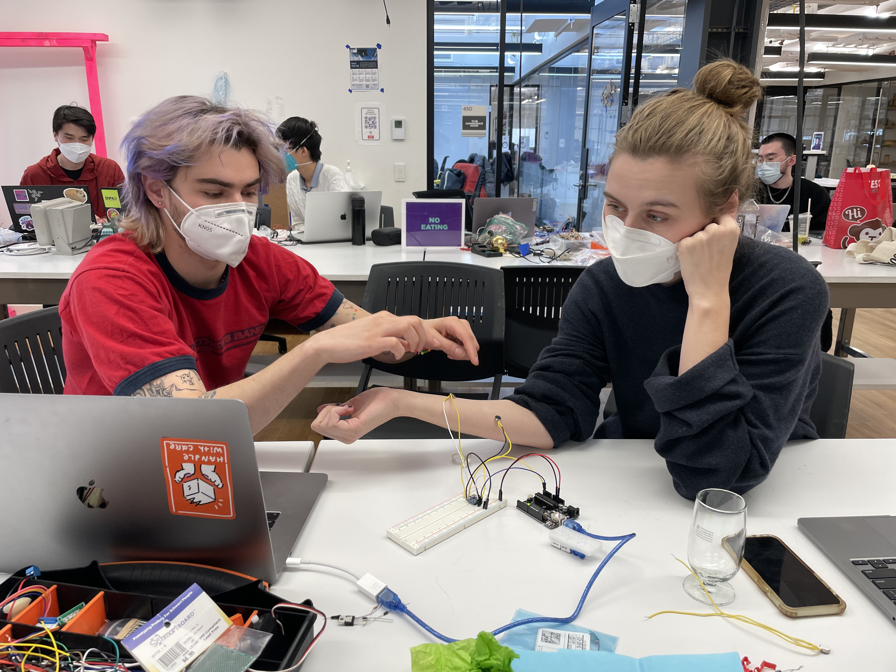

In the following labs, I worked with [Sammy](https://sammyray.cargo.site) and [Martha](https://marthajanicki.online) to explore haptic sensation.

## Lab 1 - Hello Haptics

I’m surprised how straightforward it is to do this; less complicated than even lighting up an LED. We played around with this a bit, and ended up creating a “heartbeat” pattern. In order to make this visible/detectable in the video, we played with both resting the motor on guitar strings as well as against a glass cup.

https://youtu.be/t0Mjx1c1z8k

## Lab 2 - Array

Here’s where that complexity starts to come together. Using multiple motors at once, we were able to create a sensation that mimics the typing animation on a messaging app (the ellipsis). By placing this along the arm, a person can experience not only the visual tension of waiting but also a physical representation of it.

https://youtu.be/w7ZFhruaWcs

When we “played” the motors against skin, the sensation was pretty distinctly translated. While we originally thought it might feel a bit like fingers tapping along your arm, instead they were distinctly digital feeling ... certainly a more direct representation of of the ellipsis rather than metaphorical.

## Lab 3 - Haptic Driver

Here, we used a Haptic Motor Driver breakout to control an ERM. Here, the example ran us through all the animations available in the library, where we noted that only the strongest “click”s seemed to come through with emphasis. This may also have to do with the amount of power given to the board, or just the way we were testing it.

Here we are trying the haptic motor with the driver against glass:

https://youtu.be/lulnuRCpUAs

We realized that we were able to put two ERMs in serial on the motor driver as well. While they were not equally powerful, they did vibrate with the same patterns. Below, we tested this on Martha’s arm to get the middling effect.

We were also able to successfully hot swap the ERM with an LRA, which yielded a seemingly perfect replacement. The LRA’s motion was a little bit sharper, and got just the slightest bit warm (something to look into later).

## Butterflies

Thinking of fun sensations to recreate, we landed on the feeling of having “butterflies in your stomach”. This fun little pseudo-sensation was a great challenge, as it’s more of a side effect of anxiety or nerves rather than an actual physical sensation.

This goal brought us back into the use of an array of haptic motors; by arranging a number of haptic motors on the stomach, we’re able to create a fluttering effect that moves around on the effected area. We paired this array of haptic motors with a time of flight sensor in order to gauge the tester’s distance from a particular point. With the sensor mounted to the table, we were able to interact with the setup my moving into and closer to the sensor’s detecting field. (I guess in this case, the “crush” is the table.)

https://youtu.be/ptJyBm3fnDU

At any given time within a certain distance, one motor at a time is vibrating. As you step closer to the sensor, the speed at which the motors swap grows faster and faster. By taping these sensors to my shirt, we were able to create a “moving” vibration sensation that buzzed all over my stomach.

As you can see, we also added crepe-paper butterflies to enhance the visual impact of the vibrations.

There are a few things we'd like to do when revisiting this project in the future;
1. Fabricate a soft enclosure that can house all this hardware, and be strapped to the body
1. Use a set of wireless microcontrollers in order to decouple the sensor and the haptic portions
1. Test a multi-directional sensing unit, rather than only being able to detect in a straight line
