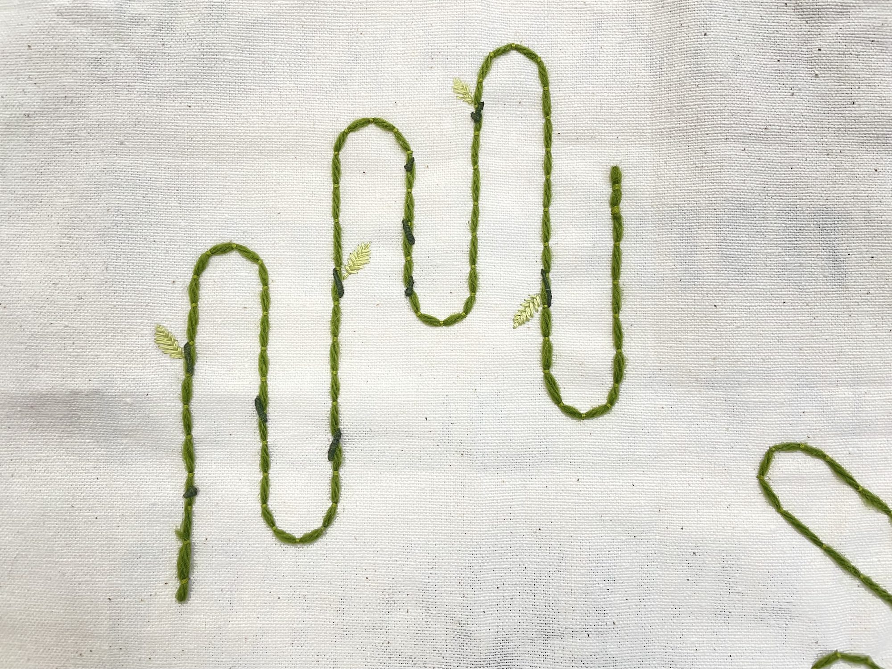
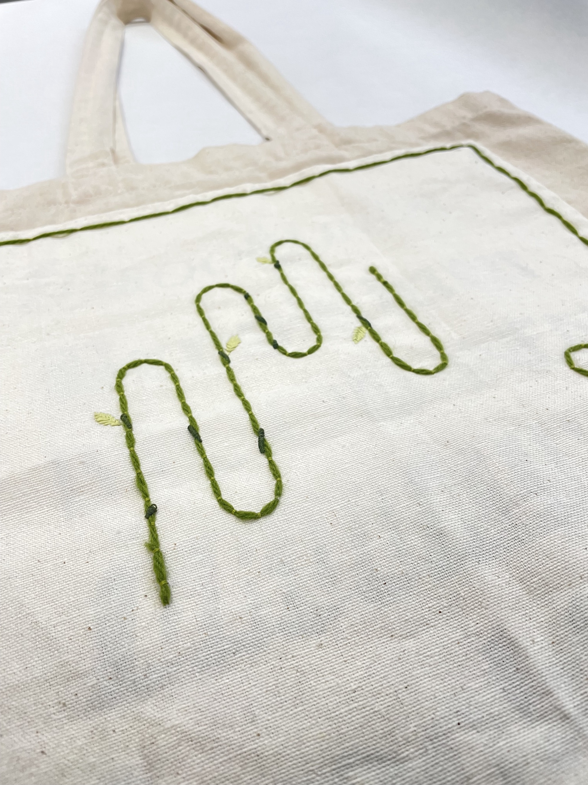

*Embroidery thread, acrylic yarn, repurposed canvas bag*

We are always weaving the cloth of life, entwining ourselves with others, spinning the fibers we are given into something greater. Below is my exploration of embodying that idea, focusing on a particular thread within my own experience.

The Weave is an exploration in media making as healing practice. In this piece, I make tangible the intangible structures in my daily life. The years before this projects’ conception were a practice in taking space and gaining agency. Like many others that may self-identify as “people-pleasing” or “fear-oriented”, I have struggled to advocate for myself in times of distress or create boundaries against the urge to care for others (even if it is to my detriment).

The central portion of this tapestry is a length of dark green yarn, adorned by small black knots and light green leaves. Using a technique called *couching*, I tack this yarn onto the canvas in lengths representing the amount of perceived agency I have during the day. Each vertical line of green represents a single day. By making these lines connect, I express how the days bleed into each other, and affect one another.

The couched vertical lines were done at the end of each tracked day; this way, the process of creating this piece became a part of my life and meditative practice rather than an artifact created after the fact. Doing this gave me a chance to reflect on the day’s events, and consider how they may affect the next (or how the one before may have shaped this one).

Each black knotted node represents a moment of over-reaching responsibility, with a length to match the intensity of the moment. Each leaf, which may only bud from the nodes, marks a moment of recognizing that over-reaching and either caring for or placing boundaries around it. While the leaves are by far the most technically complex stitches here, their lighter green encourages them to be more decoration than focus

In attaching this embroidery to canvas bag, I encourage myself to see it and live with it; the effect that my agency, my over-reaching has on me is not limited to being hung on a wall. Instead, I bring it with me wherever I go, now so translated into a piece of adornment.

