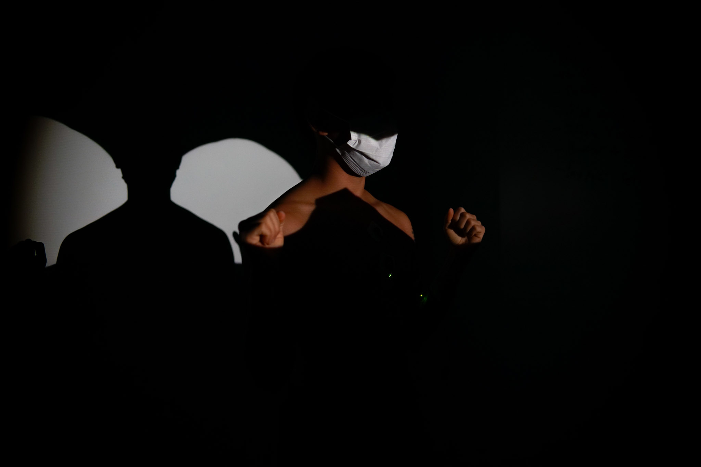
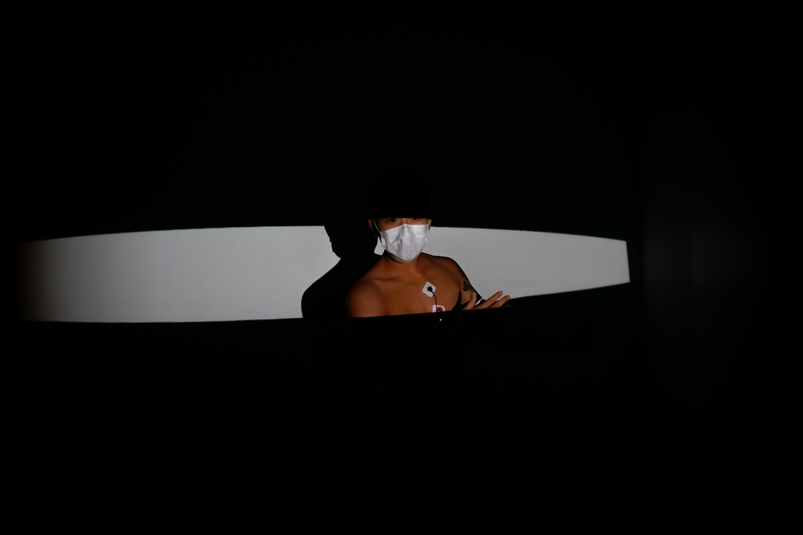

Created in collaboration with [Nunnapat ‘Spencer’ Ratanavanh](https://ratanav.com) and Bruce Mk Arthur.

Light as Medium was an exploration in creating motion-reactive and user-controlled light within the context of stage performance and movement exploration. Ideated and driven by Spencer’s experience as a modern dance artist, we integrated body-mounted sensors, a Kinect camera, and projector into a custom performance tool and space.

The snapshots below are from a proof-of-concept showcase. In all recordings, the lights projected are fully controlled by Spencer (the dancer) through his hand placement and electromuscular signals.

Spencer continued this exploration in his [Wetware project](https://ratanav.com/Wetware).
