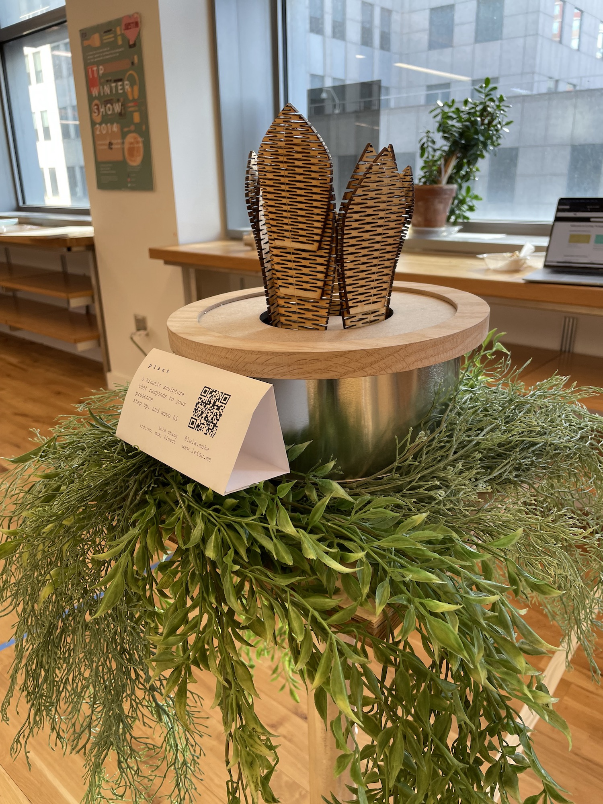
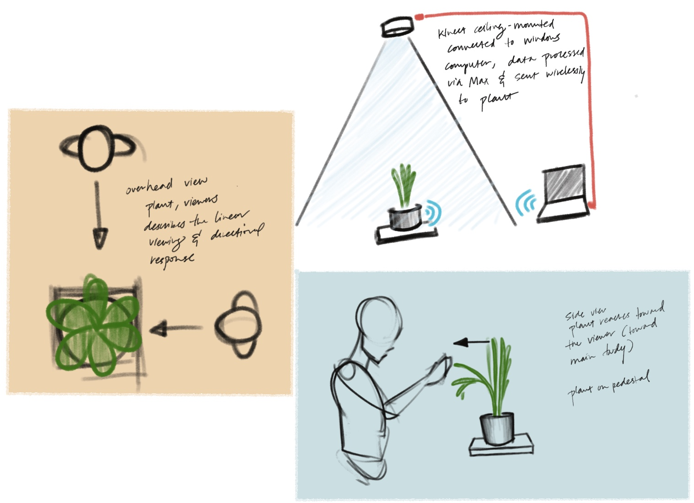
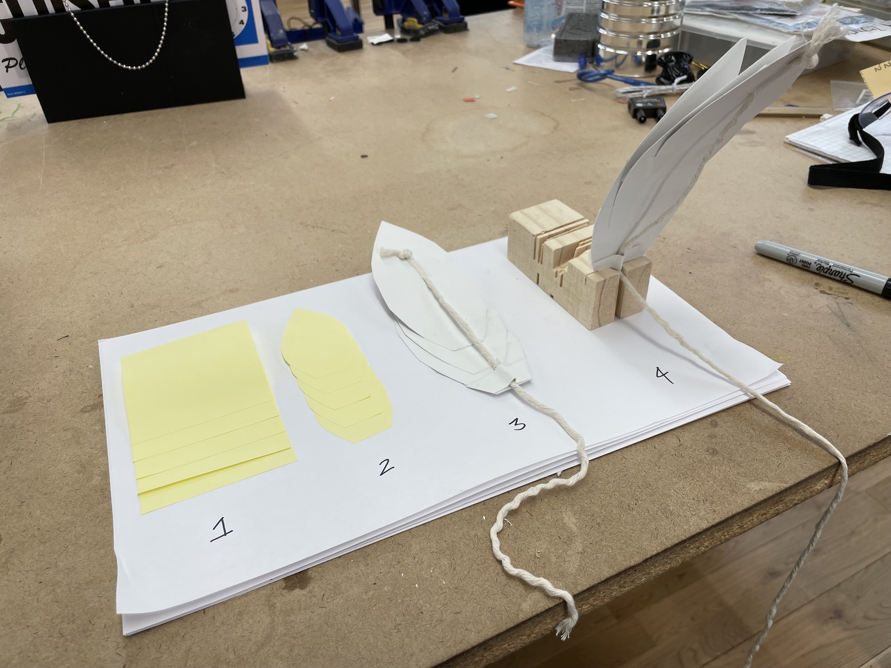
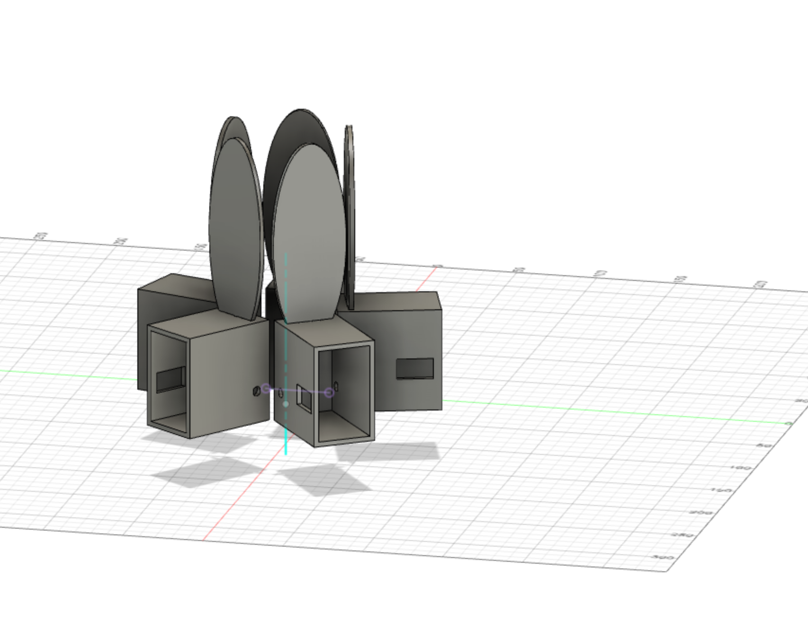
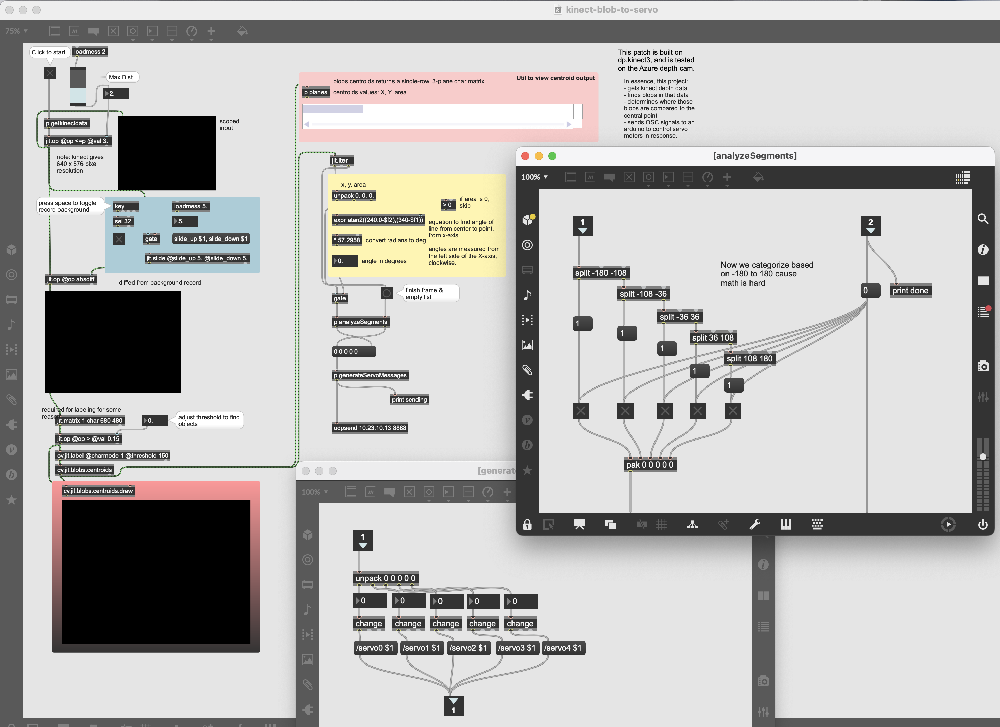
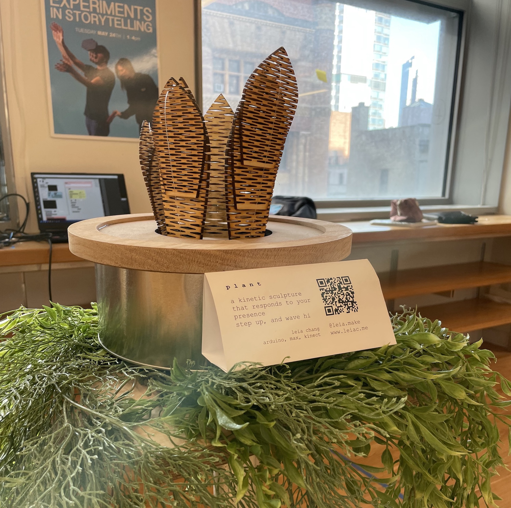

*laser-cut ply // found materials // Arduino (Adafruit ESP32 Feather, Servos & Multiplexer) // MaxMSP // Kinect Azure*

p l a n t is a kinetic sculpture that recognizes and responds to the presence of viewers.

https://youtu.be/ctKftBH3xLM

This sculpture is set up to be unassuming, surrounded by other greenery. While at first it’s completely still, the leaves bend towards the viewer as they step closer. It was built to have no detectable sensors on the sculpture itself; instead, the piece leverages the natural disinclination to look up to hide a sensor directly overhead.

The leaves on this sculpture are all laser-cut craft plywood, cut with kerf allowing for flexible movement with spring-like tension.

---
## process

p l a n t was originally created as a part of a themed entertainment exploration. The idea was to illustrate intelligent plant life; Plants that would recognize and follow you as you walked (or rode) past them.
In the proposed dark ride, these would be fabricated at various scales and be scattered through the scenes, adding to the illusion of an alien-like and hyper-intelligent environment.

This kinetic sculpture is made out of laser-cut ply, fishing wire, and an Arduino base. Other than the Arduino parts, everything is found or re-used materials (including the metal canister and the wood each leaf is cut from).

https://youtu.be/ctKftBH3xLM

1. sketches/concept
1. motion and material tests
1. single leaf
1. mockup
1. MAX, Kinect, and OSC

### SKETCHES
This plant was conceptualized as a sculpture installed within a ride queue. As guests would walk up to and past the sculpture, the plant would reach toward them. This would bring the world-building of the ride out into the line, and entertain guests while they wait.

### MOTION & MATERIAL TESTS
The first tests were done in paper. Inspired by the work of [Casey Curran](https://www.caseycurran.com)  and [Wolfcat Workshop](https://wolfcatworkshop.com/index.php/portfolio/one-month-small-machines/) , I explored using layered pieces of paper to get a complex, lifelike movement.

https://youtube.com/watch?v=EEWEZEeWX1o

While these were satisfying in their own right, I wanted to see what this movement looked like with a more rigid material. The next step was to move into wood. I’d used kerf-cut wood to achieve bends before, but for pieces in motion. After a bit of experimentation, I put together a kerf pattern that allowed for enough give to move easily, but also could spring back to its original form when pressure was released.
The kerf cuts I started from can be [found here](https://www.troteclaser.com/en-us/learn-support/helpcenter/bending-technique).

https://youtube.com/watch?v=1qh9yFkGbc4

### A SINGLE LEAF
After the leaf material and design were satisfactory, I put together a motorized test.
This allowed me to create a proof-of-concept for the moving plant. I connected a single servo to an ESP32 Feather, and controlled that motor via wifi.

 https://youtube.com/watch?v=MM1_45ECQqQ

### MOCKUP

After making a single leaf, I was able to duplicate it and tweak the design for easier assembly.

I then created a mock-up of the final piece in Fusion360 to get a rough idea of how it would be assembled. By modeling the single-leaf assembly, I was able to do a digital test-run on the spacing and housing requirements for the final piece.

After the mock-up, I built 4 more leaves and wired them up to a servo multiplexer. After confirming that everything worked, I salvaged materials to create a pot-like housing.

https://youtu.be/rPrndz2n5tY

### DETECTION

Once I had the mechanical parts all set up, it was time to do the person detection.

For body detection, I used an overhead-mounted Kinect Azure and MaxMSP. Using DPKinect-V3, I grabbed the Kinect’s depth data, filtered it to a maximum of 1.4 meters, and ran it through CV Jitter to detect blobs. While technically I’m diff-ing this input to a base image, I don’t think this is actually necessary so long as no other objects are by default within the detection area.

By then taking the centroids of the detected blobs, I could calculate what angle the blob appeared compared to the central point, and trigger the related servo.
My Max Project is available [here on github](https://github.com/leils/spring_2022_theme_park_eng/tree/main/expedition-earth/interactive-plant/kinect-blob-to-servo).

Control of the Arduino was done through OSC messages over WiFi, which I’ve used before in [previous experiments](https://www.leiac.me/content/2022/2022-02-23_tpe-osc-control/).

———————————————

## Takeaways:
- CAD is an extremely useful tool when your work gets more complicated than a single-part assembly
- Getting test data is always useful, especially when your sensor setup has special requirements (ie. being mounted to the ceiling)

### Difficulties:
- Sometimes Max would need to be re-started in order to fetch Kinect data
- I did not take into account the cables running to the Arduino for power when designing the housing, and a right-angle power cable had to be found in order for everything to fit.

Thanks to Scott Fitzgerald for all the help with Max.
