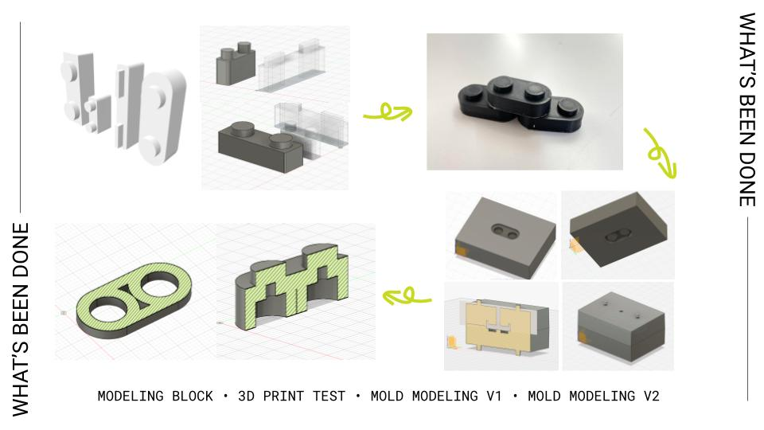
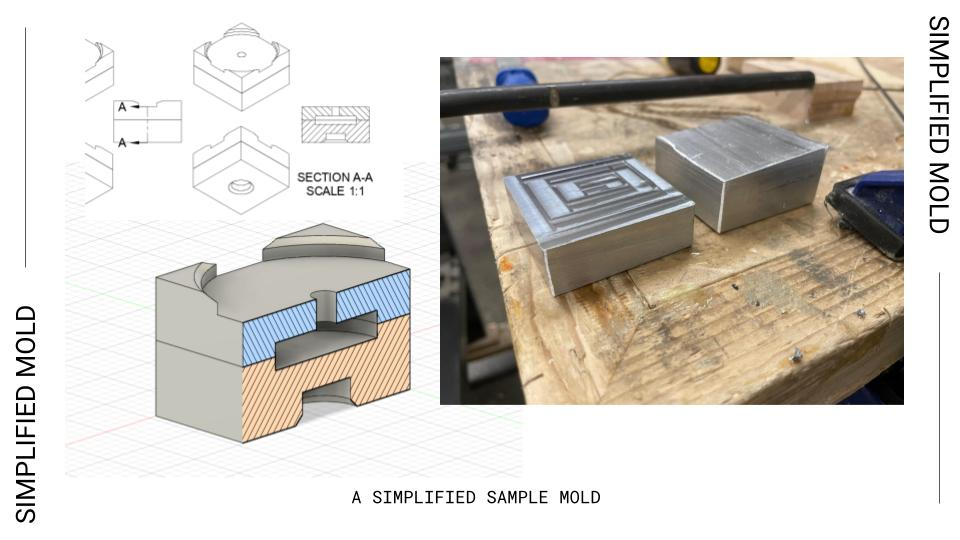

Presented with a challenge to re-think plastic recycling, I collaborated with [Jinny Kang](https://www.jnnykg.com) to create a proposal for PLA recycling via injection mould at the NYU Makerspace.

This began with our own goal of creating recycled PLA building blocks, which would ideally be integrated into a publicly accessible recycling process. In our attempts to create these building blocks (nicknamed PLAygos), we first began by 3D printing a prototype of our intended products. After refining the design, we discovered the challenges and quirks of the injection mould creation process.  

We created a CAD sample for a theoretical PLAygo mould first. After encountering the complexity of mould design, we re-focused on understanding the injection moulding process and began the design and milling for a small blank aluminum mould.

During this 7-week process, we managed to build a solid foundation from which we hope to create a more robust and accessible injection moulding process. These initial tests are key to understanding how we can leverage this process for PLA recycling in the future. In the end, we created a [quick-start guide for creating an injection mould](https://docs.google.com/document/d/16cPBAk5cZJJghmIq2P2wxjG5N9rx0AEBgYxfn4lE83c/edit?usp=sharing). This guide gives an overview on mould requirements, considerations that need to be made specifically for these moulds, and basic instruction on design and fabrication. This guide covers all of our learnings about the injection mould design and creation projects, and is intend to be a living document.

---

## Future exploration areas:
- Is there a quicker, lower-barrier way of creating an injection mould? IE. 3D printing with high temperature plastic, rather than milled from Aluminum?
- What temp/pressure/volume does recycled PLA work best with? What proportion of seed PLA vs recycled PLA is ideal?
- Is there a way to make the actual injection mould process accessible/approachable to Makerspace members?

---

Tech stack:
- Fusion 360
- Ultimaker 3
- Tormach
- Injection Moulding Machine
