This week’s adventure is working with the router.

## Inspiration & Planning

I decided to riff on replicating the simple circle that we made in class.

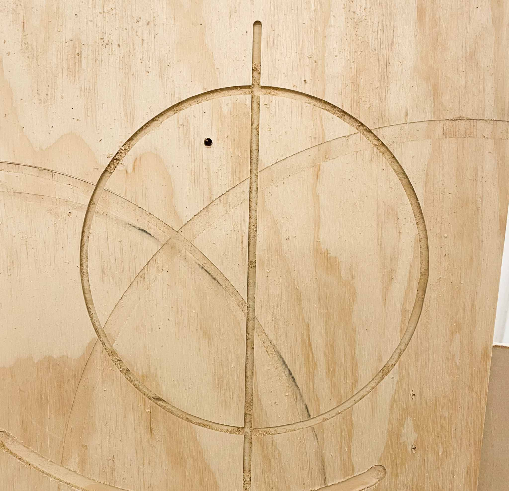

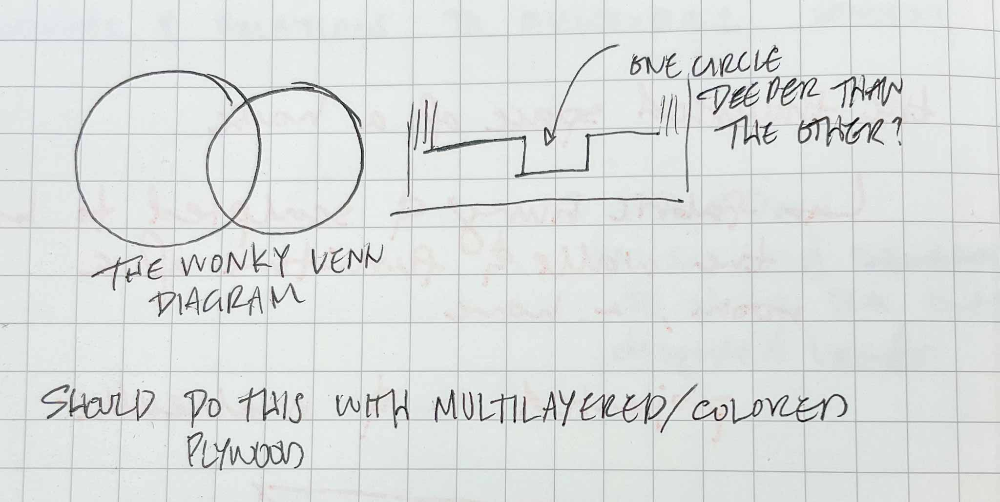

The plan: two circles in a Venn Diagram, one larger than the other. Nothing too creative, just a little test.

## Process

The raw material used for this exercise was a piece of ply (that I’m pretty sure came from last year’s class, The New Arcade).

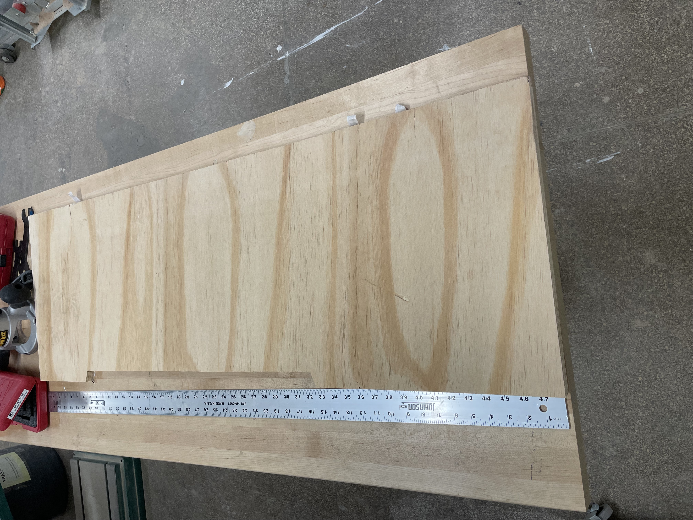

I drilled center holes a little small and used a mallet to tap in the dowels for a tighter fit. With the circle jig over the dowel, I took a first pass at a circle.

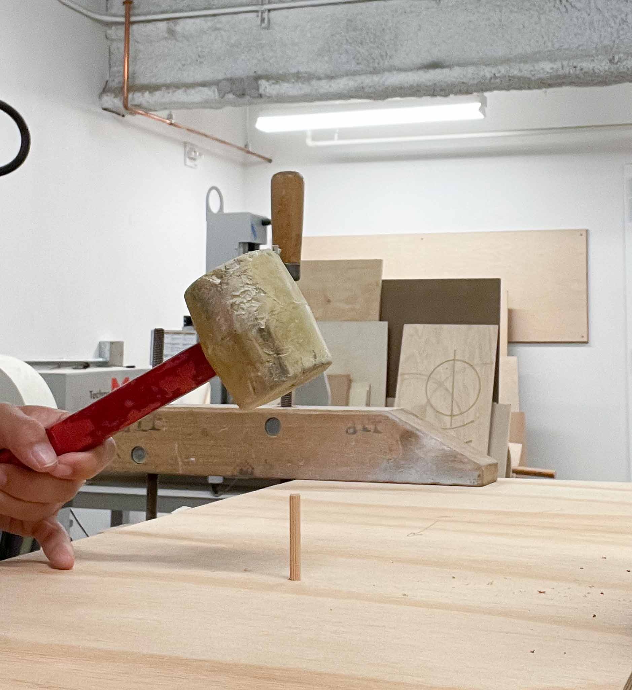

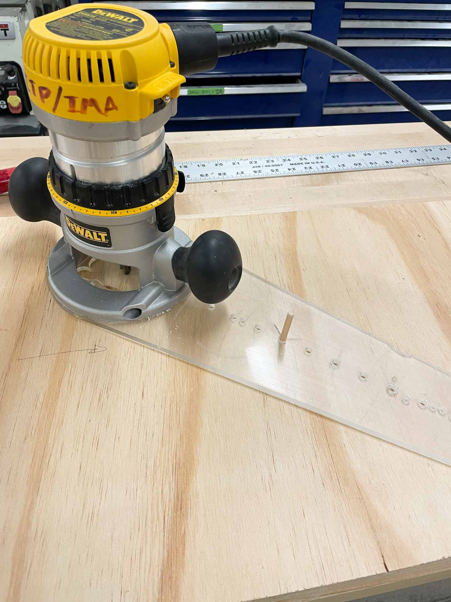

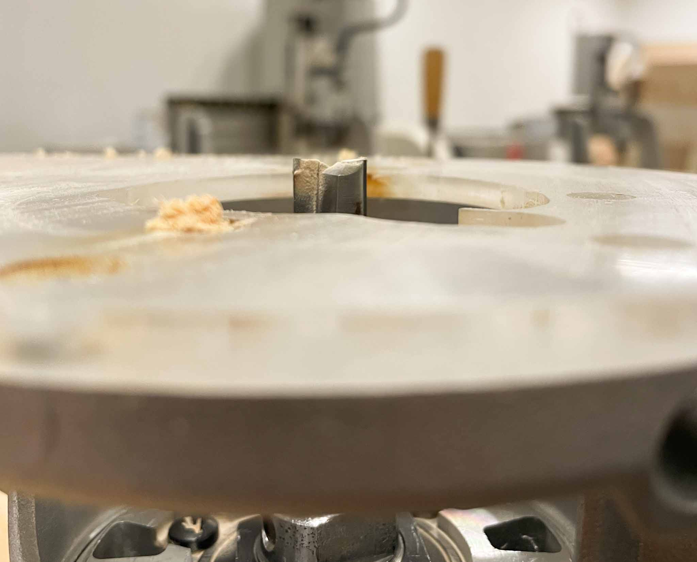

During my second pass around the circle, I noticed a burning smell and stopped the router. As it turns out, I had the depth a little too large, and was burning the wood (along with probably damaging the bit a little). In the photos below you can see those burn marks pretty clearly; the lighter side a much cleaner, nicer finish from a shallower cut.

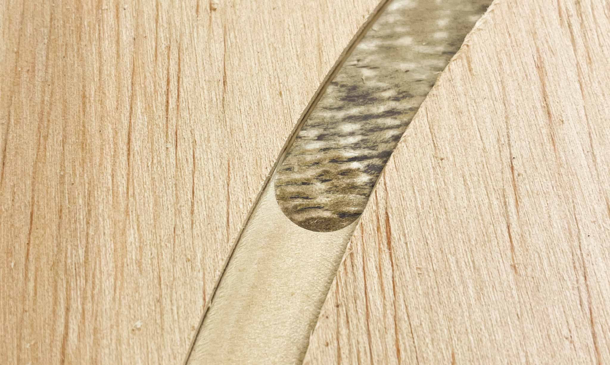

After finishing the first circle, I set another center peg and cut a second, smaller circle. This one I cut to a shallower depth.

One nice thing about doing it this way was that I could rest the router so the bit sat in the already cut space, which allowed me room to adjust the bit without turning the whole tool over.

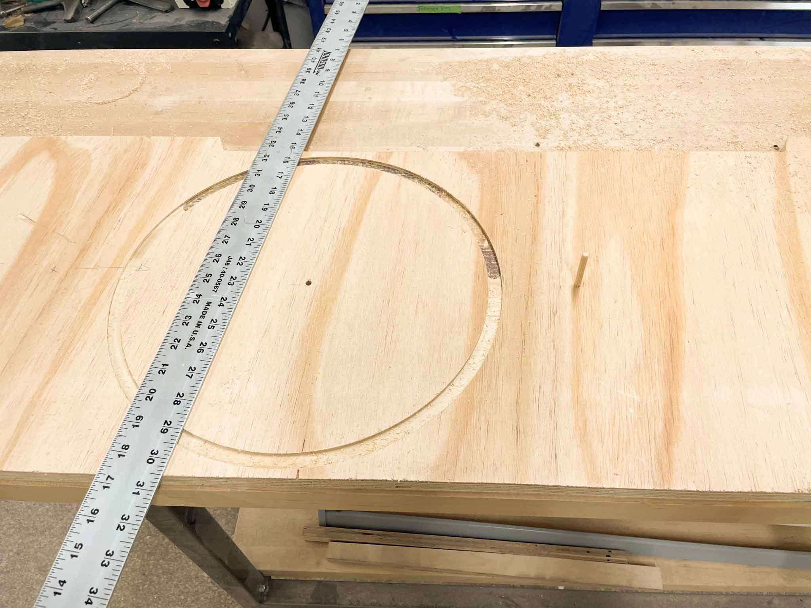

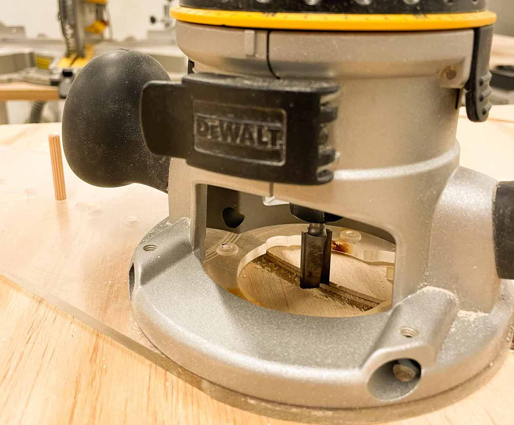

Tools used: handheld router, circle jig, hand drill, clamps, dowels, mallet.

## Final

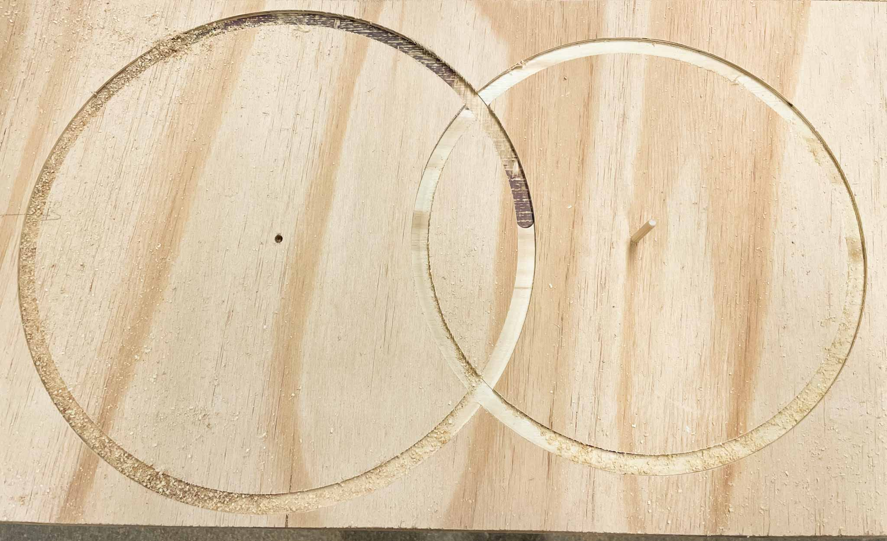

It’s a Venn Diagram! The wood burning marks left an interesting texture behind, and I’m curious how I can re-create it (without burning a bit, of course). I also didn’t deburr or finish the cuts at all, which .. well, for a skillbuild, seems alright.

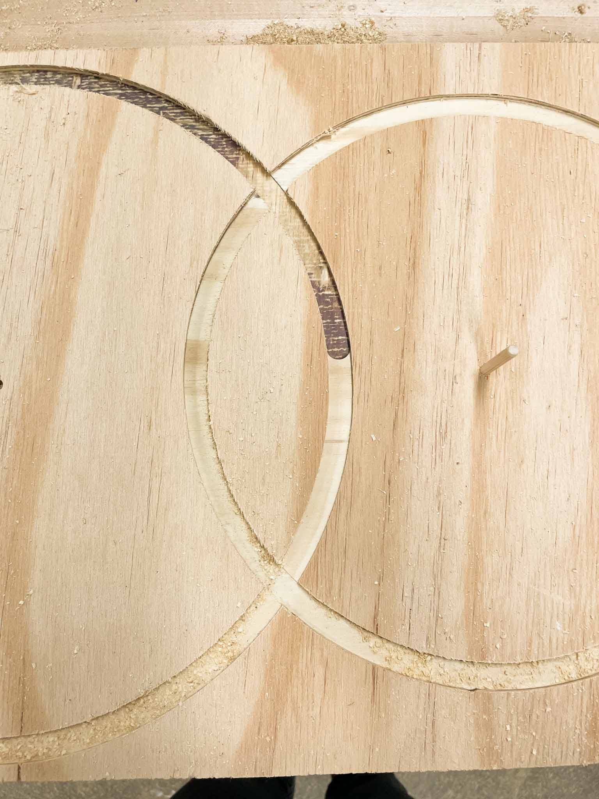

Learnings:

- Cutting too deep can leave burn marks and mess with the temper of the bit. Cut shallower than you think … my first pass was pretty good, but my second needed adjustment. The smell of burning wood keyed me into turning everything off.
- We might only have one router to work with. The second had some issues with crossthreading the collar, and I deemed it unfit to work with.
- This is, as with most woodworking, a dusty affair.
