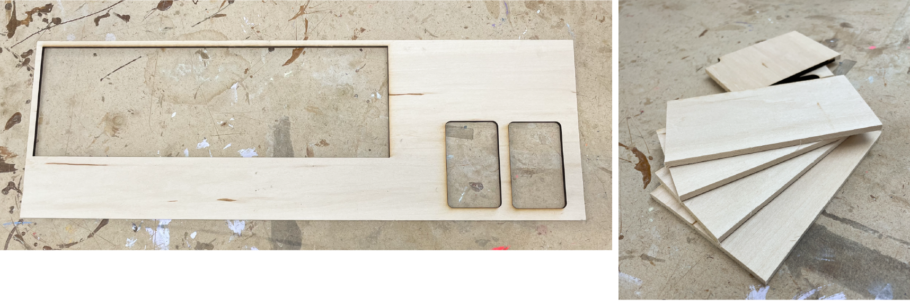
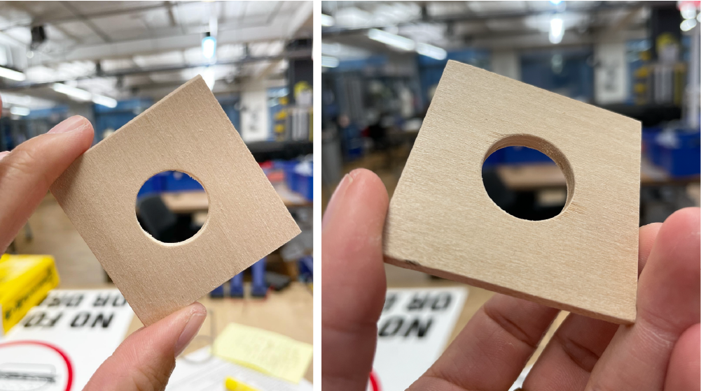
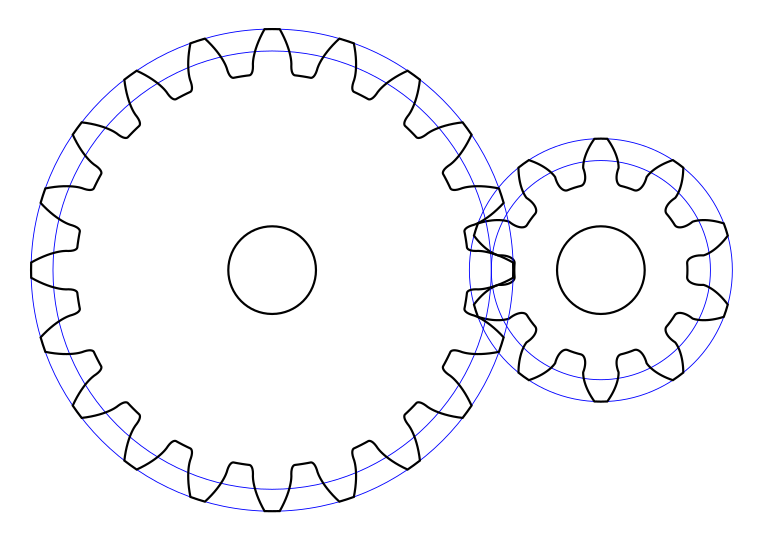
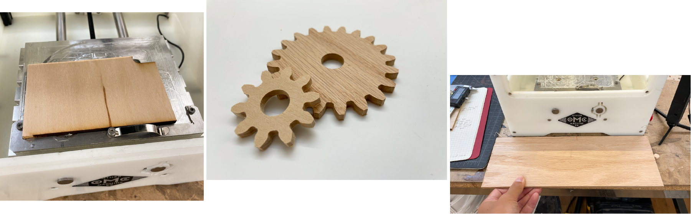
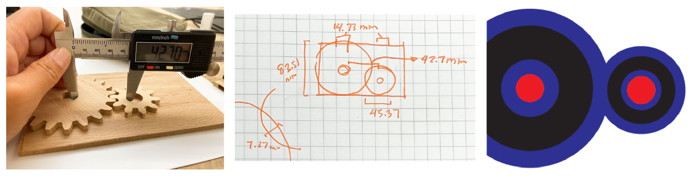
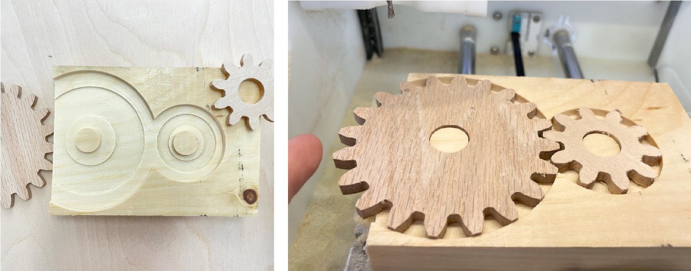
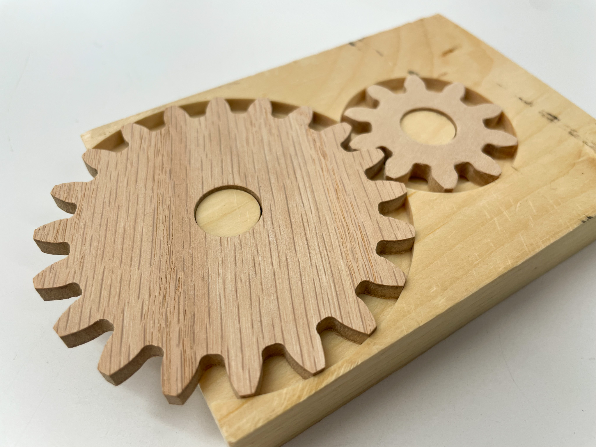

## Round 1 - Legacy Software Test

I worked with [Sammy](https://www.instagram.com/xx_napalmcutta_xx/) and [Lauren](https://www.laurenlumbra.com/) to do a simple first test, designing basic shapes in illustrator and cutting/engraving them with the Bantam. We “rescued” some used craft ply from the materials shelf and cut it down to size on the bandsaw.

Timelapse of our first test:

`youtube: https://youtu.be/z7tf4KhHvbA`

Each of us cut some simple geometry this birch ply, following the process of designing the part, measuring the material and attaching it to the bed with double-sided tape.

Here was my first wood piece off of the Bantam with some light sanding:

---

## Round 2 - Gears

I wanted to try making a few gears, having done them a few times before on the laser cutters and struggling with accuracy. I used this [spur gear generator tool](https://evolventdesign.com/pages/spur-gear-generator) to make some simple gears. I ran into a few issues here, as the SVGs generated by this tool both a) included extra lines and b) couldn’t be opened by Illustrator directly. I found a workaround using Inkscape to open the files, but had to copy the SVGs into Illustrator to then export them in the right canvas dimensions.

Here’s a screenshot of the original generated gear files. In order to work with them on the Bantam, I removed the blue lines and separated each of the paths into separate files (”axle” and “teeth” paths for both gears, 4 files in total).

`youtube: https://youtu.be/GrOkA57XIH4`

I cut these at 1.5x size, realizing that I didn’t have the right bit sizes for the interior corners (and that the generated SVGs were incredibly small).

After cutting these out, I decided that I wanted a stand for these gears. I grabbed a scrap piece of pine, and roughly sketched out this set of pockets.

The black circles in the diagram on the far right depict the inset pockets under the gears. This cutout is to reduce the friction on the gears as they turn. The left side of the larger circle is cut off; this is where the edge of the underlying wood will sit, meaning that the gear would stick out on the left side for easier access.

`youtube: https://youtu.be/O1Dzl9vyPXM`

This process was pretty painless. As seen at 0:07, I initially did a 1mm test to ensure that my dimensions were correct, dry fitting the gears into the shallow pocket. After confirming that everything was correct, I ran the pocket at a deeper engraving level, adjusting for the new (shorter) material height.

The deepest pocket was a different file altogether, and I had some difficulty getting it aligned. I’m used to Fusion360 where I can choose chained operations, and design the whole piece in one go. As you can see, the relief pockets are misaligned from the gear axles; luckily for me, their positions aren’t mechanically necessary, and I had a lot of tolerance.

After some sanding, here’s the finished object(s):

`youtube: https://youtu.be/92eSMp5BGbQ`

Tools list:

- Bantam PBC Othermill
- Double-sided tape
- 1/8” flat end mill bit
- 180 grit sandpaper

---

## Retrospective Thoughts

- **Struggle**: When trying to run the legacy Bantam software, we ran into issue after issue. First we couldn’t get the software working on Mac OS 10.7; on start, the app would hang and become unresponsive. We switched to a Windows machine on Windows 10, and there the Bantam software crashed the entire computer multiple times. Ben finally went and found a particular computer from the ER and set it up in the Metal Shop room for us to use.
- **Struggle**: Even with the right computer up and running, we found that the Bantam software had a tendency to error while doing the Z axis calibration. We kept getting the message “Oops, Bantam Tools made a mistake. Recovering …”
- **Lesson**: Some of the smaller cutouts went flying off the spoilboard towards the end of the cut. We realized that while our toolpath wasn’t digging into the spoilboard at all, it *was* cutting the tape that held down the wood. This meant our final pieces weren’t very well secured towards the end of the last pass. In later trials I gave everything a z-offset of .05, the approximate thickness of the tape.
- **Struggle**: While my own SVG seemed to load correctly, Sammy’s and Lauren’s both appeared to include paths that we’d thought were hidden in Illustrator. I didn’t have this issue on my own copy of Illustrator, so not sure what happened there.
- **Lesson**: At least on the free version of the Bantam software, there’s no way of adjusting or cutting off the tool path if the SVG defines an area that may run into the frame. I had to go back into Illustrator to remove the areas that were not actually on the material, which increased the amount/chances of misalignment.
- **Struggle**: I ordered some Delrin from McMaster Carr to cut the gears out of, but when they arrived the sheets were warped. I have replacements coming in, but they didn’t ship in time for this week’s skillbuild. I’d like to learn how to flatten these sheets to avoid this issue in the future.
- **Discovery**: At least for this very light Birch ply, Sammy was able to use the 1/8” mill on the ‘generic’ setting and it still seemed to cut fine.
- **Question for later**: When you’re relying on a milling process for its precision, how do you take into account finishing processes and the amount they may change your dimensions? For instance, how much does sanding really take off of a piece? How little is “negligible”?
