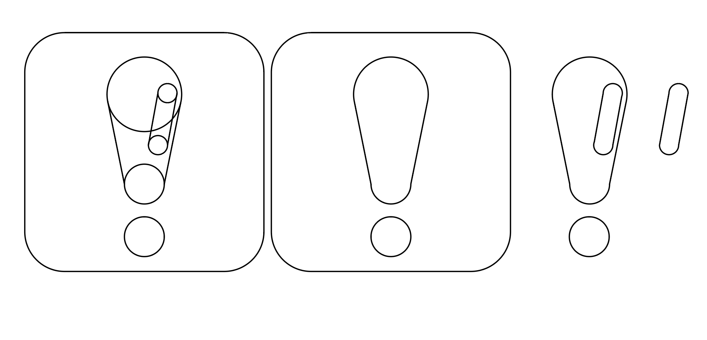
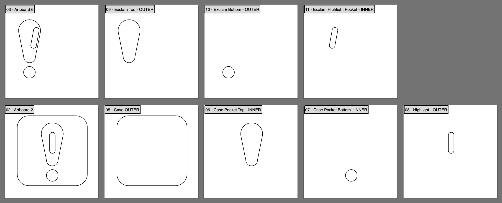
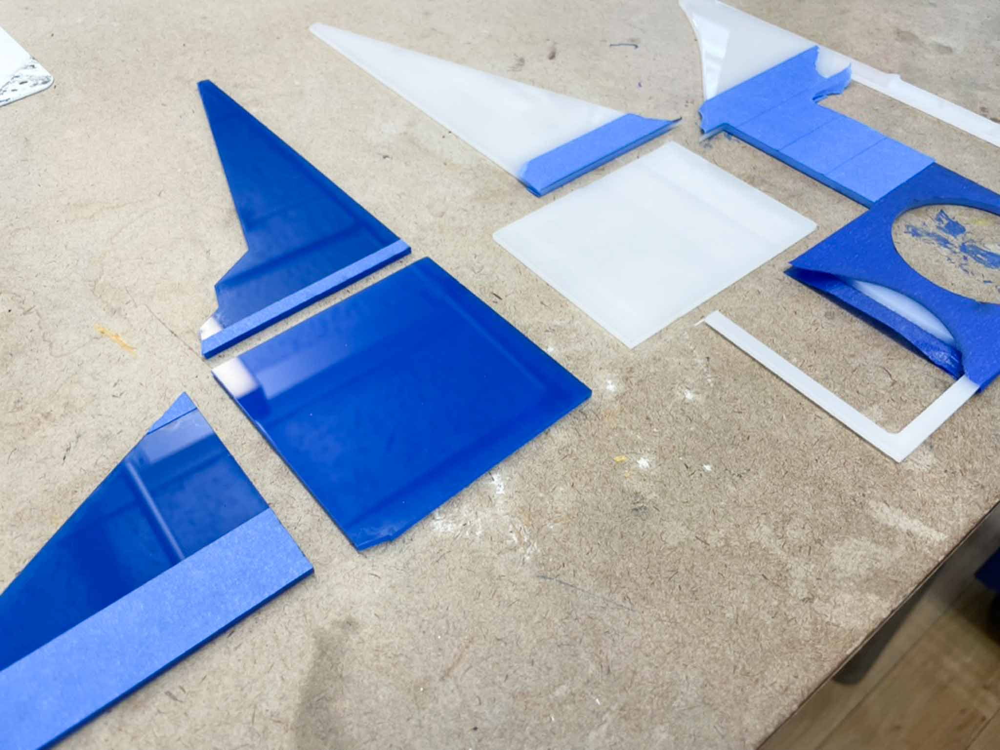
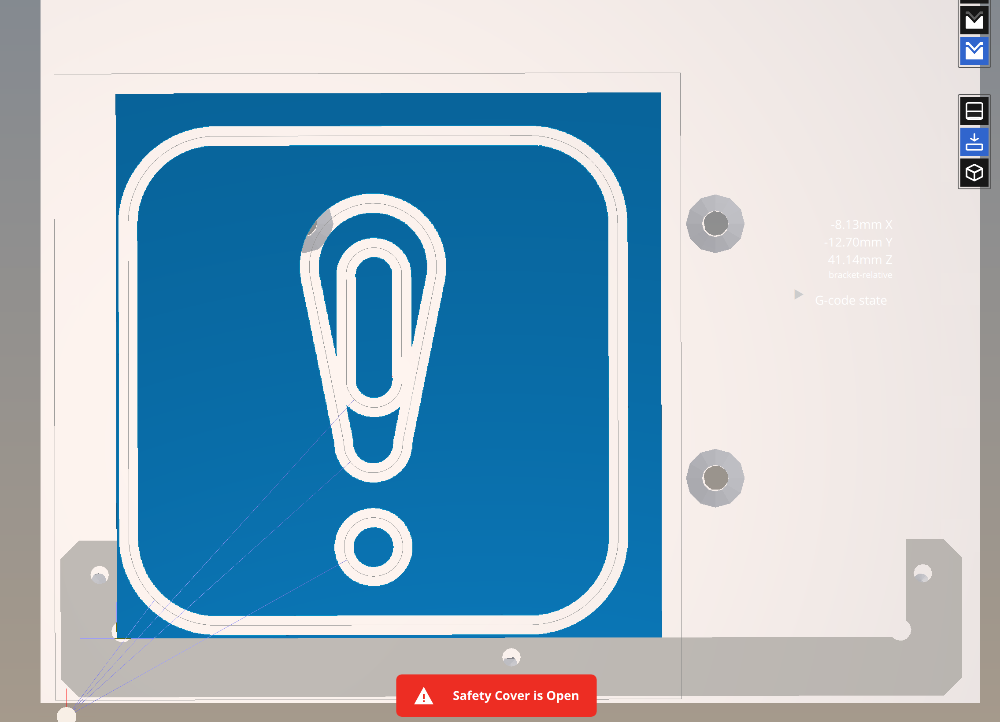
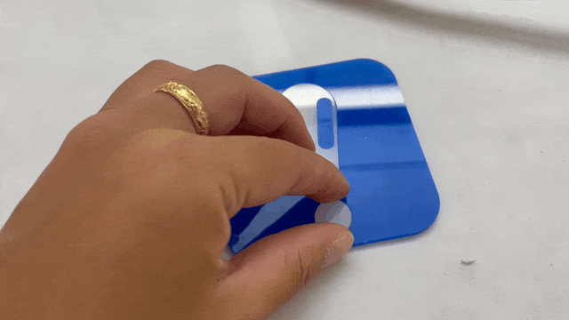
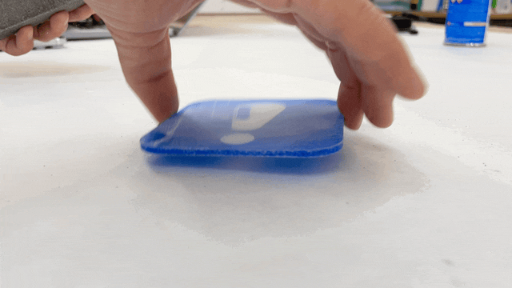
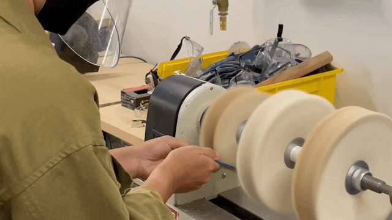
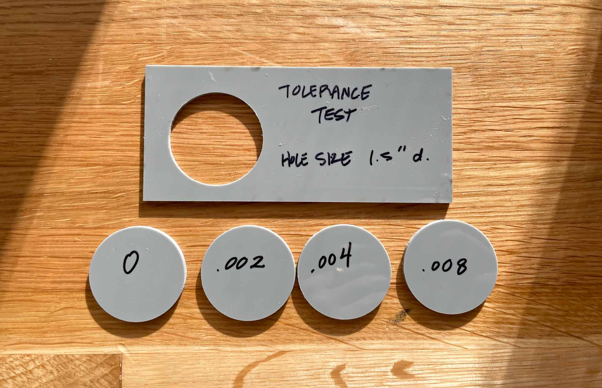

This week on the Bantam, I tried 3 new things:

1. Milling & gluing acrylic
2. Aiming for a press fit
3. Sanding and finishing acrylic

I aimed to recreate the snap/press fit demonstrated in class, so I created a simple design with no sharp corners. In Vectorworks, I drafted this:

Which I then broke out into individual cut paths in Illustrator. In the image below, the top row is intended to be cut in one color, while the bottom row is cut in another. The first image on the left of each row is the final cut piece, and each artboard following is an individual cut. Each artboard was labeled with “INNER” or “OUTER” to indicate what type of cut should be made.

I then rescued some acrylic from the scrap shelf, and cut out some 4x4” squares on the Epilog.

And milled out the shapes. I really disliked milling in acrylic, as I found the shavings difficult to clean up and stuck to everything. I ended up using extra tape to try and pick up the shavings left over on the bed.

`https://youtu.be/etXq1FGldT4`

After milling these pieces, I fit them together and glued them in place. Unfortunately I must have gotten the tolerance wrong, because the fit was way too loose.

<!--  -->
https://media.giphy.com/media/uqoUpllY0INSTCGFkx/giphy.gif

The acrylic weld worked to hold the pieces together, despite the gaps, so I proceeded with this piece anyway. In the right-hand picture you can see both the light leaking through the gap in the gluing, and a bit of the writing that the glue picked up from the scrap metal I’d used underneath it.

`https://youtu.be/1Uw4B2RUboY`

I sanded from 220 to 1000, until the piece felt good to the touch (which was actually a mistake). Then, I took it to the lathe for a wax buff.

<!--  -->
https://media.giphy.com/media/jA50snDDUYmVrf21x0/giphy.gif

<!--  -->
https://media.giphy.com/media/f8tT5557Fm1D95HETI/giphy.gif

This is where I realized I’d made an error; I’d relied on touch to tell me if I’d sanded well enough, but not actually cleaned the piece or visually inspected it between grits. I’d sanded scratches into the piece that I couldn’t feel, and doesn’t seem to have affected the *feeling* of the piece, but are definitely visible.

---

As a follow-up, I also did some tolerance testing to just see what each level of tolerance would feel like for my acrylic cuts. The exclamation point was cut with a 0.004” tolerance, but that felt too large.

I tested 0 to 0.008” tolerance, and ended up liking 0.002” best. I did happen to buy new bits, so I wonder if the tolerances need to be different on older bits vs. newer ones. Even the 0.002” tolerance felt a bit looser then a snap fit, so I might try 0.001” in the future.

---

### Tools/Software:

- Vectorworks
- Illustrator
- Epilog 60W Laser
- Bantam PCB Othermill
- 1/8” and 1/16” Flat End Mill Bits
- Sandpaper 220-1000
- Wax Buffing Wheel

### Materials:

- Scrap 1/8” Acrylic
- No. 4 Acrylic Weld

### Takeaways:

- **Learning**: By separating out each cut path onto its own artboard in Illustrator, I can batch export the whole set of paths without laboriously showing/hiding each one for individual export. I can also label each cut path for inner vs outer cuts, making for a more foolproof workflow.
- **Struggle**: Sanding is, as per usual, my enemy. I needed a lot more patience with my sanding, and the proof is in the piece.
- **Struggle**: Small imperfections in the design led to confusing assembly; the top part of the exclamation point is not exactly symmetrical, as the lines that lead from the top circle to the bottom don’t define a precise point to connect. This led to some discrepancies between the insert and the hole. In the future I’d be more careful with the design to avoid this.
- **Struggle**: Somewhere in the translation from Vectorworks to Illustrator, I’d forgotten whether I’d done the slight offset for all of my inset pieces, and may have doubled it.
- **Struggle(?)**: In the gluing process, my piece picked up the imprint of some text that had been printed on the metal I was using as a scrap surface. I never quite got rid of it. Kind of interesting though.
- **Learning**: Tolerances are difficult to get right. Test pieces are key here, especially as I try different materials and workflows.
