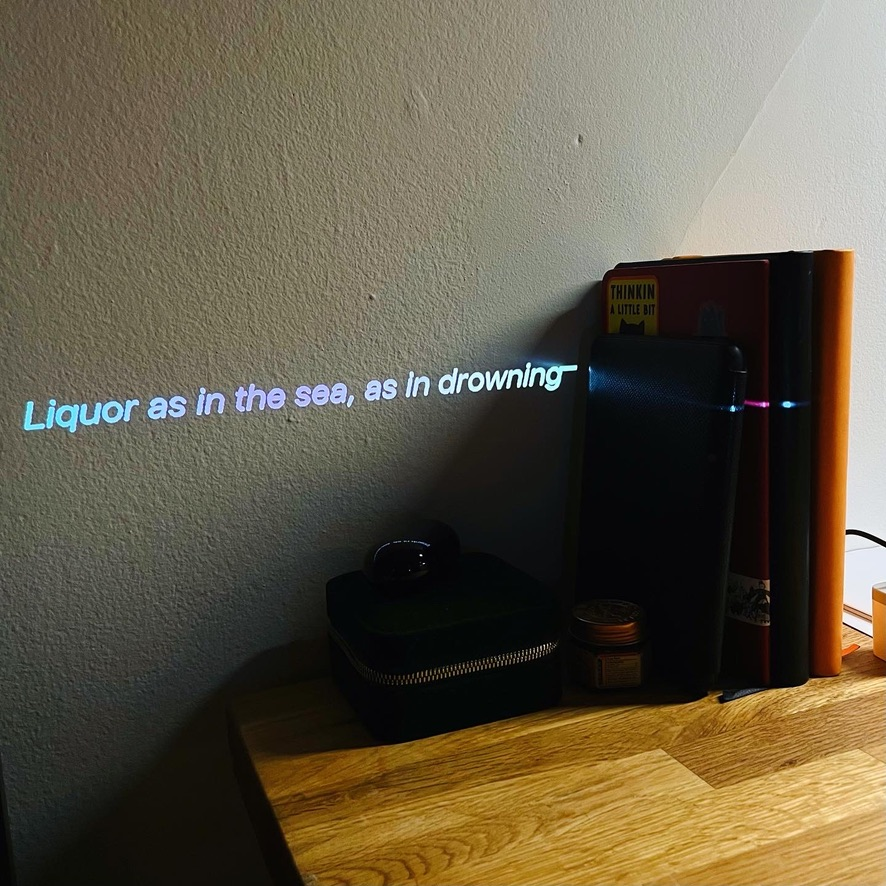
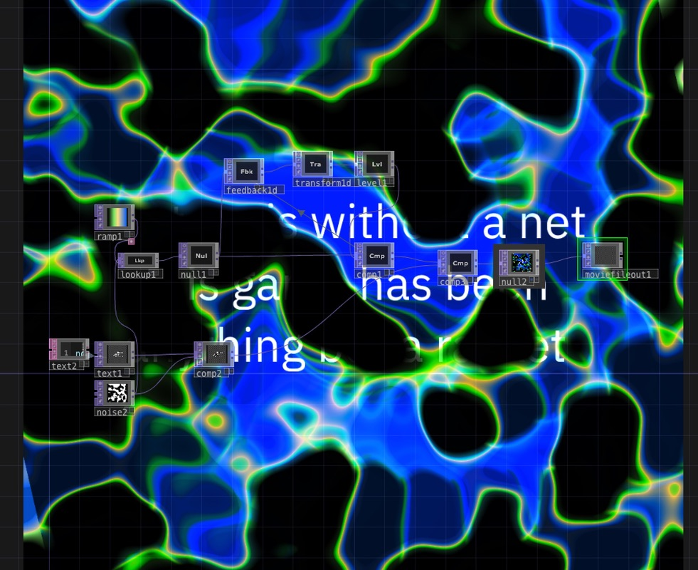

Over the course of 7 weeks over June-August 2022, I joined a cohort of ITP and ITP Camp students in a 49 day challenge to thematic work every day. For 49 days I worked with words; writing prose, poetry, and embodying words in visual or interactive media.

All of the writings created for this challenge (42 in total) [can be read here](https://docs.google.com/document/d/1P34_8vXNXSsBtLgAt6PceGhSbBgbVaDttyu9LQNwaX4/edit?usp=sharing).

The piece below is entitled **Retrieval-Induced Distortion**, best viewed on desktop. 
<iframe 
    width="300"
    height="400"
    src="https://leils.github.io/telescopic-poems/21_26-01.html">
</iframe>

The rest of my interactive browser-based poems are viewable here at [https://leils.github.io/telescopic-poems/](https://leils.github.io/telescopic-poems/)

What you see below is the culmination of those embodiments; a few highlights of this challenge.

https://youtu.be/MTFJdHixIGY

### Reflection

I came out of this a lot more confident in playing with words and meaning. I enjoy the body of poems that I created, and believe that there are gems within it to continue my work from. Posting publicly (whether through Instagram stories or posts) kept me accountable in creating things in high volume, no matter the quality, and through experimenting in quantity, I was able to familiarize myself with tools much more quickly. Tool acquisition and comfort working with words were my two top goals for these 7 weeks, and I felt that I achieved both of these.

I somewhat regret choosing such a broad range of possibilities. While I think this aided in my ability to complete all 49 days (excepting for one sick day), in the future I’d like to narrow further down to a singular tool or idea; to iterate on and familiarize myself with a smaller space.

## Tools Used

- [Touchdesigner](https://derivative.ca)
- [Telescopic Text](https://github.com/jackyzha0/telescopic-text)
- [Twine](https://twinery.org)
- [in:verse](https://inverse.website)
- [coem-lang](https://www.coem-lang.org)
