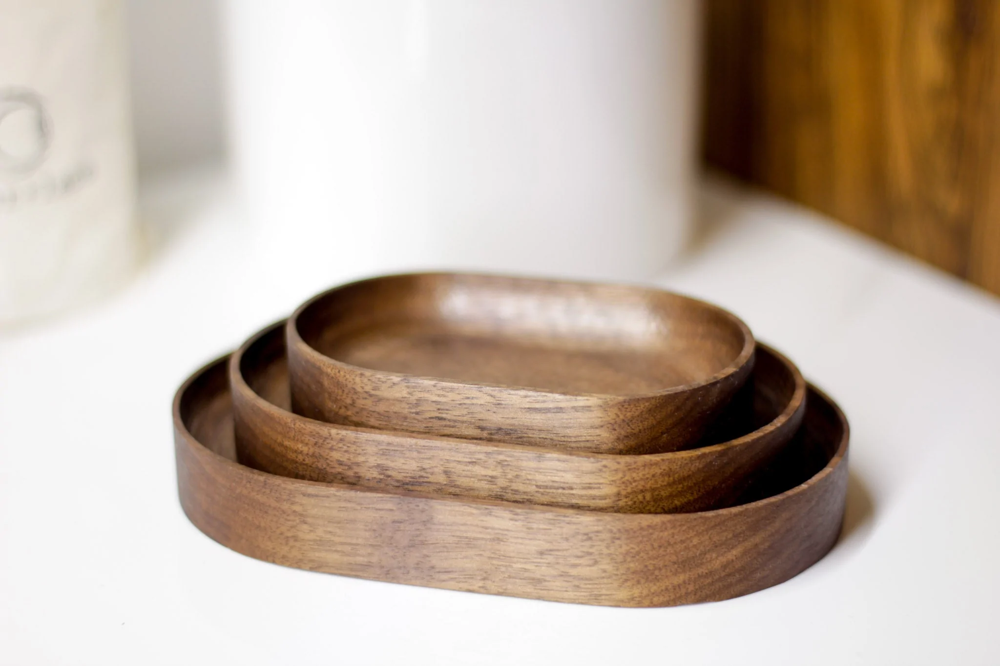
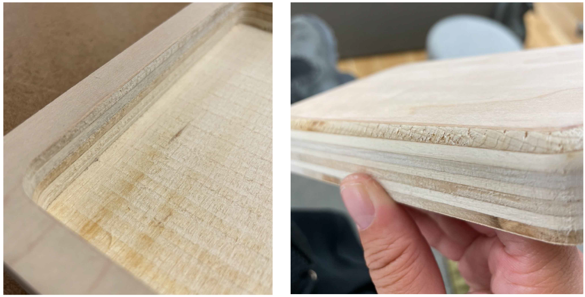
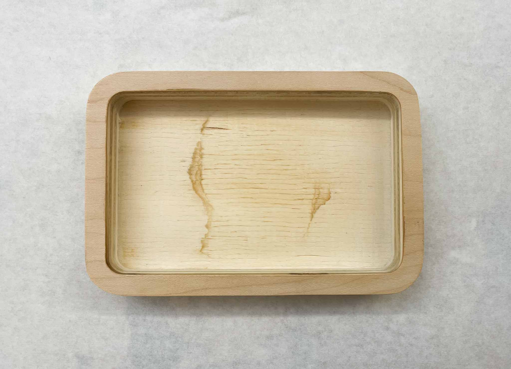
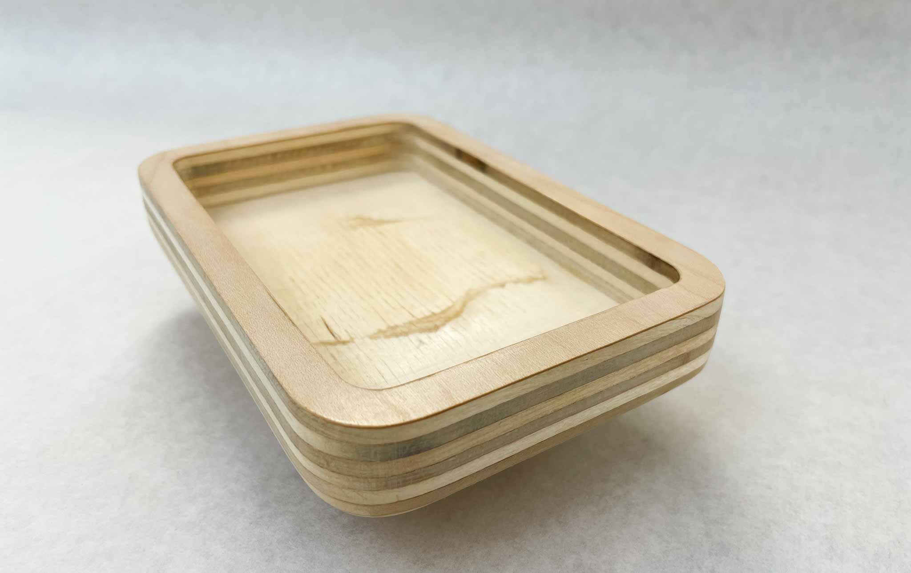
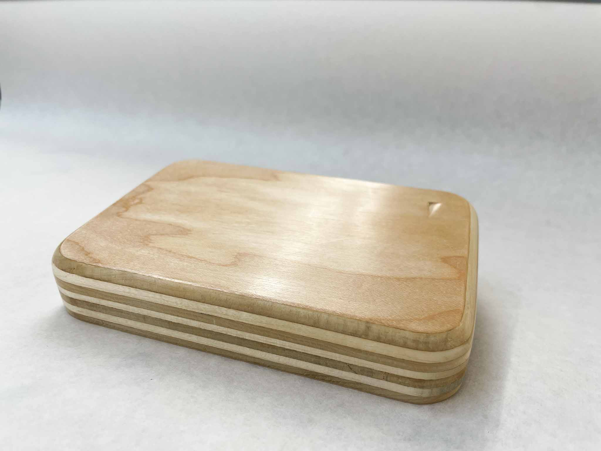

Inspired by these [Thing Spots](https://biglowwoodcraft.com/en-us/products/thing-spots), I decided to mill out a simple tray.

I found this solid piece of 1-inch thick ply in the “scrap” pile to work with, and sketched out a quick rounded-corner rectangle design. I kept the design super simplistic for this skillbuild, just to get some quick practice in before the shopbots got entirely bogged down.

I had some difficulty translating from Vectorworks to Mastercam; I kept loading files that were completely empty. After some trial and error, I realized that exporting as a 2010 file vs. a 2014 file made a difference.

 https://media.giphy.com/media/n5fNAibSgqc0J8qqnh/giphy.gif

After cutting on the Shopbot, I rounded the bottom edge at the routing table with a round-over bit.

`youtube: https://youtu.be/MEemjf3YcJI`

Two things left behind by the milling and routing; some tool marks on the bed of the pocket, and some rough tearout on one side of the contour. My best guess is that on this side the cutting was going against the grain of this particular wood layer.

Also, later images show a little ding in the bottom corner; I didn’t check my material closely enough before I cut it out. Should have looked at the bottom!

I took some extra time this round to make sure to sand a good amount; this time from 220 to 600. I wet the wood a bit as I sanded it as well to try and raise the grain; I don’t know exactly how much it changed the outcome, but it definitely made the sanding less messy.

https://media.giphy.com/media/N126Zyg7yRISx2KZY5/giphy.gif

After sanding, I took it to the waxing wheel to buff and polish.

https://media.giphy.com/media/JFh4gy5cznbzFgbdmP/giphy.gif

Here’s a big takeaway; the wheel (being round) actually has a really hard time getting into the corners of a piece like this. I ended up with a really ugly pocket bed, where the center was waxed & buffed & smoothed, but beyond that it was basically unfinished. I’ve changed my plans and will be cutting some material (maybe felt or cork) to cover up the inside, but in the future I might want to round the inside pocket edges to account for this.

In the end though, I really loved the effect the wax wheel gave the wood, and will definitely be using this finish in the future. Meanwhile, the tray fits my glasses well, and will be a great place to drop my keys and other pocket treasures.

---

### Tools/Software:

- Vectorworks
- Illustrator
- Shopbot CNC Mill
- 1/4” Flat End Mill Bits
- Hand Router
- Round-over bit
- Sandpaper 220-600
- Wax Buffing Wheel

### Materials:

- 1" plywood

### Takeaways:

- **Question**: Is there a way to estimate the time a cut is going to take? In helping others, I found myself often telling them “That preview is taking an extremely long time … most of the previews only take a few seconds, so this might take way longer than you think.”
- **Question**: Is there a way to make a contour or pocket cut *on* the path instead of inside or outside of it? Several people wanted to do bit-width pockets tracing a path.
- **Question**: How do I change the jog speed? I had some difficulty getting the bit to just “kiss” the material during Z-axis zeroing, and watched as several people ended up digging the bit into the top of their material (or worse).
- **Struggle**: The screws that we have stocked are *not* provided in lengths meant for 1-inch thick ply. I had to send someone upstairs to rummage through the screw pile in order to grab some longer screws; those screws are now stored safely away at home for my future projects using this thickness of material.
- **Learning**: I need to make sure to match my piece design and my finishes to ensure they actually work together! One more piece to add to the designing puzzle.
- **Learning**: At least for the version of MasterCam that we’re using, we need a 2010 dxf exported from Vectorworks.
- **Learning**: Look at the front *and the back* of your raw materials.
