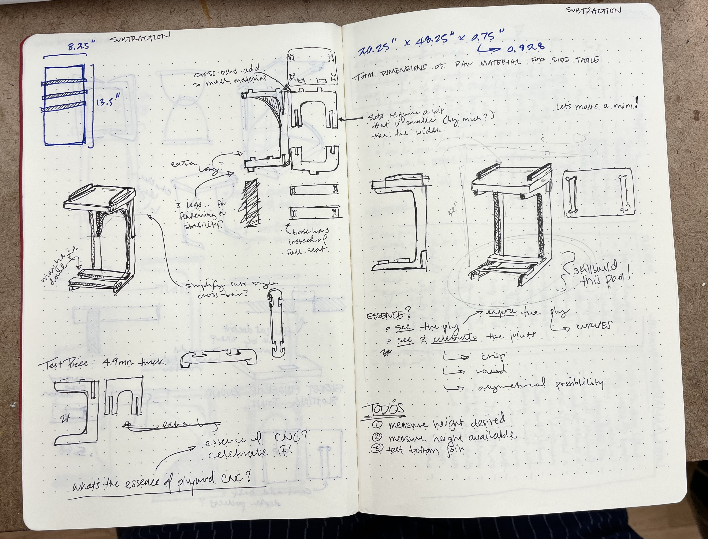
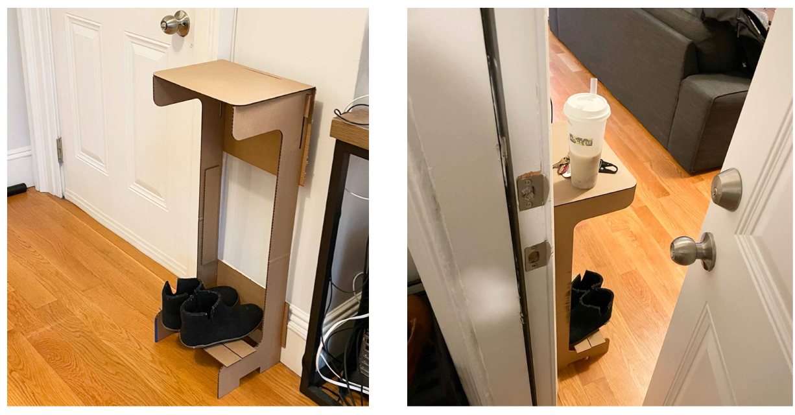
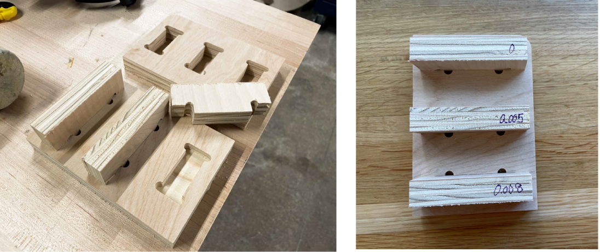
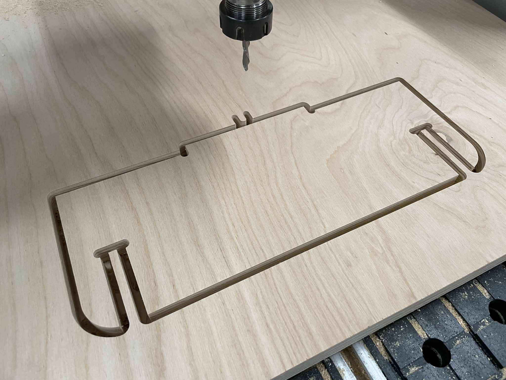
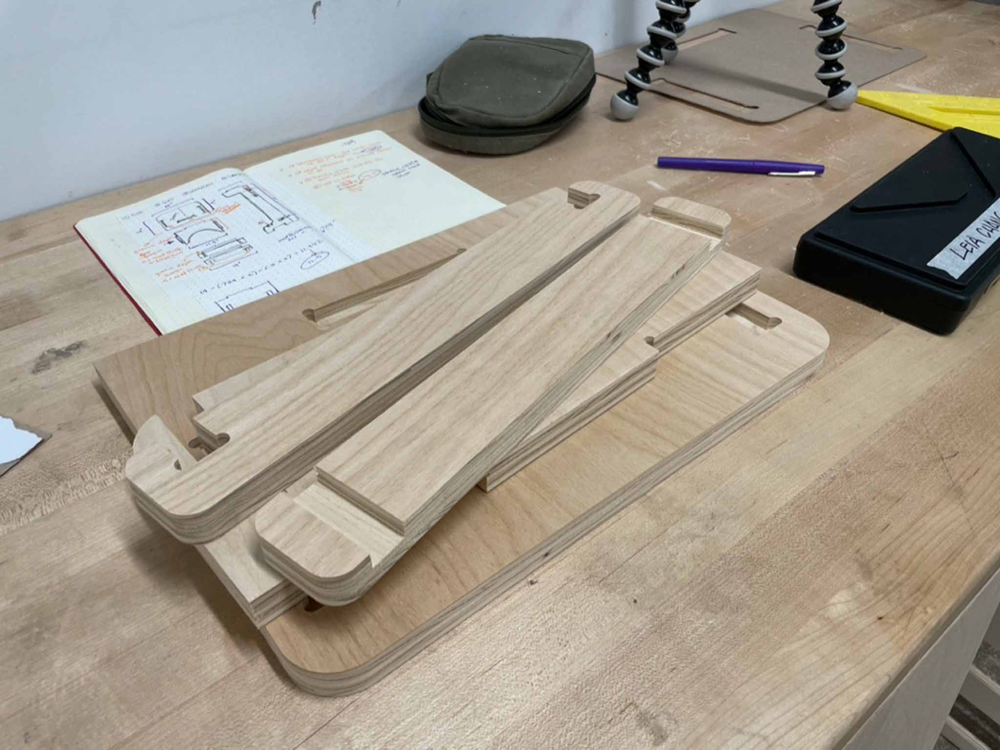
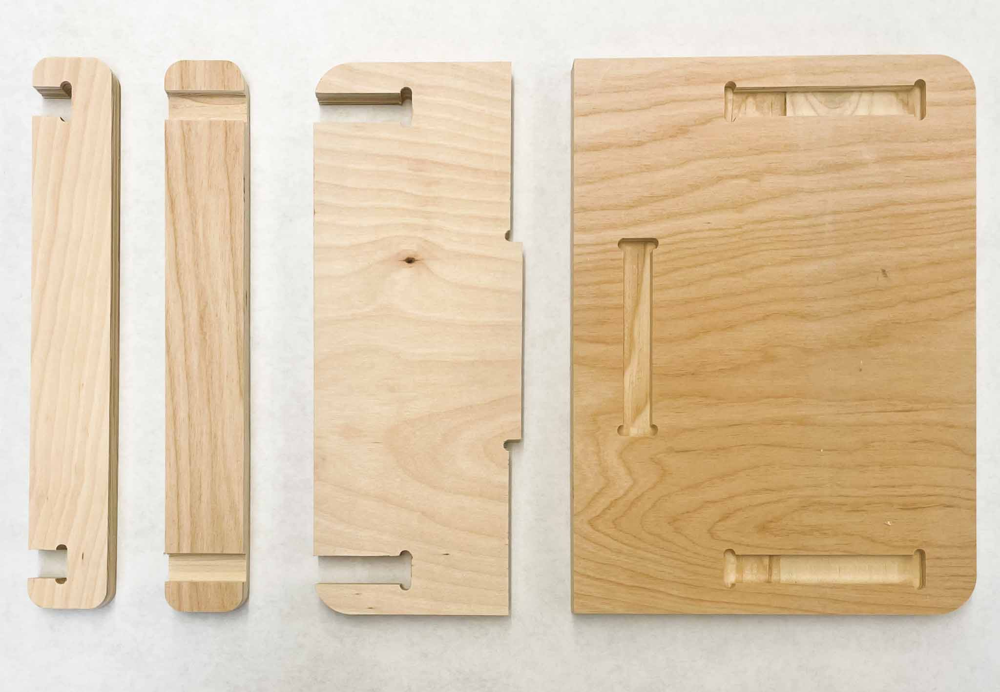
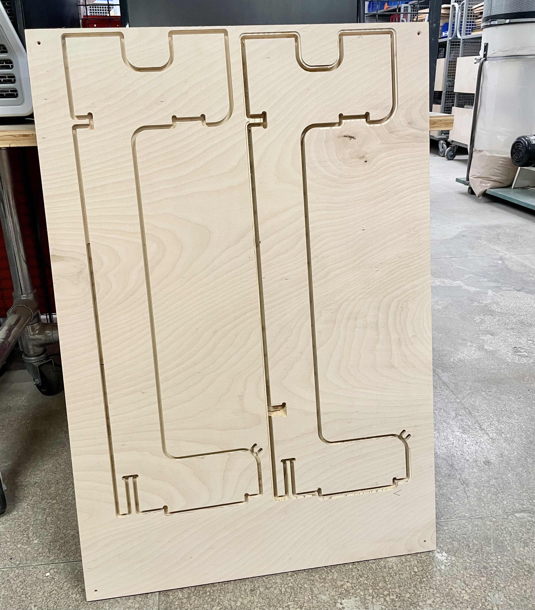

[Check out this latest update for my CNC table!](https://www.leiac.me/2022/2022-11-30_cnc-table/)
I want a side table as a catch-all table by my front door. It’s a narrow space with a few requirements:

1. Fits in this area (14 inches wide) without intruding on the entry path
2. Easy to reach from outside the door, to place keys/mail while I take off my shoes
3. A shelf along the bottom to hold my indoor slippers while I’m not home, or my backpack when I get home.

I took inspiration from this render:

## Sketches

I made a few sketches, and decided on the joints to use. I used [last week’s joinery test](https://www.leiac.me/2022/2022-10-05_cnc-joinery/) to test dogbone placement, and decided to put the circles on the long sides of the cuts.

### Cardboard Prototype

I had a hard time thinking this on paper, so I took the suggestion to make a cardboard prototype. This was cut on the 80W laser from some conveniently large cardboard, and assembled with hot glue. At first it was very precarious, but some width-wise support added to the back prevented the whole thing from skewing sideways.

Learnings I gained from this prototype:

- Increase the top to be a full 14 inches wide, to use up the whole space.
- Definitely add a cross-brace in the back.
- Spread out the beams on the base for a greater resting area
- Add overhang in the back to span the gap caused by baseboards

### Fusion 360

After living with the cardboard prototype for a few days, I spent way too long designing this thing on Fusion360. I designed the whole thing based on set parameters, and constrained it so I could change measurements when needed (such as material thickness, leg height, and tolerance).

While doing this, I also designed a tolerance test to run once I got my material, so I could test it all with the correct setup and update my numbers as needed.

## Material

I bought a 4x8’ sheet of 3/4” 5-ply Canadian Birch, pre-cut into 4x3’ pieces to be broken further into 24x36” pieces to fit the ShopBot bed sizes.

## Fabrication

A couple of wins, a couple of losses. I laser-cut some cardboard templates, cut my board, set it up on the CNC, and milled out my tolerance test. After tapping in all the pieces I went for a .005” tolerance, and updated my file accordingly.

Then I went to cut out the final pieces. The back and bottom slats were cut out without a hitch.

When attempting the top piece, the CNC slipped in Y-alignment and started the second pass way too high. This ruined my plans at maximizing the usage of that plywood, but I dismissed this as a ghost in the machine.

These pieces that did cut seem to be successful. I’ve run some shallow dry fits of the joints and everything seems to be working great; I haven’t slotted them all the way together, seeing as it might be hard to get them apart again for finishing. I’ve measured a bit and some of the tenons for blind joints might be slightly long, but that’s nothing a little sanding (or planing?) can’t handle. I plan on sanding the individual pieces down and finishing with Danish oil.

Cutting the legs was where it really went haywire. I started off with 32.5” tall legs, which pushes the limit of the bed. In my first tests last week the head was able to reach that length, but this time I had a lot of issues just running the cut in the air. I shrunk it down to 28.5” and was finally able to start cutting, but the machine started slipping the Y-axis more regularly and ruined the cuts.

I thought at first I’d made some wild mistake with MasterCam, but after this I confirmed two other students also were seeing this issue, and I shut the machines down.

https://media.giphy.com/media/qKi0iqwUTQ0LQdfBrY/giphy.gif

The mis-cut legs may still be salvageable. One of them has a joint cut in the wrong place that makes it a bit disappointing, but I stopped the machine before the other cut went fully wrong. I’m thinking of trying to hand-route out the pieces using the already cut lines as a template to follow, but haven’t managed to find a 1/4” diameter bit to do the job (as far as I can tell, template-following bits are most often 1/2” diameter). I may try to do the big bits with the 1/2” first.

These legs would still a full 4 inches shorter than I originally wanted them to be, but maybe that’s a sacrifice worth making in order to not waste the material.

## **Tools**

- Shopbot CNC
- Epilog laser cutter
- Autodesk Fusion 360
- 5-ply birch plywood

## Takeaways

- Sometimes it’s better to hand-sketch and haphazardly prototype before turning to CAD. My brain needed to slow down in order to get the dimensioning right, and then translating the design to CAD was much easier.
    - I also learned more about how to assemble pieces in Fusion, which allowed me to do that lovely rendering above.
- When CNC work is going smoothly, it’s incredibly satisfying. When it doesn’t, it can be incredibly frustrating.
- Doing a tolerance test & updating numbers right before the final cut was extremely useful.
- When in doubt, shut the machine down.
