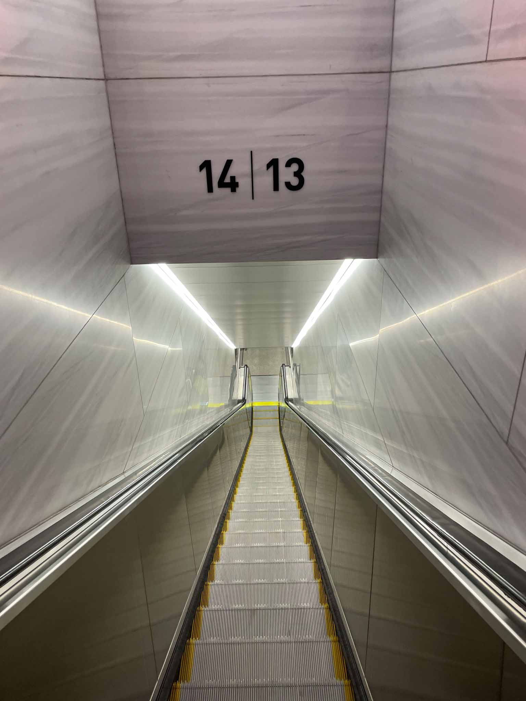
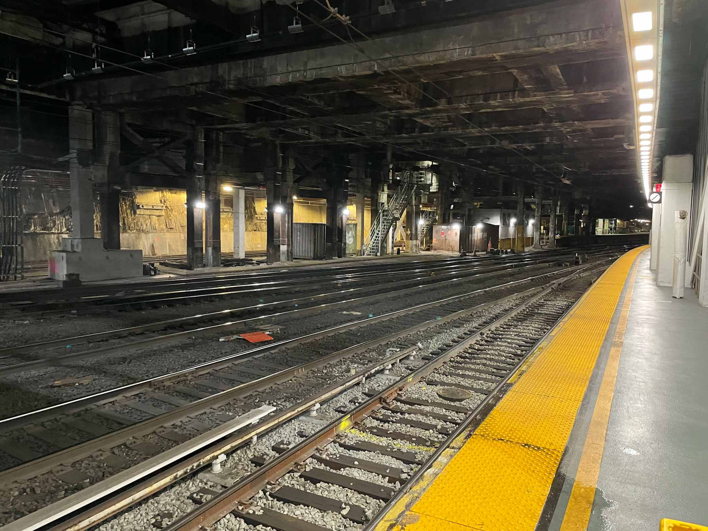
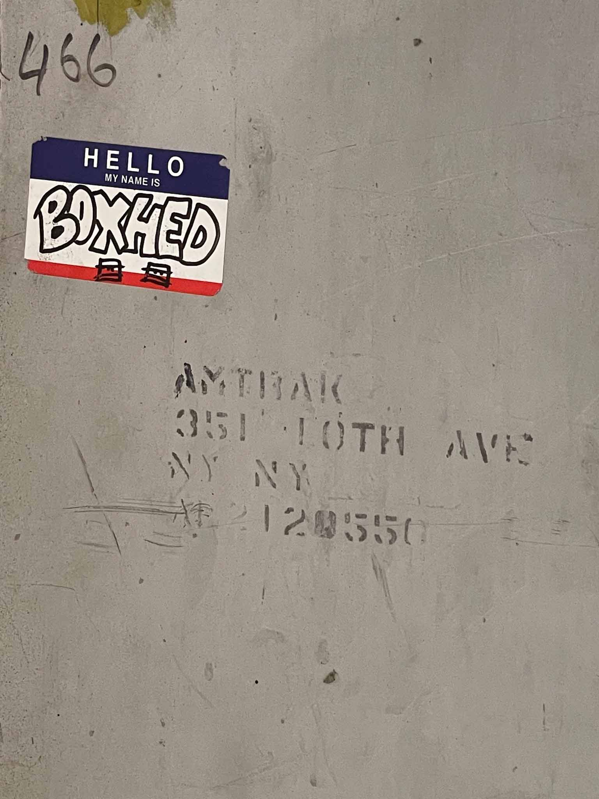
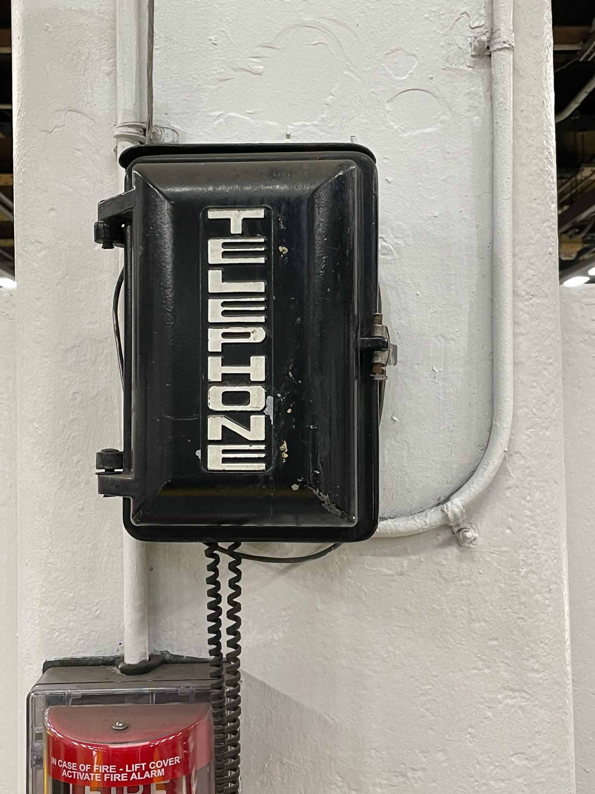

```
Assignment.
Work as a solo artist to create a Space Becomes Place Installation for a classmate to
experience IRL.
You will seek a found Space and transform it into a Place.
R&D

1. SCOUT- Go out into the world (safely) to choose an IRL site
 Seek evocative atmosphere & narrative potentiality- a site ripe with possibility for
response or interrogation. Choose a Space that conjures a sense of Place.
2. TAKE TIME TO WITNESS YOUR SITE
 Take field notes
o What do you see? what story does the space tell you? What is its dialect?
o Note any found objects, human tagging, energetic residue. Let them to
talk back to you about their secret life in this place.

3. IDENTIFY NARRATIVE POTENTIALITY
 Document: Snap 4 raw documentation photos of 4 compelling found
compositions you see that already exist without your intervention (for ex:
amidst architecture, object, figure, light, image)
Create an Installation

1. STAGE 4 TABLEAUS
 Style/Fabricate the 4 found compositions using only what is already onsite +
whatever you have on your person.
 Explore scale & proximity/distance.
 Document: Snap 4 photos that capture the 4 staged tableaus. (proof of concept)
2. CURATE A JOURNEY for an intended viewer
 Feature your 4 tableaus on this journey
 Define its beginning & ending. Curate a clear and compelling "entry" & "exit".
 Let music underscore this journey
 Feature recorded sound of you speaking any favorite excerpt(s) from your field
notes, treating as "found" text as you artfully repurpose your language.
 The whole journey should be 2 minutes in length.
Don't overthink.
Go with your gut.
Act on your impulse.
This is an exercise in creation led by listening and responding.
```

This week, I created an experience in the Moynihan Tran Hall, Platform 13.

The thing that struck me about Moynihan train hall was the stark difference between the waiting hall upstairs and the platform downstairs. The large-scale, open, lit area above feels extremely modern and polished, to the point of sterility. The train hall below is dark and cavernous, with screeching sounds of trains and constantly moving people.

Julia experienced my curated path on a rainy day. It wasn't by any means perfect, but it sure was interesting.


`https://youtu.be/v-fP7C0jNAU`







## Lessons: 
- Wayfinding is a difficult task, and takes a lot of thought.
- Spaces can change! One of my original chosen tableaus disappeared overnight.
- Don't try to film and send instructions at the same time.
