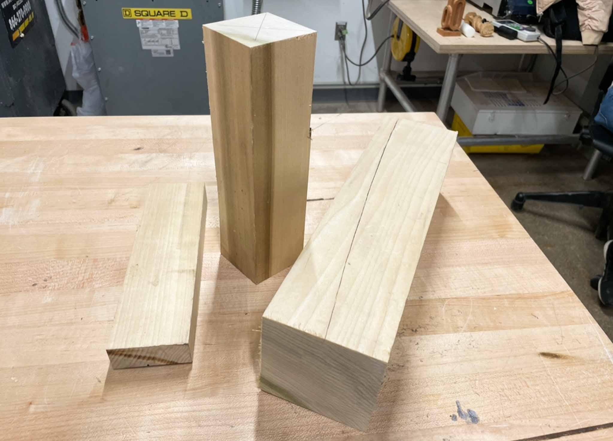
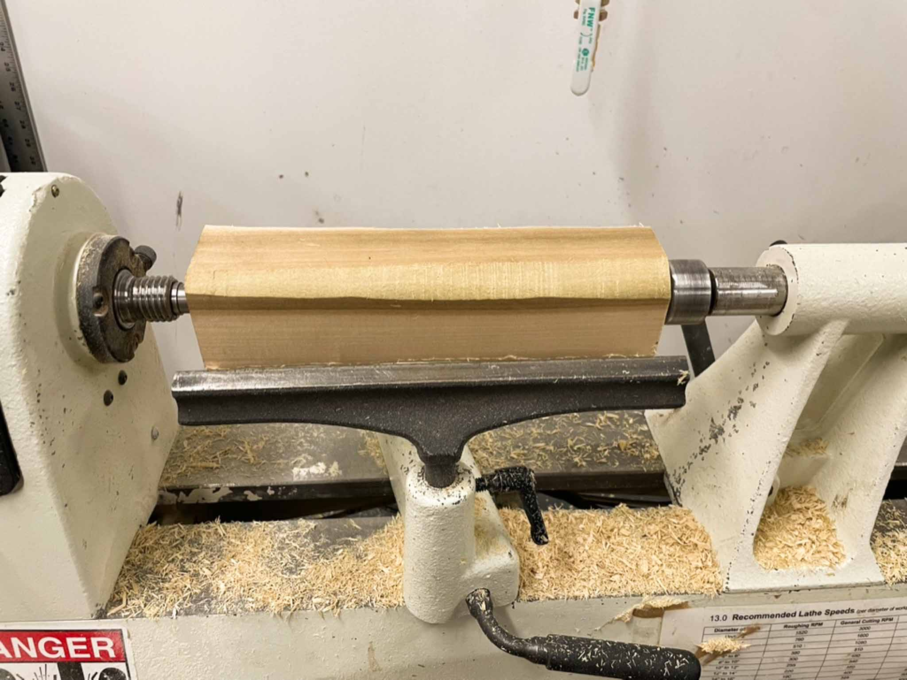
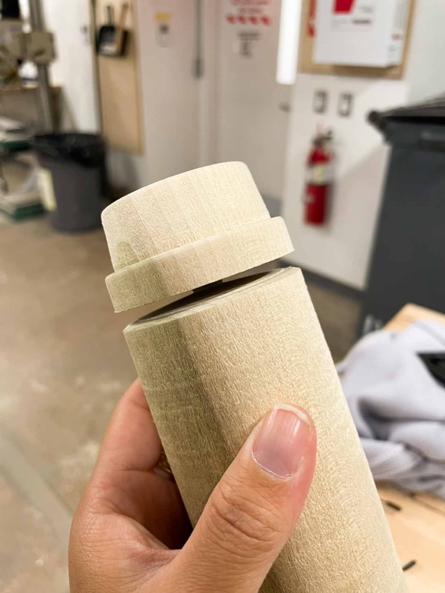
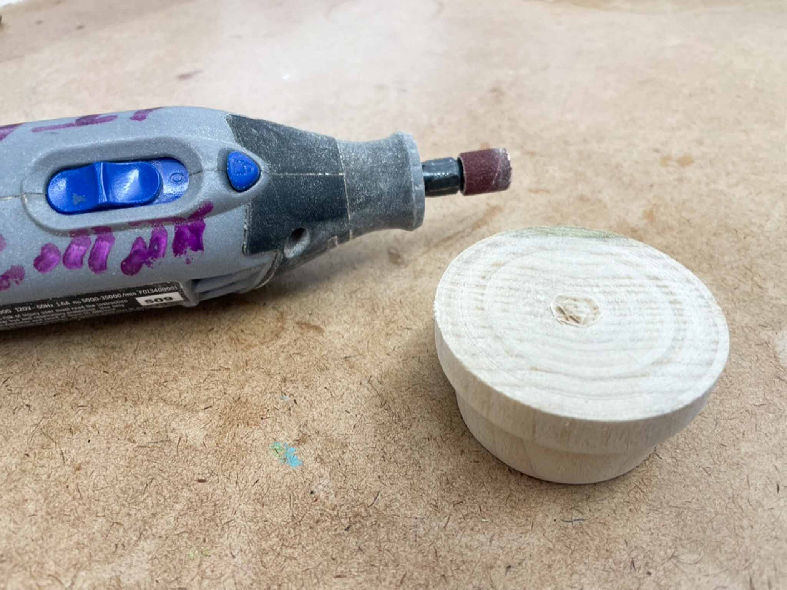
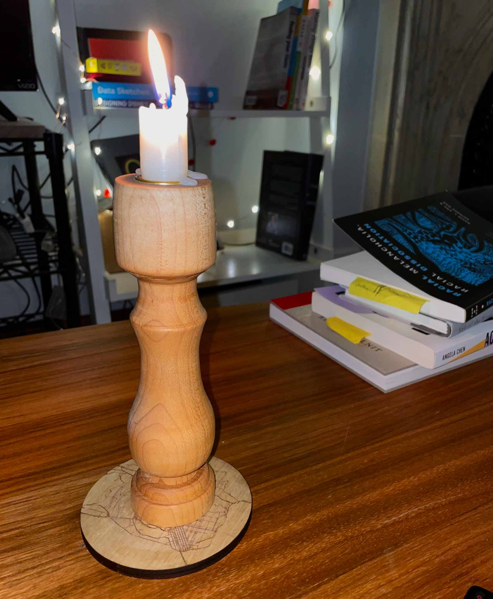

A little simpler this week, what with being out of town. I wanted to make a rough vacuform buck to test out some ideas for a styrene lamp. I inadvisably had no sketches for this.

I found a large hunk of wood in the basement with a huge split in it that I *****think***** is poplar. Since the split went all the way down the length of the wood, I decided to cut the piece down to avoid problems while turning, using the miter saw and the bandsaw. (Honestly the bandsaw was probably a bad idea, I left a few burn marks on the cut side from where it was taking off just a bit too much material at once. Plus, it was pretty hard to keep a straight line, but I think that’s my bad for not having practice at it.)

I then turned my cut piece round with 1” round scraper, which thusfar has proven an excellent $30 investment. (The chisels got a real beating this week).

A few days later, I came back to the round piece with my round scraper, a flat angled scraper, and the parting tool to create the silhouette of the buck. My desired geometry included:

- A circular face
- An almost-cylindrical form, with draft angle and rounded top edge for release from the vacuform material
- A lip on the bottom where the styrene can be mounted to something

https://youtube.com/watch?v=Y6uMVGYgFpM

So I turned this piece out, cut it with a pull saw, and used a Dremel to remove the tenon.

A little note here; I didn’t bother to deal with the top face of the buck, which now has imprints of the drive center in it. I don’t really mind as this is a first prototype, but in the future I’ll be turning it from a shorter piece, likely using a bowl chuck.

Haven’t had a chance to try it yet, but looking forward to learning from what it produces.

## Takeaways:

- I approached this the same way I approached turning candlesticks; that is to say, the entirely wrong way. Why did I do it this way? I’ll be approaching this more like turning a bowl in the future.
- Poplar feels entirely different from the maple or walnut I’d been working with in the past; softer and easier to carve, but it also has a bit of a more open(?) grain that I don’t love for my hand-turned pieces. This is fine for now and for this particular buck, but I might do a bit more research before I work with it on something I care more about.
- Yep, I still really enjoy using the lathe.

---

Bonus: [some of my candlesticks & holders from a while ago](https://www.instagram.com/p/Chq4wJKu5Wa/), and one of my candlesticks in use!

