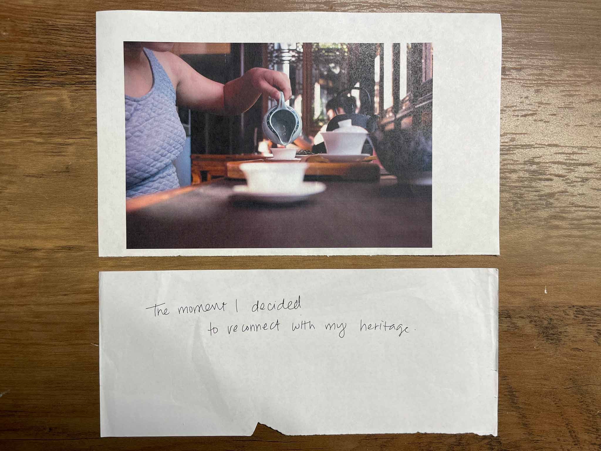

```
ASSIGNMENT:

Please bring with you a printed photograph that means something to you personally.
This could be an archival image of a relative or place from generations ago,
a family snapshot, a childhood photo––something that elicits a memory.
Please also write a caption for your image on a separate piece of paper.
```
We viewed the chosen photos first without captions, then with. It reminded me of the "space to place" exercise we did in Outside the Box, where the addition of attention and intention changed the experience of a space into a Place, one of noteworthiness and care.

> “I used to think to think it was my rememory. You know. Some things you forget. Other things you never do. But it's not. Places, places are still there. If a house burns down, it's gone, but the place--the picture of it--stays, and not just in my rememory, but out there, in the world. What I remember is a picture floating around out there outside my head. I mean, even if I don't think it, even if I die, the picture of what I did, or knew, or saw is still out there. Right in the place where it happened.” - Toni Morrison



Caption reads: "the moment I decided to reconnect with my heritage".
