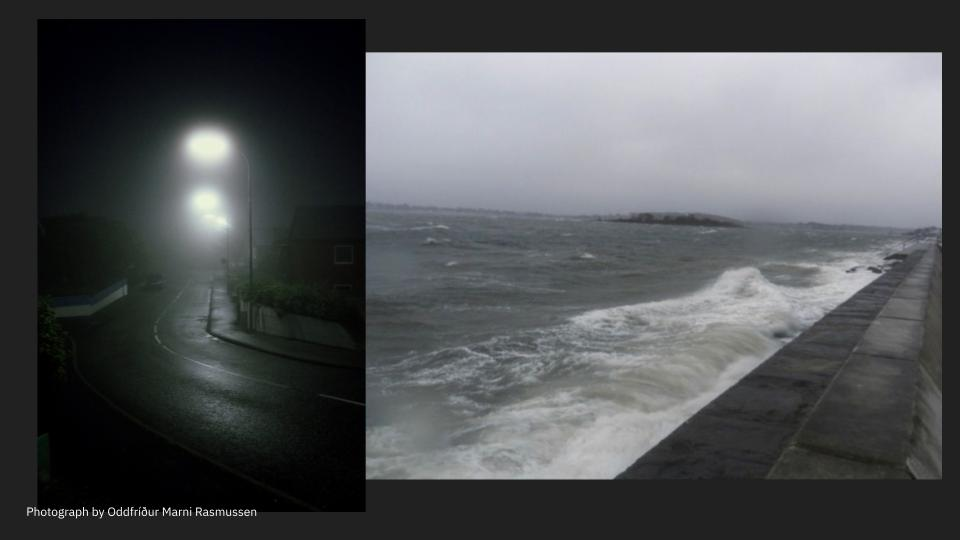

```
As an interpreter of your partner’s dream world, answer:

- What is the nature/essence of the dream world your partner described?
- What are the most important elements you must communicate to us so we
understand the rules, look, feel, sound, smell, taste, energy, mood of this world?

Create a 4-image inspo character/worldbuilding dream world mood board
for your partner’s dream.
```

Adnan described a dream to me with a moody, noir attitude. It begins by the seaside; waves crashing, but not visible. It’s the knowledge of waves, the sound, but not gazing out into them. It’s night, foggy, misty, raining. A rogue car drives by, and the lights of the lamp posts draw cones into the darkness.



Adnan is walking this path with his friend, Satya. They’re childhood friends, comfortable, chatting in the night with unintelligible words. They walk, and walk, climbing the stairs of an above-ground train station.

.jpg)

The platform is empty, and the two of them wait. They wait for a long time, chatting idly, on the empty platform. Late at night, there’s almost no color except the yellow of the subway platform. They wait for an indeterminably long time.

.jpg)

Late into the night, the train finally arrives. It’s the last train, and it comes on the opposite platform; the two rush to make it to the other side, suddenly in slow-motion, the chaos and calm both falling over everything. They run up over the bridge across the tracks. On the way, Adnan makes eye contact with the train conductor, who is inexplicably Hasan Minhaj. Hasan is smiling, but not slowing down.

.jpg)

They reach the top of bridge, just about to reach the end of it, and the dream ends.
