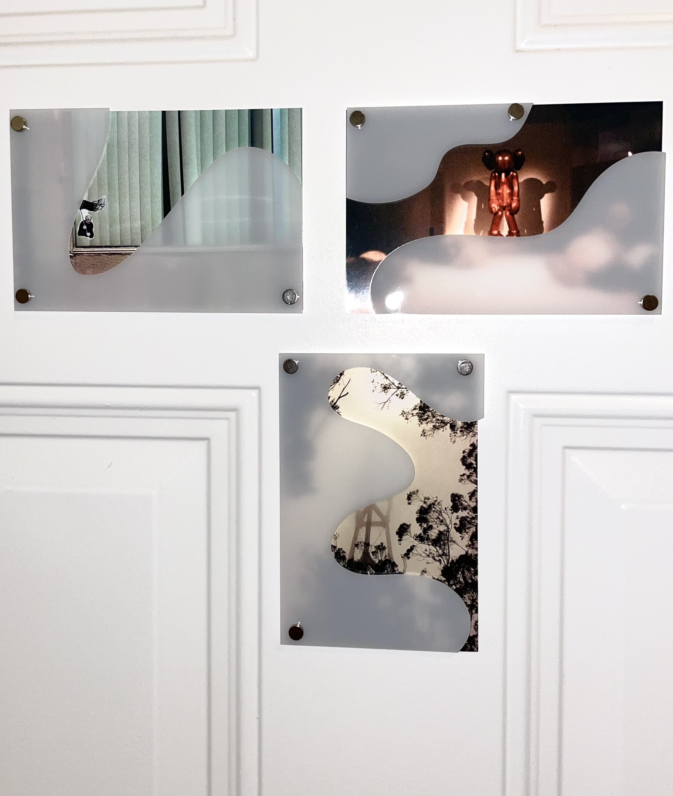

Things I did this week for thesis:

- Set up an interviewing pipeline for folks living outside their parental/heritage culture, sent out a call to the ITP student body.
- Began a survey for interview intake, providing me with some pre-interview data and thoughts.
- Interviewed 4 people, a total of 6 hours of interviews. More are scheduled to take place in the next few weeks.
- Chatted with Morgan Chen, an ITP graduate who also did research on Chinese-American second-generation immigrant experience.
- I remain fascinated by obscuring/framing, and have done some explorations in acrylic on photography. (more about this exploration [Framed ~ Obscured](https://www.leiac.me/2022/2022-10-14_framed-obscured/))

Things i did not do this week:

- Much reading of my resources

---

## The Interviews

  In order to keep my interviews open-ended, my only two pre-defined questions were:

  - What do you consider to be your cultural heritage?
  - What is your relationship with that cultural heritage?

  As the interview progressed, I found myself asking how they feel connected to that heritage, and what feels like home to them.

---

## So what now?

I’m continuing to interview, and slowly sorting through & processing the interviews I’ve already done.

Some quotes/paraphrases that stuck out to me from my interviews and survey responses (kept anonymous for now):

> I feel my cultural identity everywhere, but in the small things; the way I dress, the food I gravitate towards, the objects I own. I’ve never actually thought of these as cultural connections, but now that I’m thinking about it, they really are.
>

> Since moving away from (**************their homeland**************), my identity as (**********************this cultural heritage**********************) is even more solid, through needing to defend it.
>

> Oh, I don’t speak to my parents about my feelings. I can only speak about my feelings in English, and my parents only can understand (*****************heritage language*****************) … I will probably never speak to them about my feelings.
>

> If I have kids, I’m going to make sure they speak the language. Without the language, it’s like the wires are too frayed to plug back in.
>

> I consider other immigrants “my people” and feel much more comfortable in that type of community.
>

These interviews have thusfar led me to some new threads:

- Cultural connections being small but ubiquitous, in a number of different things that you do/have/remember.
- Immigrant-Americans (and other immigrants) creating a ***new*** culture, being more at home in communities of diverse second-gen kids.

---

## To sum up my current Thesis state:

I’m focused on building an exploration and expression of immigrant connection to cultural heritage, based on my own experience and cultural bridges. I’m starting at my cultural touchpoints; food, language, rituals and signifiers. I’m also exploring the unique creation of second-generation culture; in my case, the hybrid of Chinese-Taiwanese-American, and the way that unique mixture is authentic in its own way.
