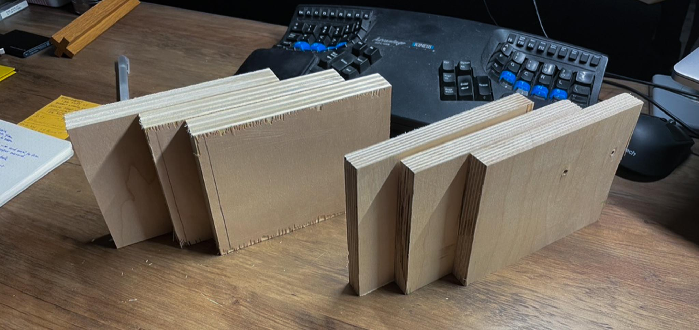
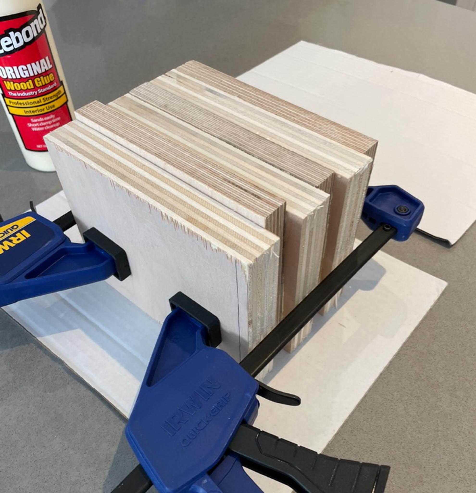
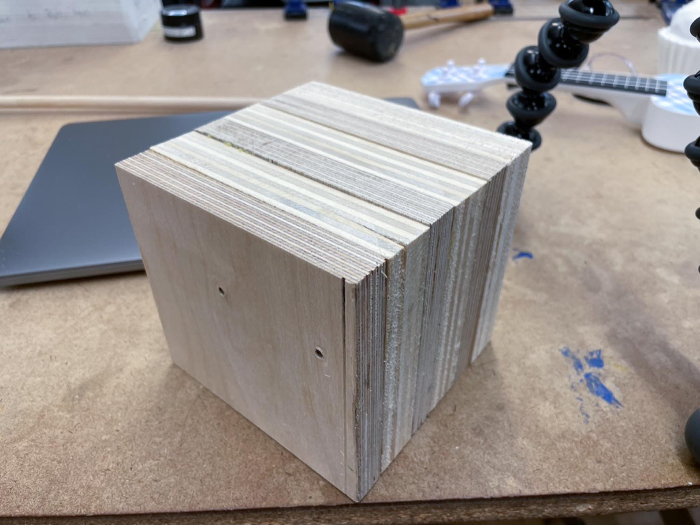
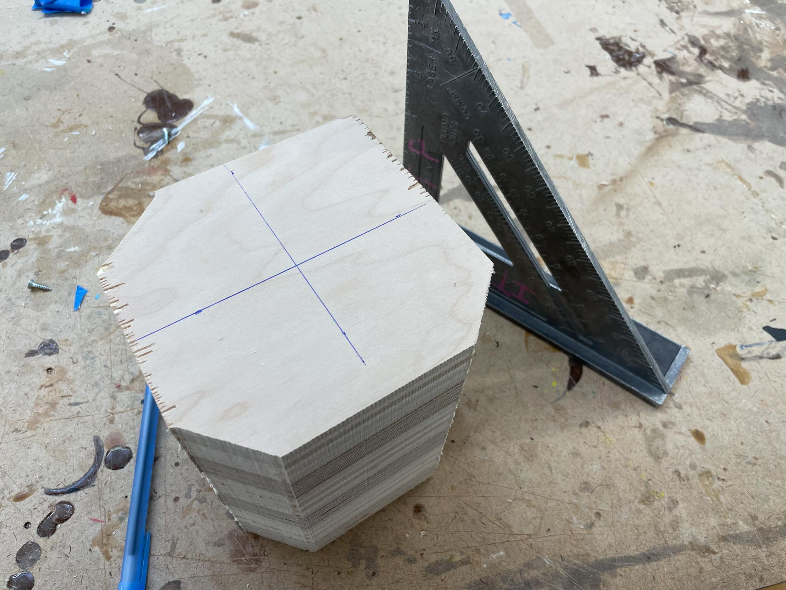
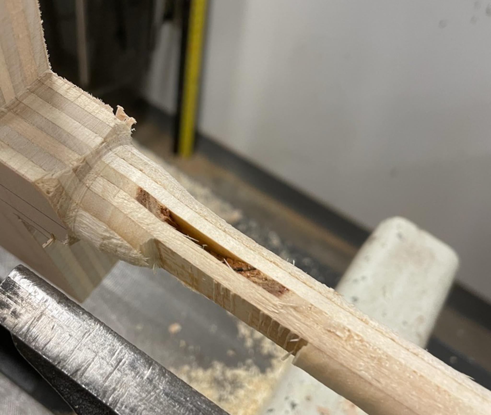
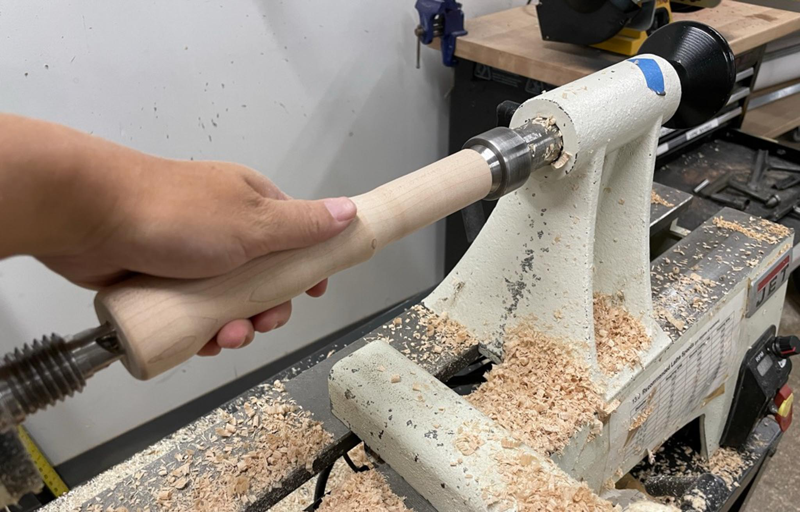
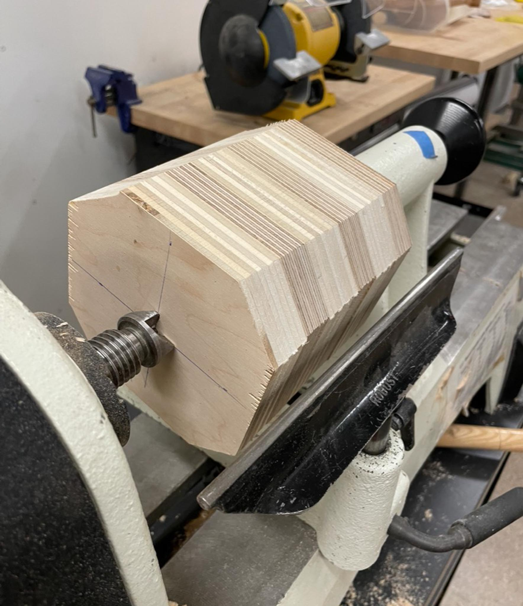
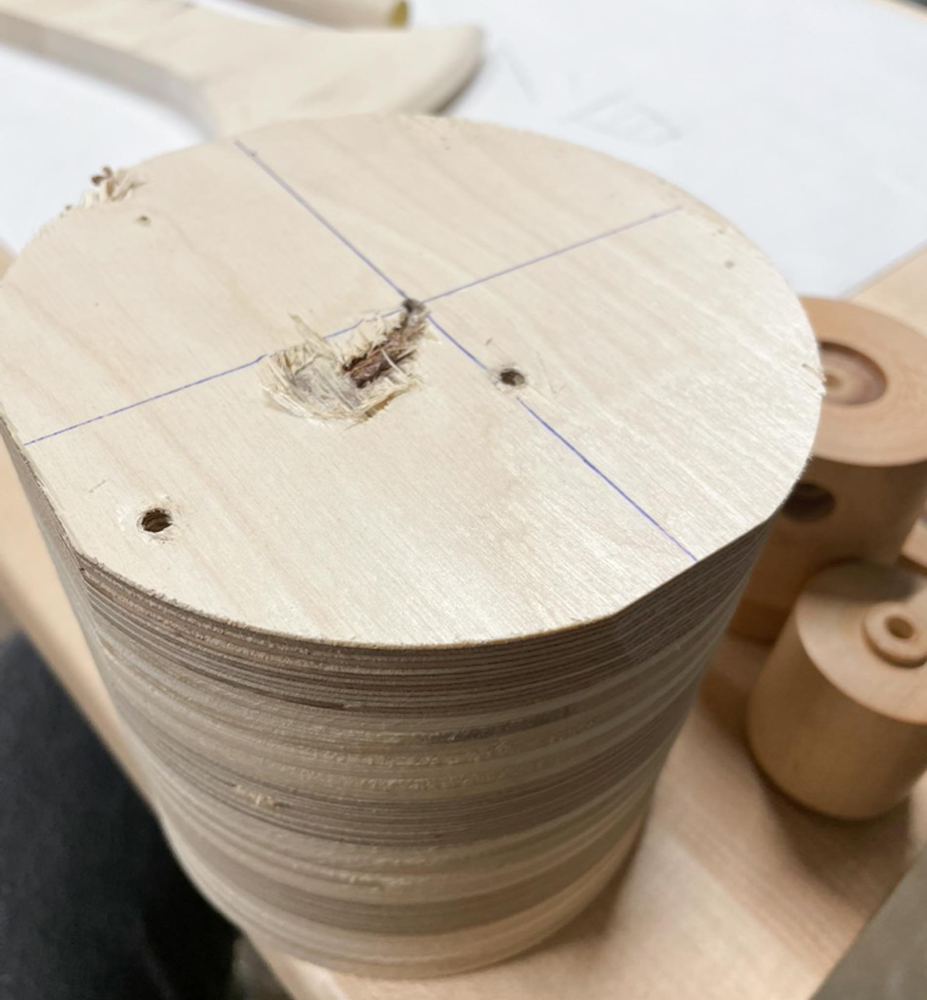
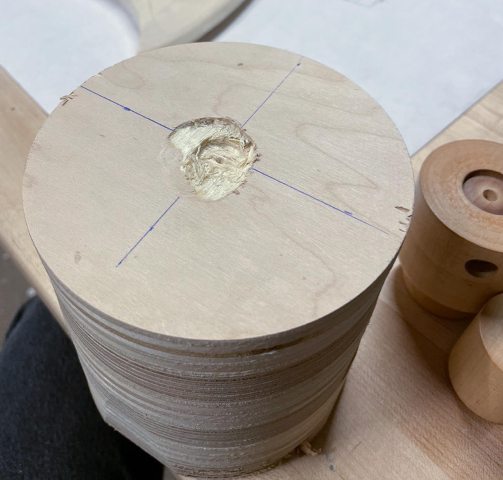

This week’s attempt at a mallet was a series of ~~failures~~ experiments with plywood.

Let me tell you, I came into this skillbuilder with the fullest confidence that I’d walk away with a pretty decent mallet. “It’s not that hard”, I said. “The design’s pretty simple”, I said.

Hindsight, and all that.

---

## So what happened?

The plan was:

1. Do a laminated plywood glue-up, larger than I need it to be.  
2. Create a jig to drill the perpendicular holes on the lathe.
3. Turn a handle out of some spare stock maple.
4. Turn the laminated ply into a mallet head
5. Drill the holes, assemble.

It was a lovely plan.

I gathered material:

- Birch plywood scraps
- Stock maple blanks
- 5/16” Wood Dowel

---

The glue-up was pretty straightforward. I took two pieces of scrap I’d had and cut them into chunks, aiming to have an end piece around 5x5x6”. The two pieces were different grades of ply, which I thought would make for an interesting visual effect in the end.

I brought the glued chunk in and used the bandsaw to even things out, nipping away the corners of the block to make turning a bit easier later.

Note: _Honestly, this is huge for a mallet head. I could have gotten away with something much smaller._

---

Up next, the jig. I cut some blanks on the bandsaw, which wasn’t too hard. But they were huge, and the key error is that I cut them out of plywood. I don’t know what I was thinking, but I guess the only straight and sizeable scrap I’d had around was plywood. This absolutely sucked on the lathe, with chunks tearing out left and right. All of this makes sense, of course, given the nature of plywood.

After two rounds of this, and some deep breaths, I grabbed the leftover jig that we’d made in class and drilled my own extra hole into it to fit my dowels.

---

Turning the handle went well, and I aimed to match a 1 1/4” forstner bit. No complaints here; it’s beautiful and I’m used to turning maple. I didn’t bother to cut off the ends, because I don’t really care what they look like.

---

Finally, time to turn the head. And damn if plywood doesn’t feel way different from maple! I turned it nearly round, but two or three times had the chisel catch and completely de-center the piece. This left gouges on the two ends, making it impossible to find the center again.

I think the density of the plywood contributes to this, as well as the fact that the drive centers were not particularly sharp. I tried keeping my chisel extra sharp, but that only marginally helped.

At some point I didn’t feel safe turning this piece without trying to cut off the ends, but my frustration was peaking and I thought it would be better to set this project down.

---

## Tools

- Wood Lathe
- Drill Press
- Bandsaw

## Takeaways

- A disappointment, perhaps. But also a lot of things learned.
- It takes some time to get used to a new material. Play with that first before trying to do a whole new project in it!
- Plywood has its own strengths, but also its weaknesses! Remember to use it for what it’s good at.
