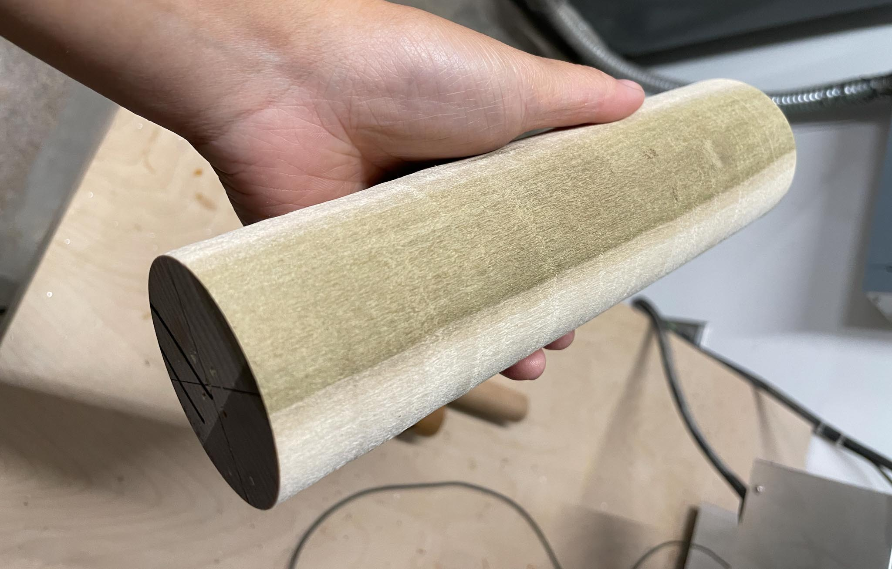
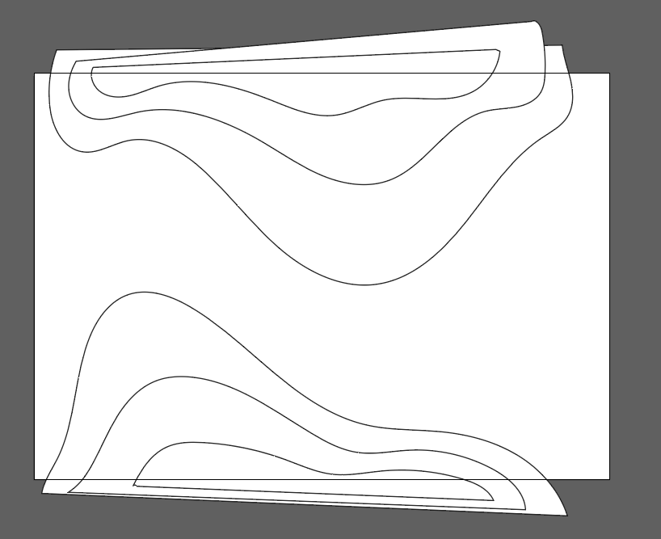
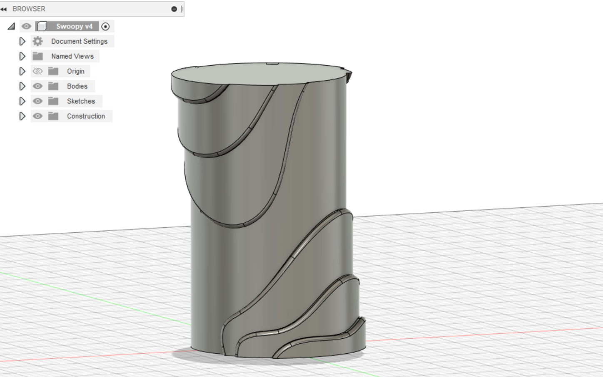
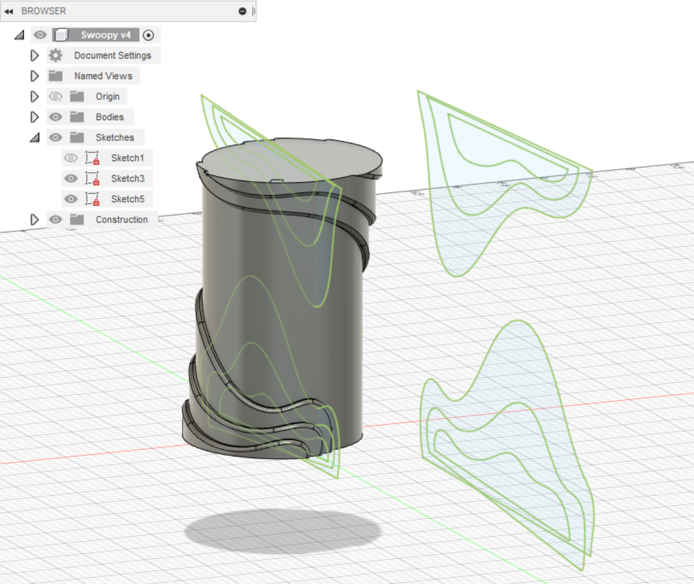
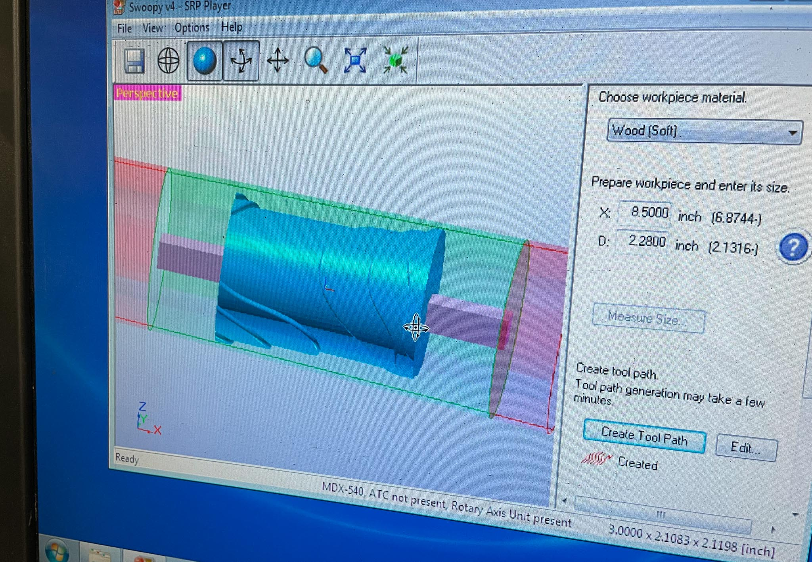
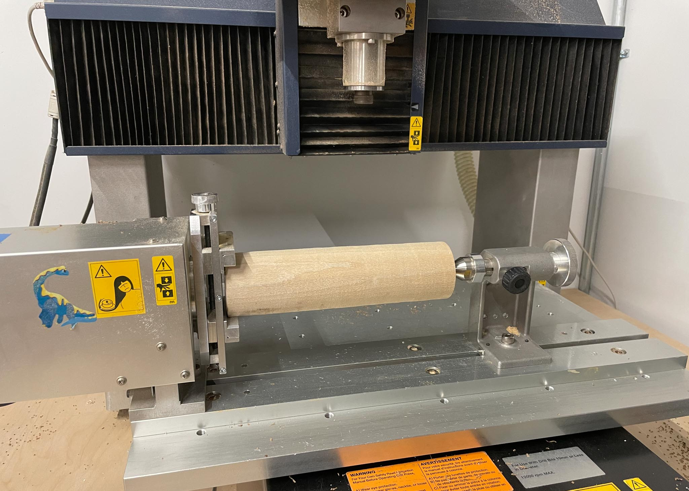
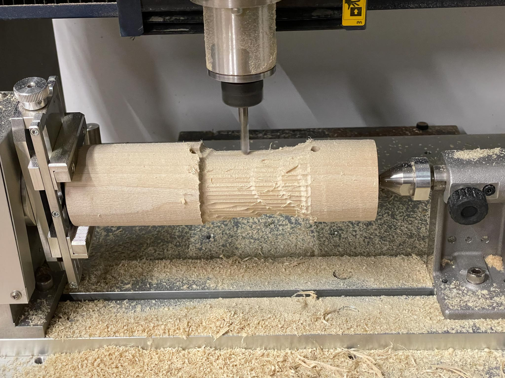
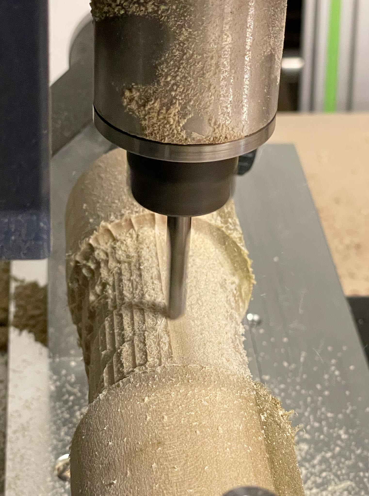

For this week’s skillbuilder, I started by thinking about what the advantages and limitations of the 4-axis are.

Things the 4-axis is good at:

- asymmetrical shapes
- double (or multi!) sided parts
- working with pre-rounded parts (like dowels)

Limitations of the 4-axis:

- working size is fairly small
- long working times, especially if stock material is much larger than the final object

I decided to run this test with the leftover poplar that I’d already turned round on the lathe.

I took inspiration from [framed ~ obscured](https://www.leiac.me/2022/2022-10-14_framed-obscured/), another experiment that I’m currently working on. I already had these swoopy designs in Illustrator, so I drew up yet another version and exported these as SVGs into Fusion.

In Fusion, modeled a simple cylinder and embossed my designs onto the outside. (This required two separate SVG imports, in order to place the embosses on opposite sides of the cylinder).

Then, I exported as an STL, and brought it down to the sub-basement to start milling.

The original estimate (with default supports) came out to around 1.2 hours. After tweaking, I got it down to .6 hours. After that, running it was a snap.

At first, I was a little startled with how deep the bit was milling, so I paused the job. I think that was the F&S from choosing soft wood rather than hard. I’d done a little research on  whether Poplar should be milled as one or the other, and came up with a some conflicting answers; from my experience with it on the lathe, I decided to chance the soft setting. It seemed to work out well.

I did make the mistake of not updating margins in both the roughing and the finishing steps. The finishing step plunged twice into the un-cut margin to the side of my piece before I stopped it; nothing seemed damaged, but it was definitely an unpleasantly surprising experience. I was able to edit the milling paths and only re-run the finishing pass.

I’m pretty pleased with the final piece. The two plunges make me a bit hesitant to run with my original plan of parting the piece on the lathe, but I’ll find a way of cutting the ends off and turning it into something nice.

---

### Tools:

- 4-axis CNC mill
- Fusion 360
- Wood Lathe

### Takeaways:

- I truly believe this software should update the model in both the roughing and finishing path … but until it’s smart enough, I need to remember to do that myself.
- Something about the way this machine mills is incredibly satisfying.
