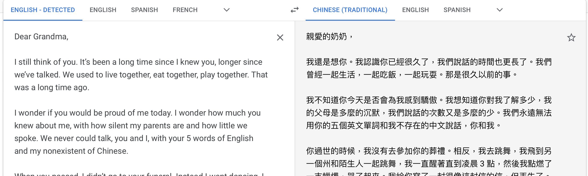
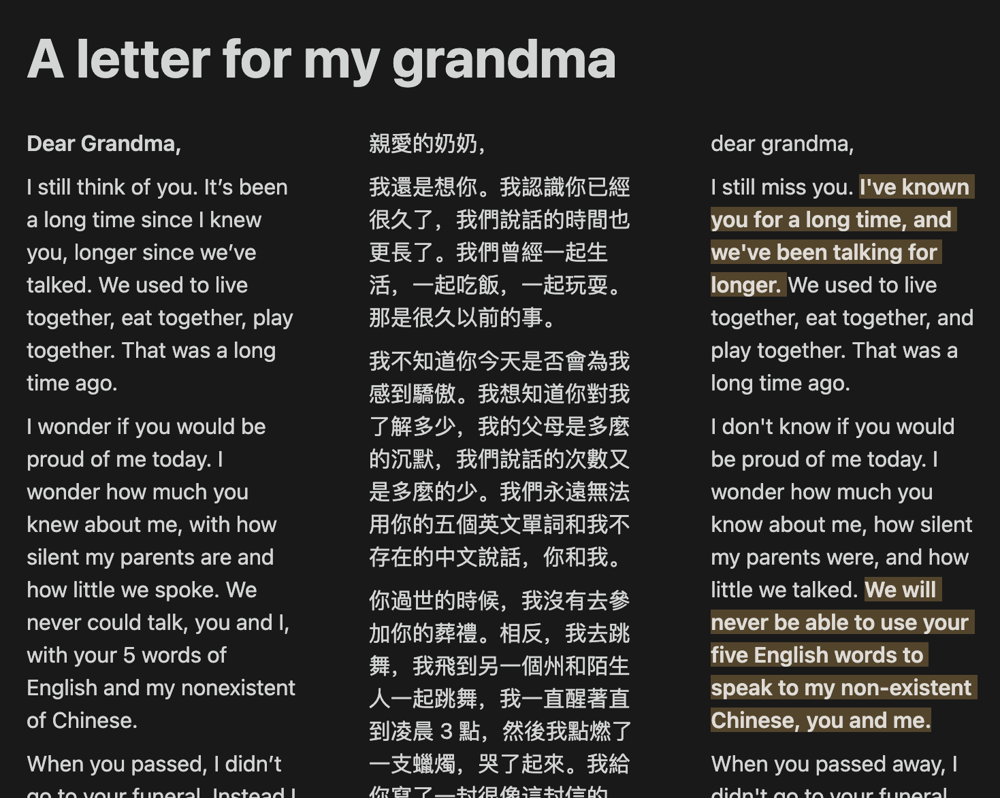
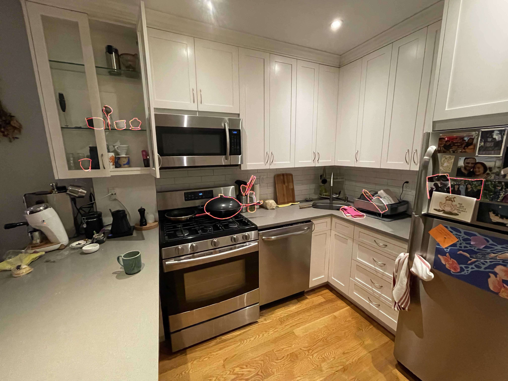
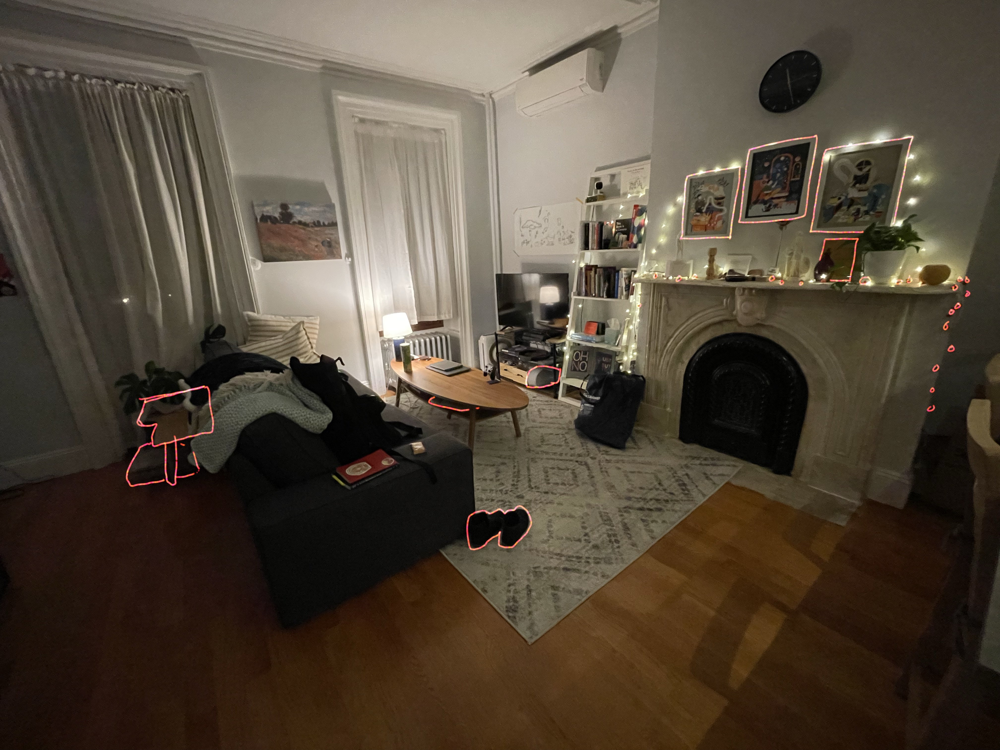

_What is a prototype? A prototype is something that answers a question, tests something out. ~ Pedro G. C. de Oliveira_

This week I did a few experiments that I might call prototypes. They all aim to answer a question, or to test out a hypothesis. I don't know that they succeed, necessarily, but they certainly are informing me in the process of developing my thesis.

## 1) I played more with obscuring

I had my parents send me some old photos, and found one that I’d never seen before and had no context for. I created obscuring layers over it and found myself with more questions than answers, and decided to layer those over it as well. This was an interesting experiment, but I realized that it left me feeling more disconnected than ever; the opposite of where I want this project to lead.

https://media.giphy.com/media/2JsIKMyguEQY2XggWi/giphy.gif

| Core Questions | How do we view the distance in time between ourselves today and a memory? How do we acknowledge distance, while working to close it?  |
| --- | --- |
| Context | This project lives a world of family and art. It follows in the footsteps of other artists working in intervention over found media (see Betty Yu, in references below)|
| Venues | This project is a gallery-focused project. Alternatively, it would be possible to showcase this project online with this gif format, or a rollover format. |
| Audience | English-speaking, arts-world folks |
| Accessibility | This project in its current form is only accessible to an English-speaking persons with unimpaired vision.  |

Takeaways:

- Obscuring the faces removes even more context than I might have anticipated. My intention was to express my own current distance emotionally from this moment, but instead I also removed any context the photo gave for the relationship between my father (the man) and myself (the baby).
- I still really like the obscuring acrylic though, and the multiple layers give an interesting level of tactility to the photo
- There’s something in the handwriting that intrigues me. I’d like to explore that more.

## 2) I wrote a letter

I wrote a letter to my grandmother, who passed away 6 years ago. She passed away right before my college graduation, and I did not attend her funeral. Screenshots are truncated because I don't feel ready to show the full letter.



I ran this through Google Translate to convert it to traditional Chinese, and then back again to English to see what the differences might be.



As a fun bonus, I reached out to a few friends to practice my truly horrendous Chinese.

| Core Questions | What happens in translation? What is lost? What is gained? How can the artifacts of translation create serendipitous meaning?  |
| --- | --- |
| Context | This project lives in a world of written text, literature, perhaps zines.  |
| Venues | This project feels like one that can live either online or within a printed book.  |
| Audience | English-speakers, specifically those also experiencing the loss of a heritage language.  |
| Accessibility | This project in its current form is only accessible to an English-speaking persons.  |

Takeaways:

- I’m intrigued by the conversion to future or present tense (since tenses are so contextual in Chinese, that often gets muddled) and thing I’ll want to explore that more.
- Using Google Translate is an interesting way of going about this, but translating the full piece this way doesn’t resonate. I think I’d focus on individual phrases, or pull interesting translations on their own.
- This project has left me with the phrase **“[something] in translation”** that keeps tugging at the back of my head. What does translation look like in a non-language context? Are emergent immigrant cultures a type of translation on their own? Am I always in the process of translation?

## 3) I observed my own object bridges

I had the idea last week to take a projector to my own home and highlight in the space the things that I feel connect me to my heritage. As a prototype, I took photos of my living and kitchen space, and outlined these objects that come to mind in Procreate, to see what stands out.





I don’t know much about this one … it’s intriguing, but feels more like a first step towards something rather than an actual prototype. The questions it answers are only questions I have for myself as a jump into future projects.

| Core Questions | How do I use objects to represent both my identity and my heritage? How do I connect physically with that heritage? What makes me Chinese? Chinese American?  |
| --- | --- |
| Context | I was thinking of Song Dong as I did this one, who took the items out of his mother's home and showcased them, in their hundreds, at galleries around the world. |
| Venues | I really don’t know about this one. |
| Audience | ????  |
| Accessibility | ????  |

Takeaways:

- I do feel resonance in pursuing my heritage-bridges in object form. I know that I’m all about physicality, but there’s also something interesting in what I surround myself with too, and it’s a way of bringing in that personal focus.
- The pictures I edited seem a little sparse to me, but I realized that there are so many more objects I would have wanted to highlight that are tucked away into cabinets or closets or shelves. It sparks a desire to pull out all the objects at once, and take a picture of them all together.

## 4) A thought experiment in objects as portals to the self

For Medium of Memory, I’m creating an exercise with Gracia Zhang and Cindy Hu that we’re tentatively calling “Recipe for the Self in a Suitcase”. It’s a rumination exercise on objects that represent yourself, and what it means to place them in a transient container (the suitcase representing immigration, or just movement and travel). We haven’t run this exercise yet, but I’m finding myself very drawn to it.

```
First draft of activity:

A Recipe for Self in a Suitcase
(hand out a large sheet of paper to each individual, and a drawing implement)

This paper is your suitcase.

- Draw 1 object that you will always carry with you when you move. Think about
why you want to carry it with you as you draw.

- Draw 1 object that feels or reminds you of family. This may be blood family
or chosen family, or something else entirely. Consider why it feels like family to you.

- Draw 1 object that connects you to your ancestors. This may be blood ancestry
 or spiritual ancestry. Try to capture what makes it ancestral for you.

- Draw 1 object that feels like you. What does that mean to you?
Do you think it feels like you to others?
```

| Core Questions | How do we use objects to channel and transport us to memory? What ways are memories passed down to us? How do we forge new connections to past experiences?  |
| --- | --- |
| Context |  |
| Venues | This format would be run as a workshop, with potential for a book/gallery exhibition of accumulated works.  |
| Audience | Individuals interested in exploring a sense of self and home, potentially undergoing transitional periods.  |
| Accessibility | As an online-hosted (or even open-sourced?) workshop experience, this  |

Takeaways:

- This definitely hits my desire to engage community around these questions that I have. I’m going to keep this one in mind moving forward.

---

Other things that popped up for me this week:

- I’ve been updating my resource list and slowly growing it into a [Digital Garden](https://leiamake.notion.site/Thesis-Garden-31063b21d64e4d9e87d4db1ff203e9f2). I will continue to tend to this Garden as the project grows.
- More interviews! 4 more interviews, though I haven’t yet sifted through them amongst all the prototyping thoughts. I’m meeting with Blair this week to talk about the interview process and figure out how to pull on the threads that came out of them. They’ve definitely helped shape the explorations I’m doing above though, and reinforce my desire to explore second-generation cultural authenticity.

New artists I’m noodling over:

- [Acts of Remembering - Betty Yu](https://www.e-flux.com/architecture/survivance/382557/acts-of-remembering/) : Thinking about bringing together fragmented stories, the act of forgetting, translation, hiding.
- [Waste Not - Song Dong](https://www.youtube.com/watch?v=n1NkuIyPvWo) : Thinking about objects as storymakers, the overlap between personal objects and shared objects, how objects can create relationships through shared context, how the value of objects is changed by our attention to them.
- [Tableau](https://johnkestner.com/tableau/) and [rev—>table](https://johnkestner.com/rev/) - John Kestner : Thinking about how furniture can be created to embed ideals, values, and stories.
