*Note: This tutorial is written in Nov 2022 and reflects the software as such. This is a 2D SVG tutorial, and does not address 3D or GCODE workflows.*

Let’s say this is the object I’d like to mill using BantamTools. I already have it modeled in Fusion360, and a simple sketch. How do I export this sketch and process it to use in BantamTools as an SVG?

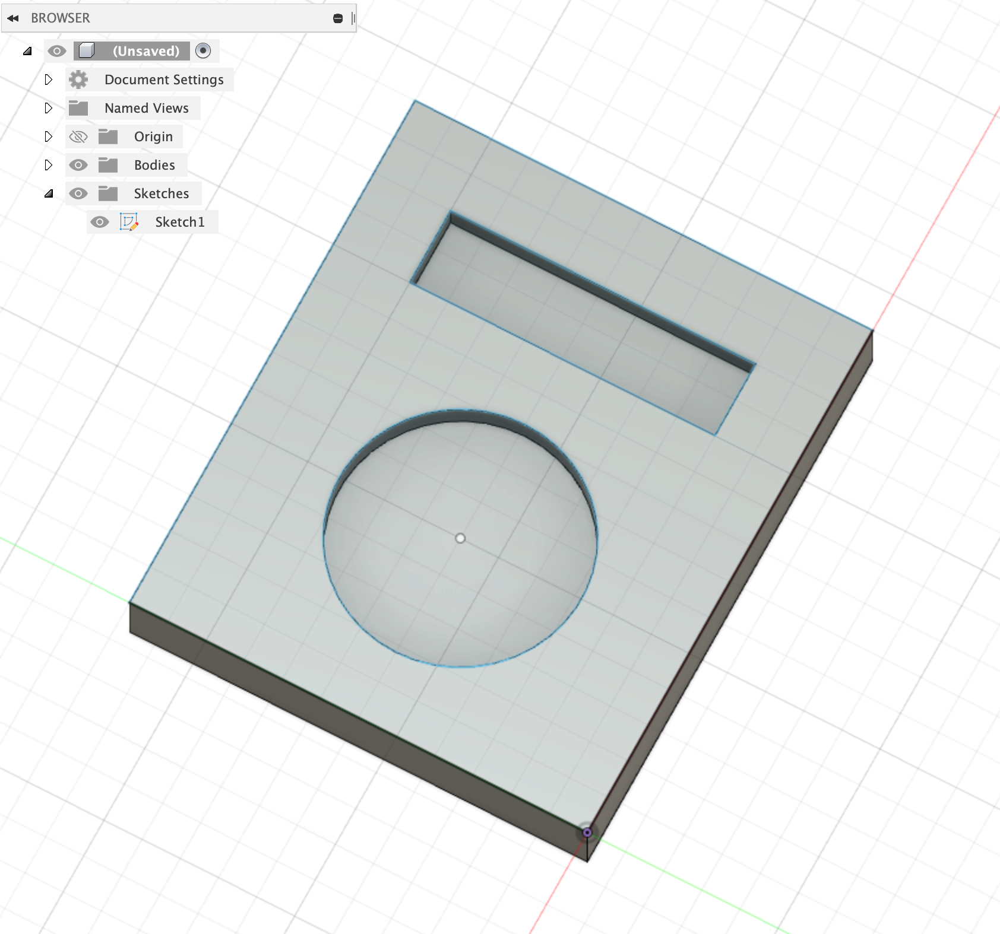

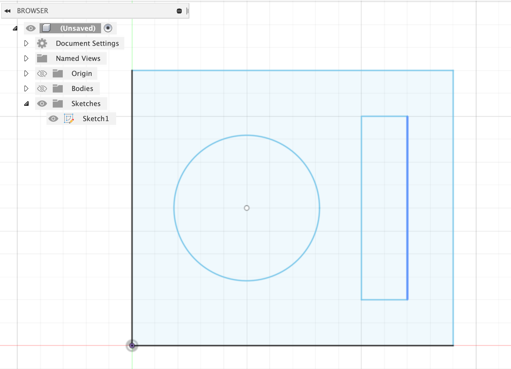

## Overview:

1. Export the sketch from Fusion360 as a DXF
2. Process that DXF sketch in Illustrator to separate cut and engraving paths.
3. Export these new paths as SVGs.
4. Load these SVGs in BantamTools

---

## Fusion360

Select your sketch. `Right-Click -> Save As DXF`

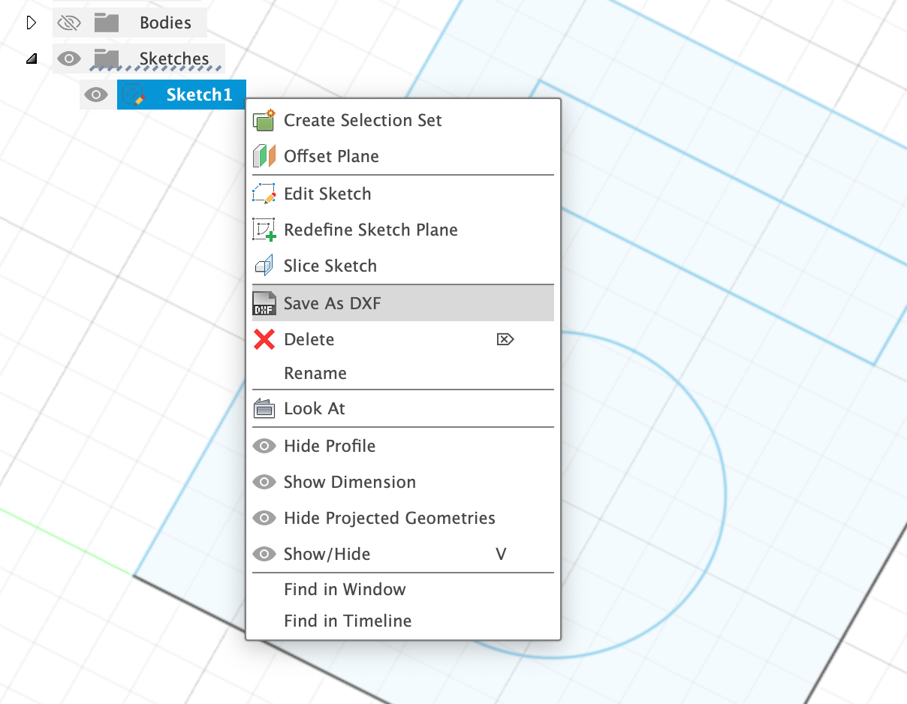

---

## Illustrator

Open that DXF file in Illustrator.

DXF stores the **paths**, but not a **unit**, so you have to define what units you designed this in. I used Millimeters, but make sure you choose the units you’ve used (Inches, perhaps) and **make sure Unit(s) = 1**.

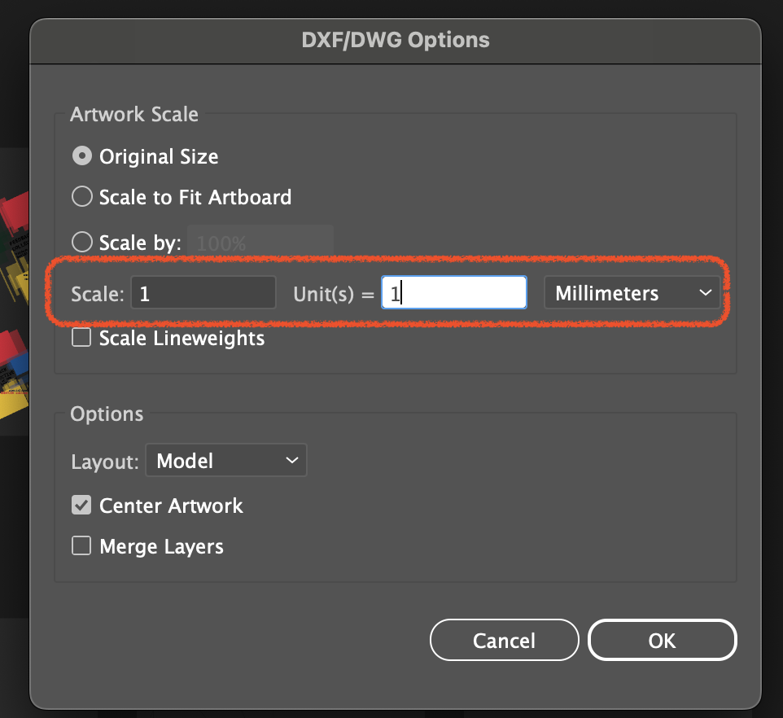

Here’s what my DXF looks like in Illustrator.

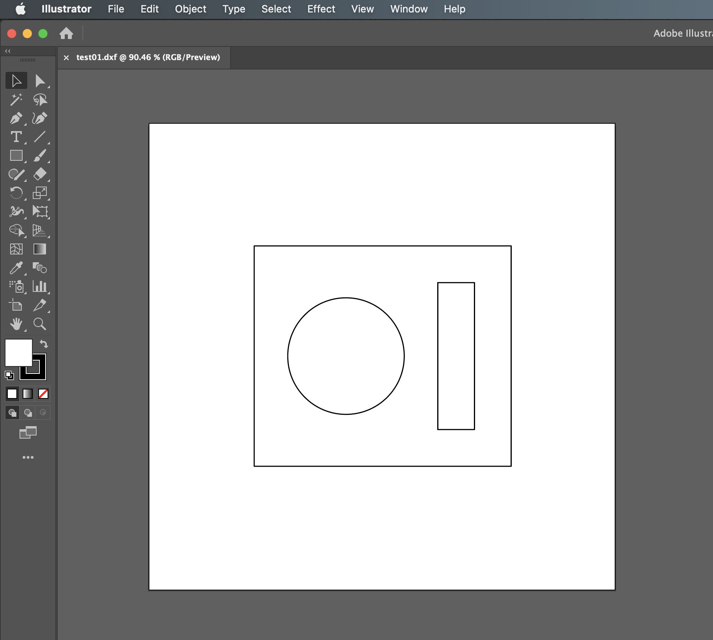

In Illustrator, you should:

- Clean up any lines that will NOT be cut or engraved. Your DXF may include reference lines or construction geometry that you don’t want to cut.
- Separate out your individual paths for export.

### Why separate out individual paths?

Well, the free version of BantamTools only supports cutting 1 path per file loaded! If I loaded this entire file into Bantam, it would ignore the inner paths and only cut/see the outer one.

My personal workflow:

1. Copy the art+artboards using the ArtBoard tool, as many artboards as paths
2. For each artboard, I delete all but one path
3. Rename each artboard based on what I want to do with that path.

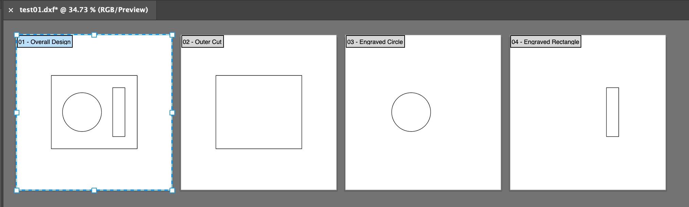

Once your artboards and paths are all sorted, it’s time to export them as SVGs.

`File -> Save As` , choose `SVG`, and make sure you check `Use Artboards`.

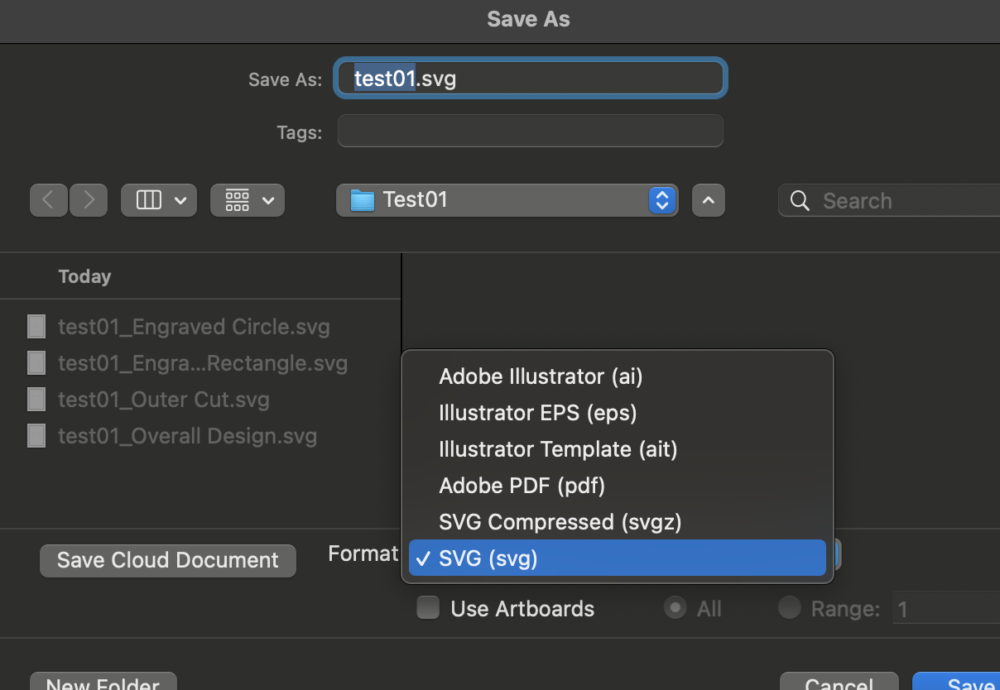

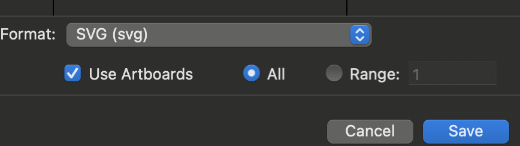

Click `Save`, and this should export all your artboards as individual SVGs as you can see below. The files highlighted below are the files we’ll be loading into BantamTools.

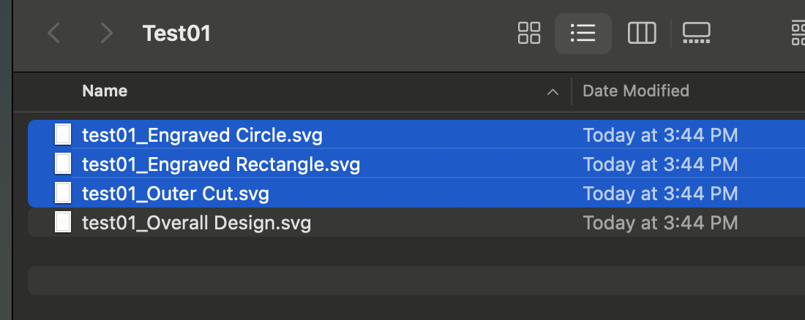

---

## BantamTools

Choose `Initial Setup -> Open File`. Open each of your files.

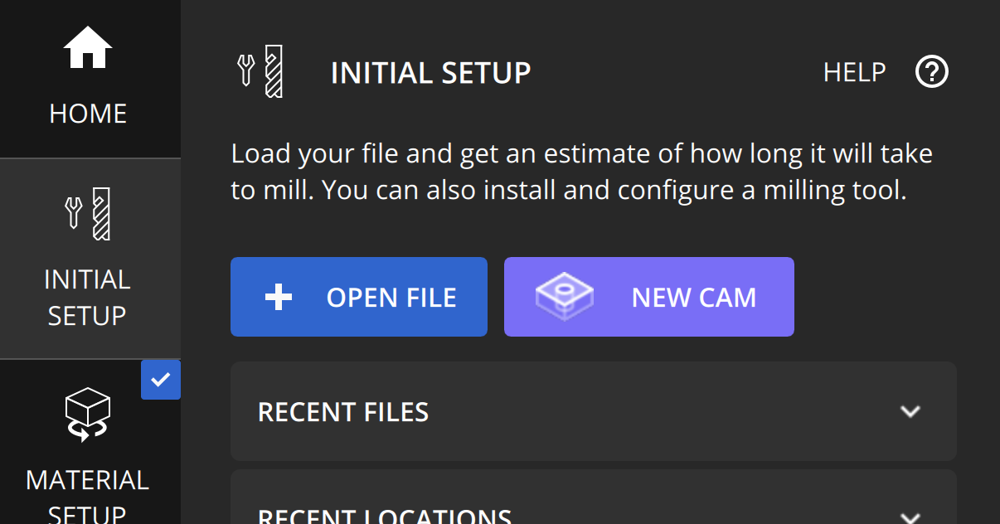

Once loaded, the rendered preview will probably look very messed up. That’s ok! Just make sure all your files are loaded (see the files on the left).

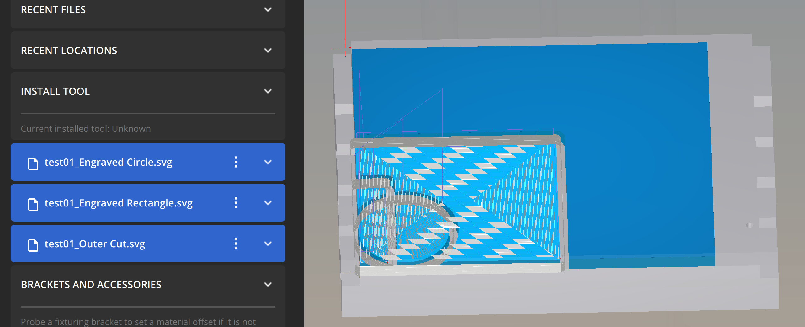

For each of these files, update the ToolPaths to reflect the following:

- _Either_ `Engraving` or `Cutout`. If `Engraving` , choose an engraving depth.
- Cutout placement, based on whether you’re cutting the **inside** or the **outside** of the path.
- Scale from `Document bounds`. This makes sure we can align the paths the way we designed them.

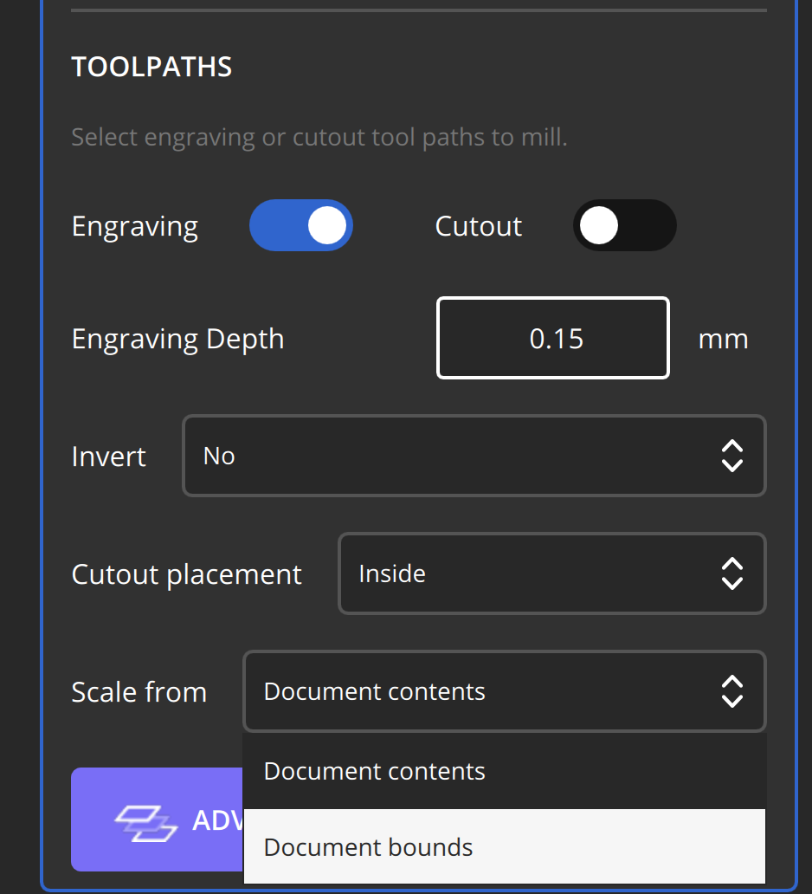

When you’re done updating these, your preview should reflect your original design.

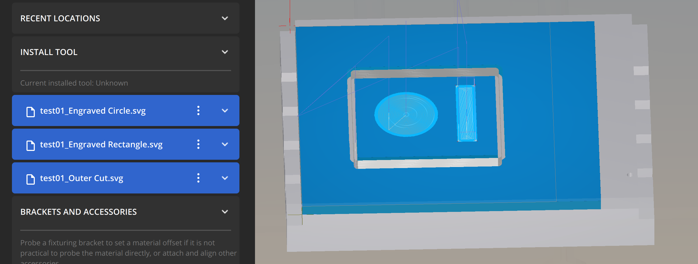

And that’s it!

---

*Note that you may need to also change the scale of your SVG plans.*

`Plan setup -> Scale`, make sure you change them for **every file**. This is also where you’d move your files/plans around on the material if you need to.

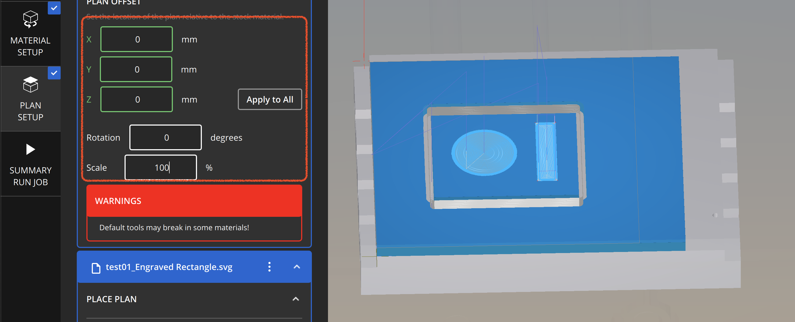

---

For more details on the Bantam Classic SVG workflow, check out [their official tutorial here](https://support.bantamtools.com/hc/en-us/articles/360051958314-Classic-Advanced-SVG-Workflows).
