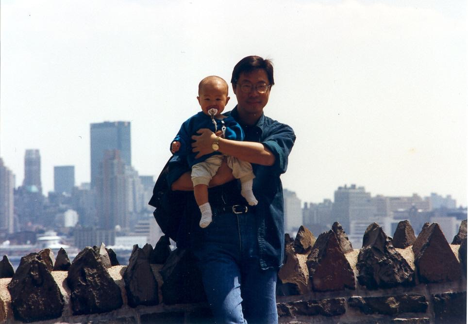
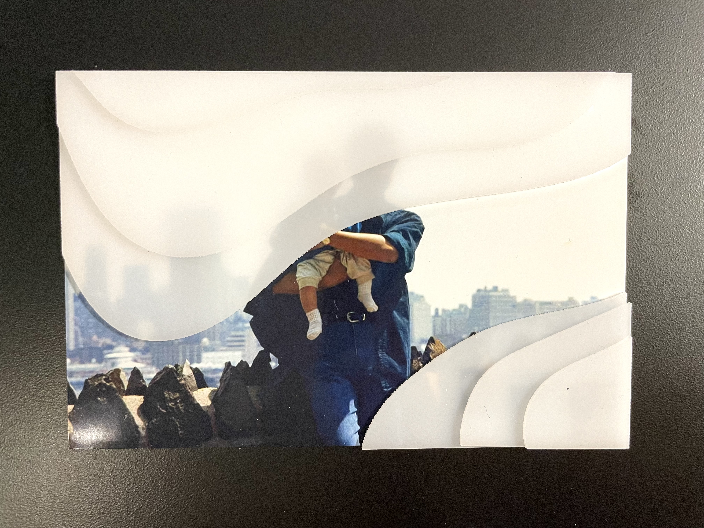

Explorations in narrative, and how interventions change experience.

I began this set of exercises with this photo: one of many sent to me by my parents. I had not seen this photo before, and had no context for it other than knowing that it depicted myself and my father, somewhere in or near New York.

My first intervention more obscuring, this time with multiple layers. I was looking to represent the distance I felt from this image, and my own fogginess in these memories.

After seeing these obscurations, I found myself with more questions than answers. My next exploration was an added narrative; to embody mine, I layered these questions and their subsequent answers over the obscuration layers. I envision this piece as a double-sided photo; one side with the questions, the other the answers, spinning slowly in the air.

https://media.giphy.com/media/2JsIKMyguEQY2XggWi/giphy.gif

While this was an interesting experiment, I found myself in the end feeling more disconnected to the memory and my family than before I’d started. I seek connection from my work, to feel more grounded through the process of making it.
