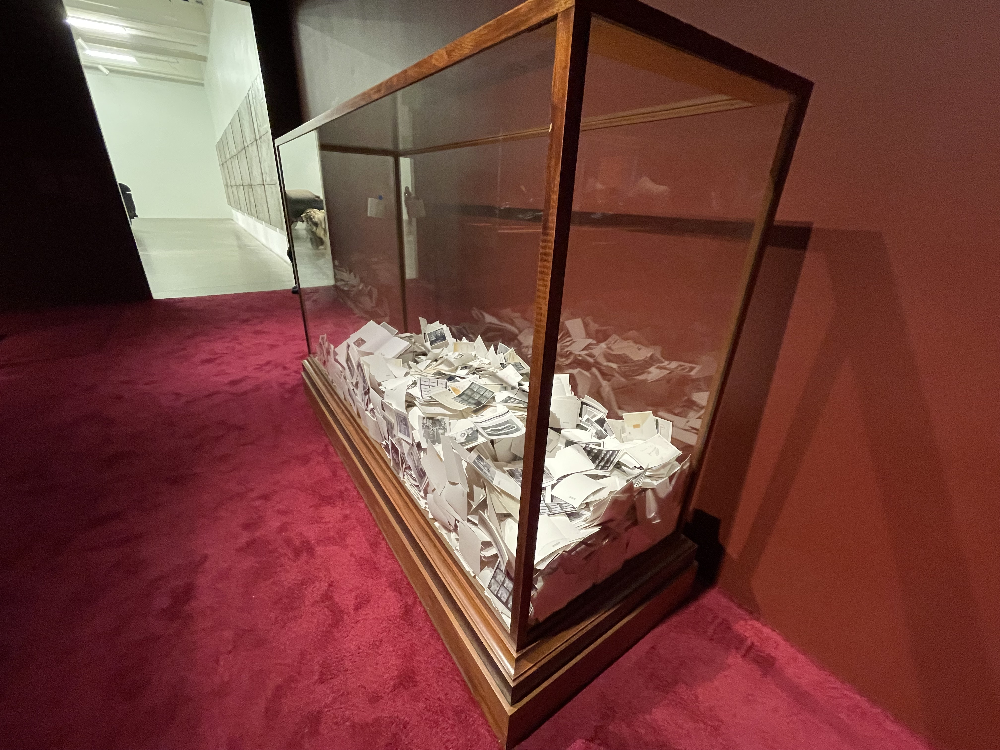

Last Friday I went to see the [Theaster Gates](https://www.newmuseum.org/exhibitions/view/theaster-gates-young-lords-and-their-traces) exhibition at the New Museum, and found myself thinking about objecthood as portal to memory. Throughout all of the work showcased at the New Museum exhibition, I saw a thread of “preserving that which is crumbling” and throwing the material/process into sharp relief, rather than “elevating” the process as *Art*.

Gates’ work is interesting in its choices. Coming right off the back of two highly relevant classes (one, with [Simone Salvo](https://simonesalvo.com), on the ways that memory can be held and channeled in objecthood; two, with [Ben Light](http://blightdesign.com), on how simple choices in framing/placement/presentation can change the entire attitude and reception of an object), I thought a lot about the choices that were made around the objects that I saw. It’s interesting to note that much of the exhibition consists of objects that found their way into Gates’ care; the art is sometimes more in the act of curation and presentation, less in the act of making.

Some favorites:

- A Vitrine filled with original archival images from *Ebony* and *Jet* Magazines from the Johnson Publishing Company collection. The choice to fill this glass box, not even half full, with these images is extremely evocative of the curiosity gap for me. It seems almost haphazard, careless, maybe even rude. But it makes me want to sift through these images, so displayed and covering one another, and entirely out of reach within this display case.
- The entirety of a the late Robert Bird’s personal library. Just sat there, on display. Telling the story of the person without anything else.
- Wooden sculptures created to resemble crosses, made from the reclaimed wood floorboards of a church Gates’ helped restore.
- A bell, rescued from another church, placed intentionally in a shed facing *away* from the center of the room, forcing the audience to walk around the shed and into the corner in order to view it.
- A room full of pottery, scattered along the floor for you to walk through, along with this description:

    > Gates has been developing the concept of “Afro-mingei," a hybridization of Black life, thought, and craft with the Japanese mingei movement, which celebrated the beauty of everyday objects made by anonymous craftspeople. Presented here in an extensive display is a selection of Gates's pottery work made in recent years, including a wide array of ceramics reminiscent of both pots for storing food and funerary urns - forms that yoke life and death. Together, they also suggest a sanctified meaning of clay and the ritualized practice of craft, or, as Gates has described it, "the magic of taking the lowliest material on earth - mud - and turning it into something beautiful and useful."
    >
- A set of books, entitled *A Negro Digest for a Weary Heart* (2019, pictured at the top of this post). Each book titled in part like a poem. Something here about the whole, and the individual, and wanting to reach inside but not being able to.

    

How does attention transform objects? How do we embody our attention? How do we embody and direct this attention for others?
