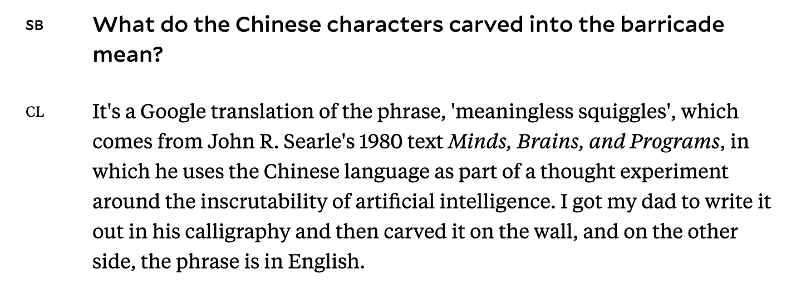

## Media Collection
Didn't have the mental energy to engage with all of the media for my classes this week ...

### [Material Metaphors - Candice Lin](https://ocula.com/magazine/conversations/candice-lin-material-metaphors/)

- Archaeological sites of future histories, the cyclical nature of past and future. Pasts are our futures, speculative or not.
- Race as performance of culture, depending on the lens.
- Zones of cultural, social, individual contact. What crosses over? What doesn’t?
- “*coolie”*: derogatory term for an unskilled laborer generally of South or East Asian descent.
- In the 19th century, Chinese immigrant workers were derogatorily referred to as “pigs”.  *Interesting to think about, given the current western context of  police as “pigs”.*

> …thinking about materials and the histories embedded within them, and using the process of making the material as a way to re-animate or re-circulate meanings that have been lost in the dominant knowledge related to those materials. ~ Candice Lin
>

> … the work becomes better when you don't necessarily control everything about it and you're open to receiving meanings. ~ Candice Lin
>

*~ shared by Simone Salvo*

---

## Snippets

- [Andor’s designers approached it like a Star Wars period drama](https://www.theverge.com/23445550/star-wars-andor-production-costume-design-interview) ::  a delightful view into what makes the new Star Wars show entirely unlike previous media from this universe, and incredibly interesting to watch.
- [Dacey’s Patent Automatic Nanny - Ted Chiang](https://en.wikipedia.org/wiki/Dacey%27s_Patent_Automatic_Nanny) :: shared by Maya Williams, an incredibly uncomfortable and convincingly realistic science fiction short story, pondering the question of interaction and childhood amongst much more.
- Visited the Theaster Gates Exhibition at the New Museum and [wrote up some field notes](https://www.leiac.me/content/2022/2022-11-20_theaster-gates-fn/).
- I grabbed coffee with [Adnan](https://adnanaga.com) and [Tuan](https://tuan-h.com), and we chatted about what it means to “slow down”. The idea that we so often go about our motions without thinking, letting the momentum of our actions carry us through the day. Sometimes we let that momentum define a rhythm for us, one that leads us to grow frustrated at slower beats.  What does it look like to instead lean into those slower beats, to practice a type of mindfulness that allows us to process, to linger, to be more present with things that may just take *time*?
- Anyway I’ve also started to collect things [over here](https://lsc-collection.tumblr.com) to try and make a more commonplace-notebook-esque space. Who knows what will fall out of it (if anything).  More quotes, pictures, things that resonate.
