I wanted a catch-all table by my front door. It’s a narrow space with a few requirements:

1. Fits in this area (14 inches wide) without intruding on the entry path
2. Easy to reach from outside the door, to place keys/mail while I take off my shoes
3. A shelf along the bottom to hold my indoor slippers while I’m not home, or my backpack when I get home.

I took inspiration from this render:

---
## Designing

### Sketches

I started on paper, because working on paper at the beginning is much easier & allows me to flesh out ideas quickly.

I made a few sketches of various potential shapes before settling on this one, which utilizes slot and tenon joins to hold itself together. I’d previously done some [joinery tests](https://www.leiac.me/2022/2022-10-05_cnc-joinery/) to determine what I wanted to use for this type of plywood.

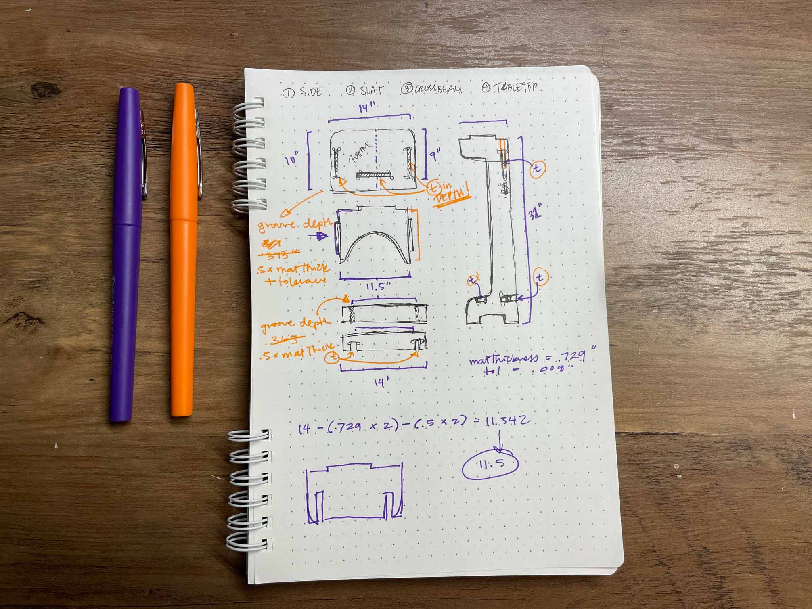

### Cardboard Prototypes

Bringing things into real physical space always helps me work, so I created a mockup to stand in its place. I utilized an 80W laser cutter to cut out pieces I’d mocked up in Fusion 360, and used hot glue to put it all together.

### CAD

After living with the cardboard prototype for a few days, I updated my design and got to modeling it in Fusion 360. I designed the whole thing based on set parameters, and constrained it so I could change measurements when needed (such as material thickness, leg height, and tolerance).

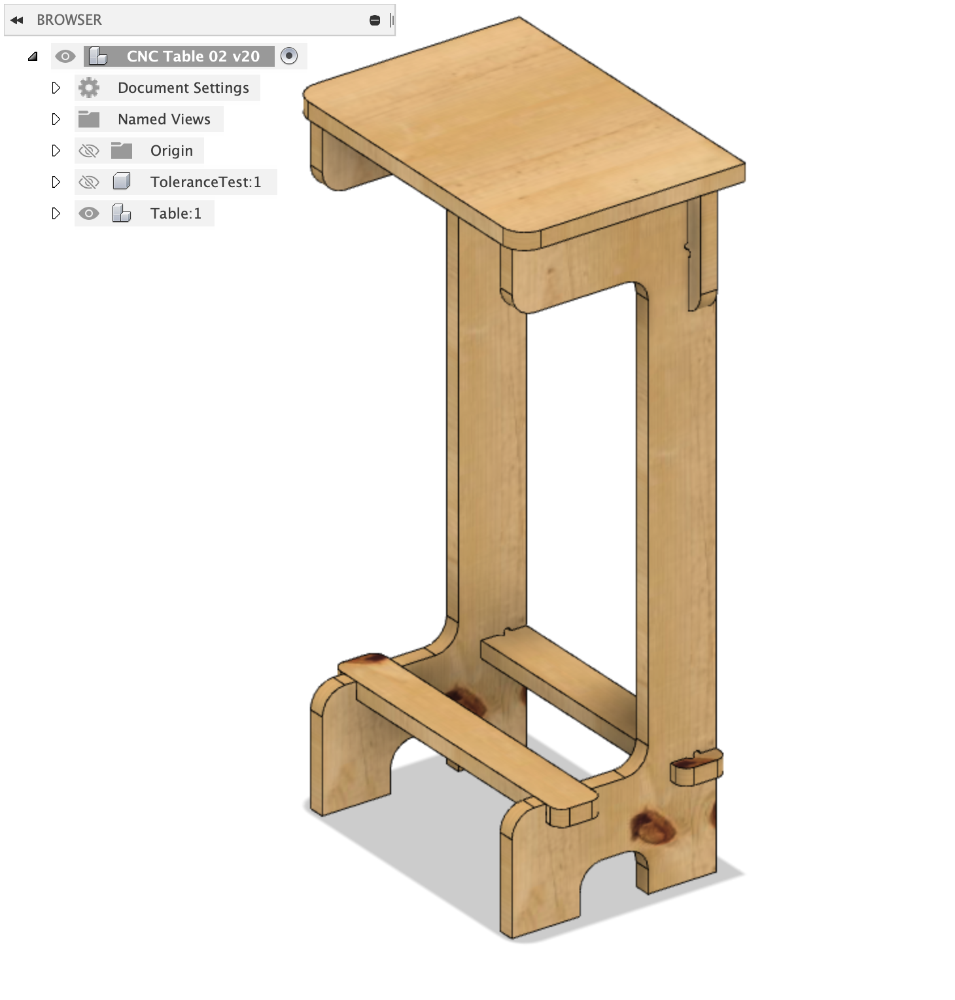

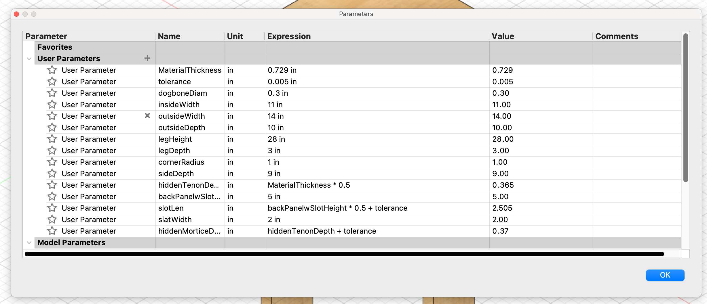

While doing this, I also designed a tolerance test to run once I got my material, so I could test it all with the correct setup and update my numbers as needed.

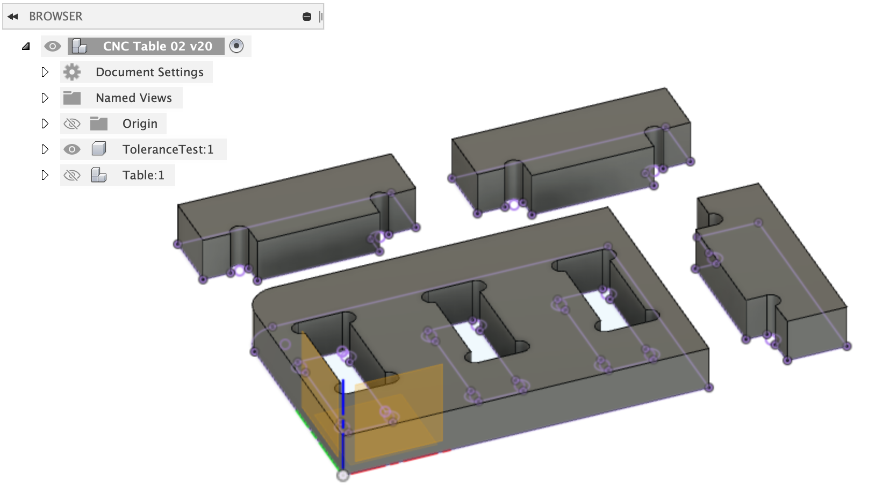

### Material

I bought a 4x8’ sheet of 3/4” 5-ply Canadian Birch, pre-cut into 4x3’ pieces to be broken further into 24x36” pieces to fit the ShopBot bed sizes.

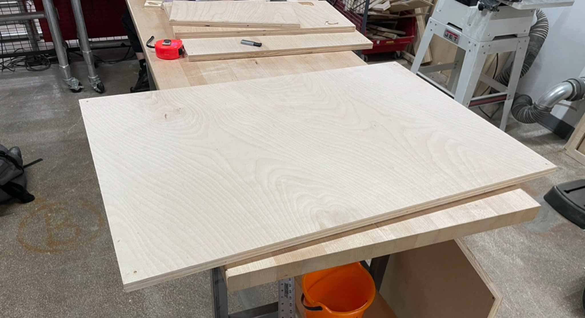

---

## Fabrication

### Shopbots

I cut out the top, bottom slats, and back panel on a Shopbot. You can [read more on this in an older post](https://www.leiac.me/2022/2022-10-12_cnc-table/), but generally this went off without a hitch before the machines unfortunately went out of service.

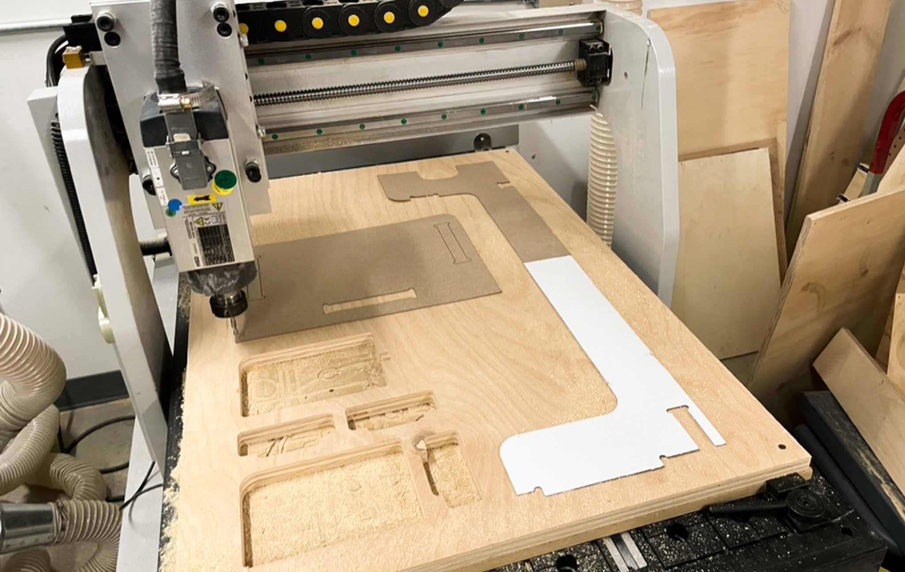

### Shaper Origin

After the untimely downfall of the Shopbots, I pivoted to using the Shaper Origin instead, a handheld CNC machine I had access to.

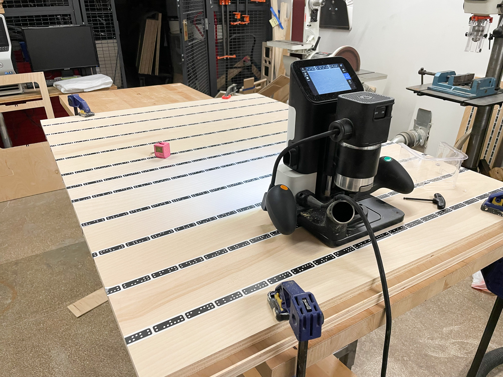

There were a few hiccups I had running the Shaper Origin the first time, but I chose to run it on a sacrificial scrap piece I had lying around.

After the sacrificial learning cut, I set up a fresh plywood sheet with Shaper tape, scanned it, and ran about a half-dozen passes to cut it out. It was a pretty simple setup once I understood the Shaper UI (see my later section on the hiccups around this). The shaper is fairly straightforward, if tedious to use. I also attempted to stabilize the worktable by shimming one of the legs, because it was more wobbly than I wanted it to be.

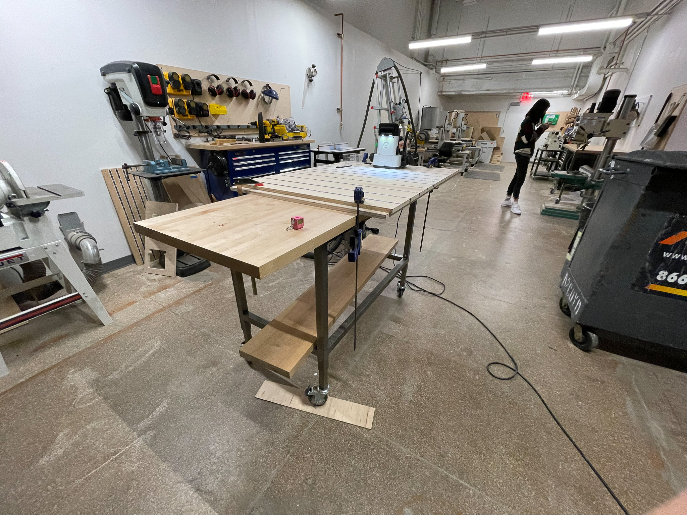

https://media.giphy.com/media/wtcxeXadfpIXynFneZ/giphy.gif

The legs of the table took about an hour each to cut out, having to move the machine by hand and adjust the depth between each pass. This was painfully slow compared to the full CNCs, but it got the job done.

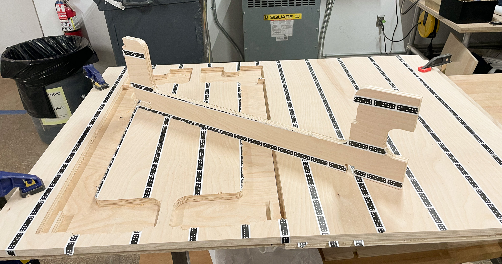

After all my pieces were cut, I did a quick test fit of some of the joints to make sure they still fit correctly.

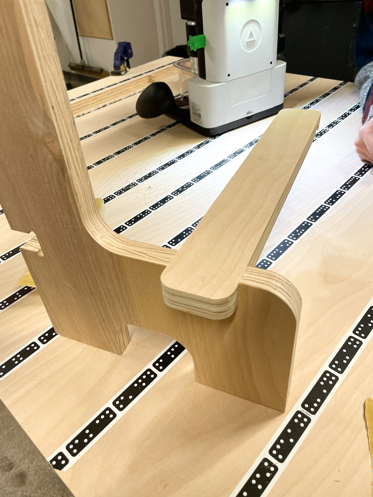

Satisfied with the tolerance and fit, I moved on to sanding and finishing. I sanded all the pieces down by hand from 120 to 360 grit, wiped them down with a damp towel, and then gave them 2-3 coats of Danish oil.

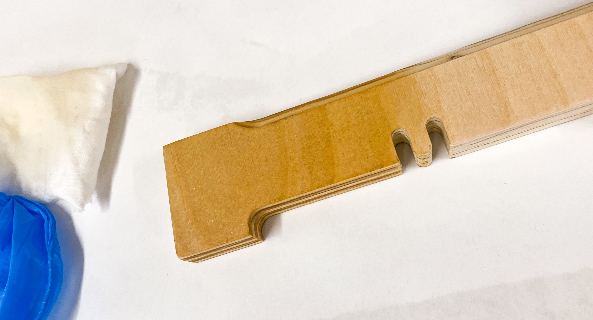

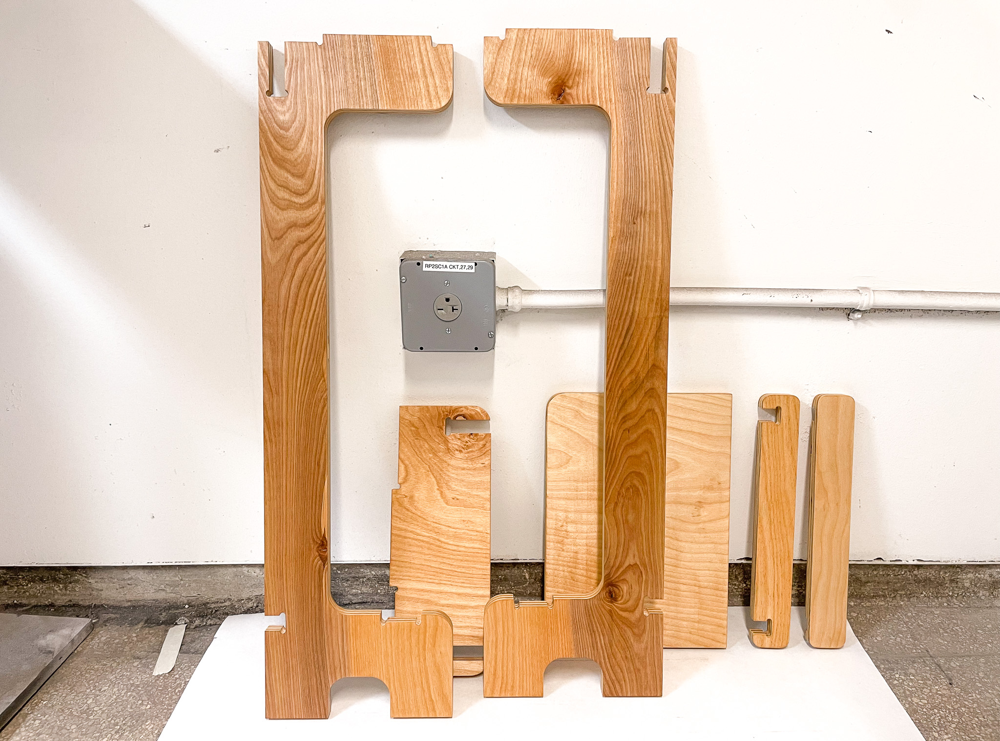

I left these overnight to cure, and then assembled them! Here’s the finished piece.

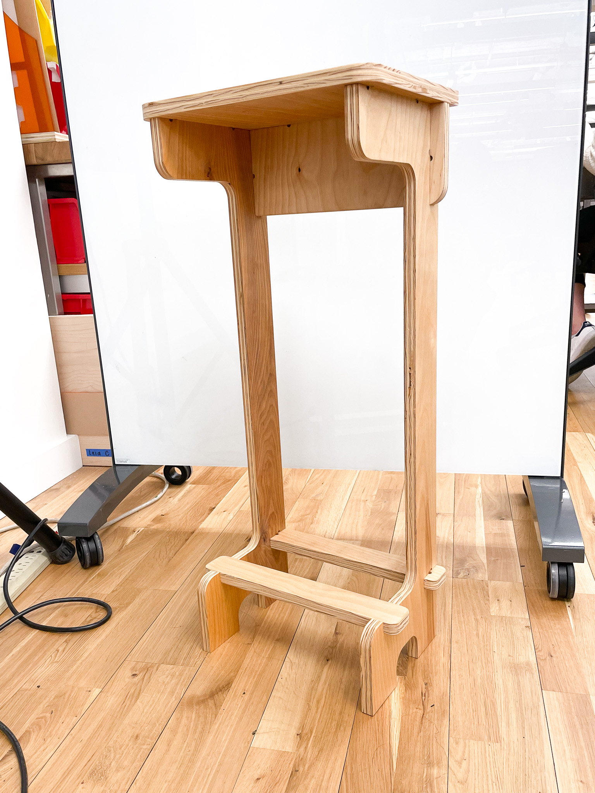

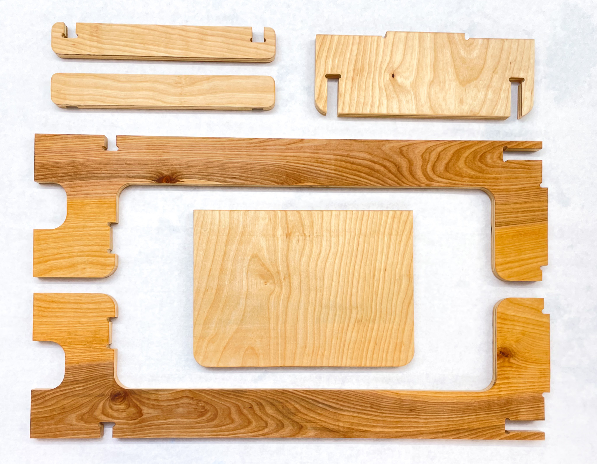

https://youtu.be/DksNMPupLfs

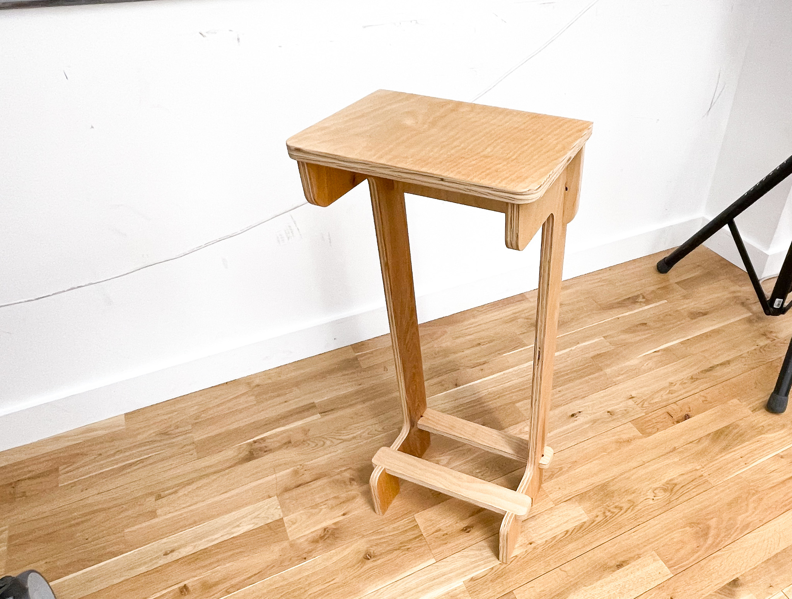

---

Tools & Materials:

- Autodesk Fusion 360
- Epilog Laser Cutter
- Shopbot CNC
- Shaper Origin
- 4-ply Birch Ply
- Danish Oil

Frustration points:

- The Shaper interface was useful, but required a different mindset than the Shopbot. It took some time to get used to setting up the parameters in the Shaper UI, and I disliked the possibility of additional human error every time I needed to change the depth for the next path.
- I couldn’t find a way of precisely placing my design onto the board after scanning. I’ve seen some youtube videos about using grids to do so, but the shaper just seemed a bit fast and loose with placement.
- I think having a designated spoilboard might be useful here; one that I could screw my wood down onto, rather than fussing about with clamps. Clamps really got in the way of placing designs.

Reflections:

- The Shaper Origin is a fairly intuitive and powerful tool, but I think these table legs were not the ideal project for it. In the future I’d use the Shaper for projects with thinner material, or to do cutouts/pockets in large boards.
- In the future, I’d consider doing a wet sand for the plywood, as the Danish Oil seemed to raise the grain after soaking in.
- The whole piece is actually a tiny bit back-heavy. This isn’t an issue because it’s going to be up against a wall, but it’s something I couldn’t feel until it was cut from ply, and I’ll have to be careful about in future pieces.
- For now, I’ve chosen not to glue it together for ease of transport. However, I realize the joints will probably loosen up as I assemble & disassemble it, so I’ll probably end up gluing it in the end.
