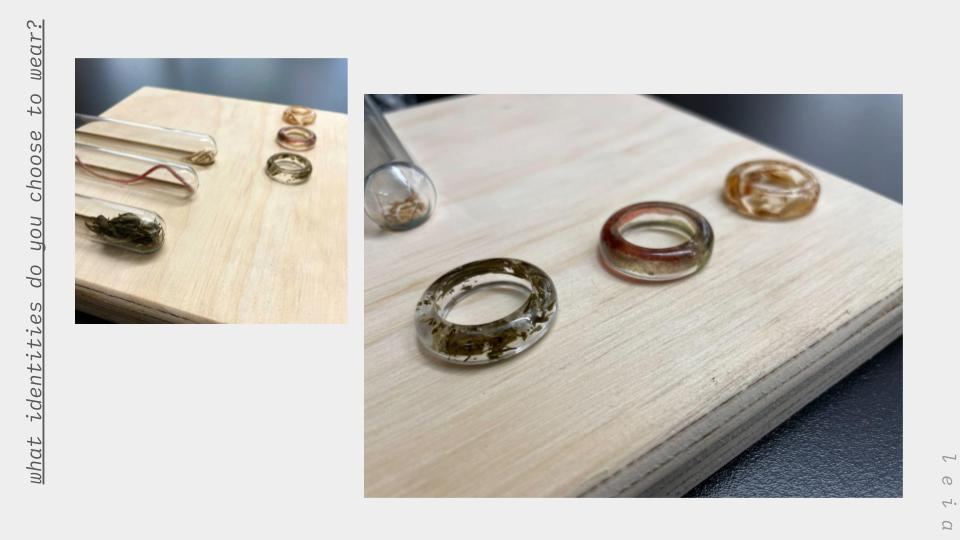
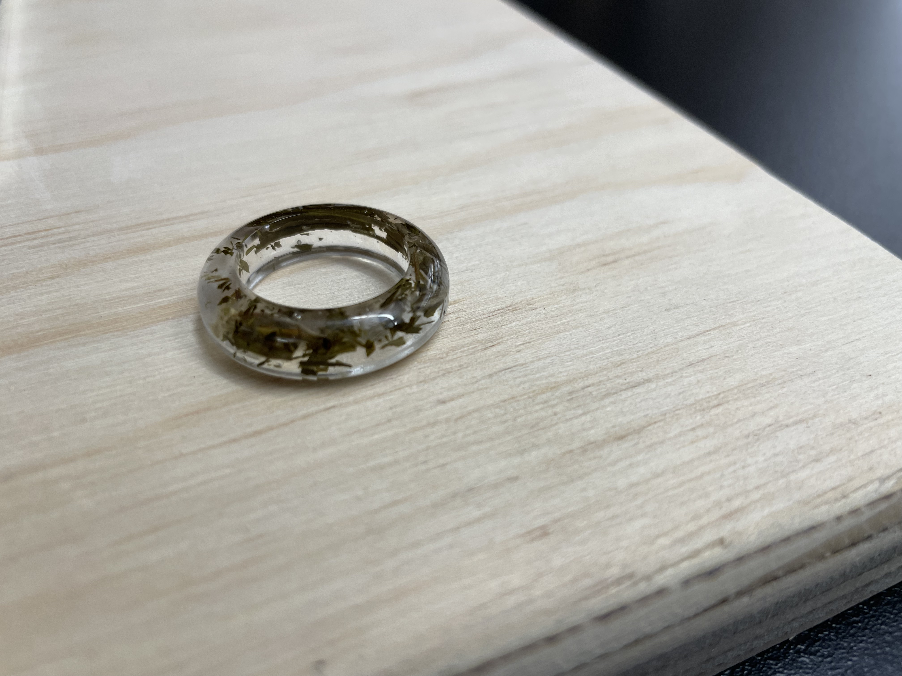
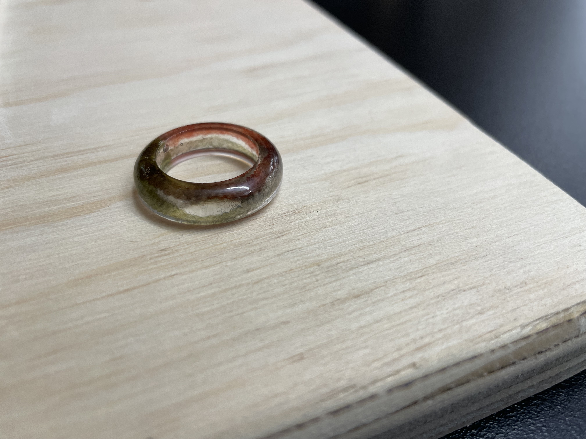
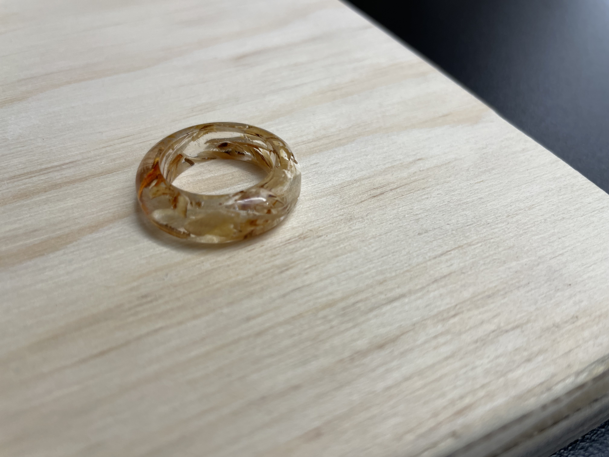

*what identities do you choose to wear?* is an exploration in embodying memory and identity. Fragments of material are suspended in a clear epoxy resin in the form of wearable, semi-clear rings. These are sized to fit my own hands, and are intended to be worn by me as I choose, on a semi-regular basis. Despite the gallery-like nature of their presentation, these rings are in fact created to be a part of my daily wardrobe.

For presentation, each ring is accompanied by a short writing, and a sample of the material suspended within the piece.

The writings are more than documentation; they are a recording of my recollection of each fragment’s history and its impact on my path, an artifact of my reflections on how I have become the person I am today.

---

*tea leaves, dried white silver needle*

In 2016, I found myself in the Lan Su (蘭蘇) Chinese garden in Portland, Oregon. The garden is a collaboration between the city of Portland and their “sister city” Suzhou (苏州市). It’s a rare cultural spot in the city of Portland, one of the whitest major cities in the United States due to a series of racial laws only recently shed by the state. In an idyllic town, it’s an idyllic place; sweeping trees, blooming flowers, a calm pond overlooked by a tea house.

I was there when the tea house opened for the afternoon. The house offered tea tastings, maybe a half-dozen kinds on the menu. I’d sat down with my then-boyfriend, to taste a flight of white teas, a tea I’d only had once or twice before.
A tea tasting flight is much like any other tasting flight, like one of whiskey or coffee or chocolate, except that you taste each tea multiple times. You’re instructed to sit there and steep a single serving of tea over, and over, and over again until the leaves have given up all their flavor.

A tea tasting can take an hour or more. You drink the tea and let the aroma linger across your palette. You taste it as, steeping by steeping, it goes from grassy to sweet to astringent to tannic until finally it’s nothing. You taste all of it, from beginning to end, and sit with it through all of its transformations. And in that time, you can sit with your own transformations, your thoughts. There’s hardly a better setting for reflection.

Sitting in that tea house, drinking a fourth steeping of this particular varietal of tea, in the middle of a carefully curated garden, in the middle of a carefully curated city, I decided it was time to carry my Chinese heritage in a different way.

*yarn, worsted-weight wool*

When I was 3, my family moved from New York to San Francisco to live with my grandmother.
My Chinese was at its best then; just barely conversational enough to pass for a young Chinese child my age. Even so, my grandmother and I couldn’t exactly talk. Se h had moved to the United States without a lick of English, and we had gone to live with her with only my dad as translator.

Still, when you live in the same house for 10 years, you figure out ways of communicating. She’d wave me over to grab a bowl of jook, rice porridge she had every morning. She’d slip me chalky orange candies that I realize now were Vitamin C supplements.

My grandmother loved knitting. She made all these intricate beautiful patterns, in sweaters and blankets and scarfs. She’d spend days making these gifts for the people she loved. There would always be a blanket of hers on the couch, all made in light blue yarn, done in a cross-hatch pattern that to this day I don’t understand how to make. Every evening I’d see her with a new project, knitting away, adding rows. And slowly, she taught me to knit with her.

Knitting is a hard thing to do with little, uncoordinated fingers. She’d show me how to loop the yarn over the needle, how to pull the stitch through. No words to explain the stitches, no names for the patterns, just slow and patient movements, her with her thin needles, and me with my bulky ones.

No matter what I tried, I’d end up with a tangled mess. The first thing I ever made was a scarf, but in the end it looked more like a weightlifting belt with all the stretched stitches and misaligned rows. After she moved out, I set down the needles and yarn.

More than 10 years later, isolated amidst a pandemic, I found myself reaching for something to busy myself with.
This is a clipping of yarn from the last gift I made for someone else; a pair of socks, for someone I love.

*wood shavings of birch ply, laser cut burns*

Did you know that before all of this art stuff, I was a programmer? A programmer as a profession, with all the stereotypes attached. I was this hyper-minimalist software engineer living in what was supposed to be the living room of an apartment in San Francisco, plugging away at a keyboard all day only to jump on the bus after work and spend another 4-5 hours looking at my personal screens in the comfort of my own home. Back then, I was “a full-stack web developer focused on front-end frameworks, particularly Ember”. Today I like to joke that “I put data in boxes on screens for people”.

For a solid 8 years, the things I’d make were limited to the web pages for work, and meals I’d eat, and that was pretty much it. There’s something funny about making web pages all day, and it’s that everything that you work just kind of disappears. This is true as a whole (everything rots, everything dies) but when you work with software, your code gets run and the thing that you made becomes an entirely different thing on a screen and changes every time some data changes somewhere. It’s not that the work isn’t appreciated, or isn’t useful. It’s that the work doesn’t end up feeling like it exists. I’m sure some of the code I’ve written is still living out there in some repository, running over and over and over, slowly getting more outdated as the days pass, but whoever’s look at the end of it never really sees the code, only sees what it does, just sees what gets plopped out the other side by this black box machine. And so my code is doing something, but it also just floats off in the ether.

Working with wood is kind of the opposite of working with code. There’s a joke that every programmer dreams of quitting their job and becoming one of three things: a baker, a gardener, or a woodworker. I’m pretty sure I’ve hit at least two of the three so far. It’s not that I think programming is horrible. But there’s something that working with wood gives me, a satisfaction or a tangibility or just an actual sense of accomplishment that I think I’ll be chasing for the rest of my life.

These wood shavings are from the first project I poured myself into here at ITP, the first project that I worked in wood and made something that felt real.

---

*what identities do you choose to wear?* comes from asking how I became the person I am today, and what choices have I made to get here. Deep in my ruminations on cultural and heritage identity, I find myself asking, “Who chooses who I am? Who chooses what I inherit?”. Each ring holds within itself a thread to a moment in time that has shaped who I am, through a choice made by me that has echoes of itself across the years.

I have also found myself thinking about the power of attention, and how it alters our understanding of an object. Objects inherently hold connection to memories, but by framing, preserving, or sanctifying an object, we lend that memory extra power. This attention can be given through ritual, through thought, or as seen here, through the act of transforming.

The resulting rings serve as both artifact and reminder of the choices I’ve made around my identity simultaneously providing a portal to the moment of choosing, and a chance to choose these identities over again. Each time I wear these rings, I bear their identities on my body, and remind myself of their presence.

This project is as of yet incomplete, and I have no plans for it to be completed. My identity will continue to change, and I hope to honor these future inflection points in future artifacts.

*epoxy resin, collected materials, paper*
