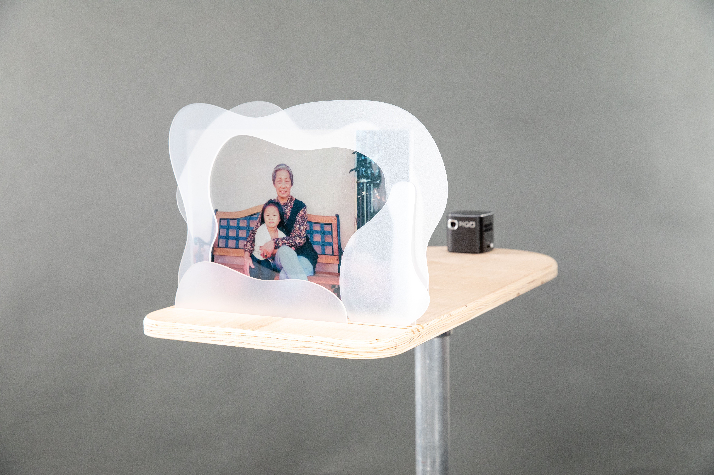
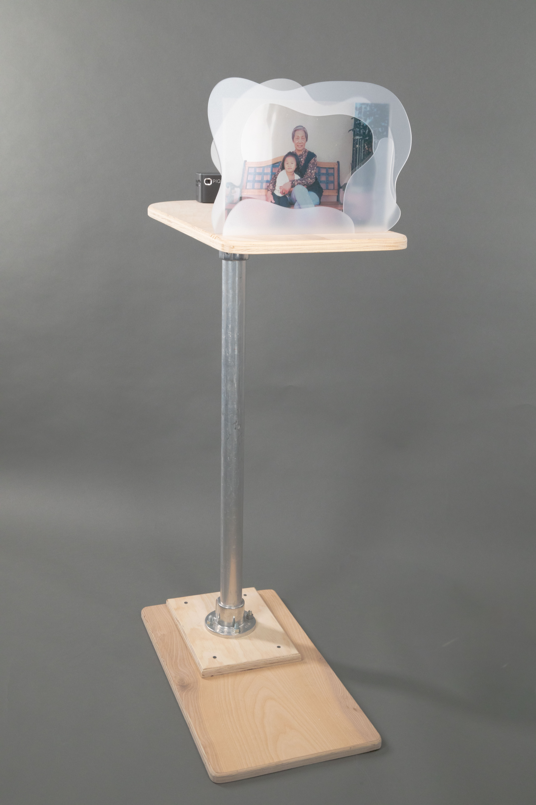
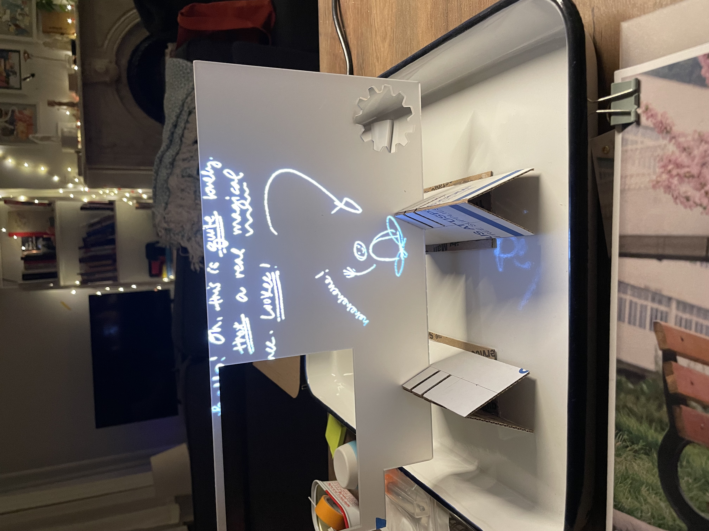
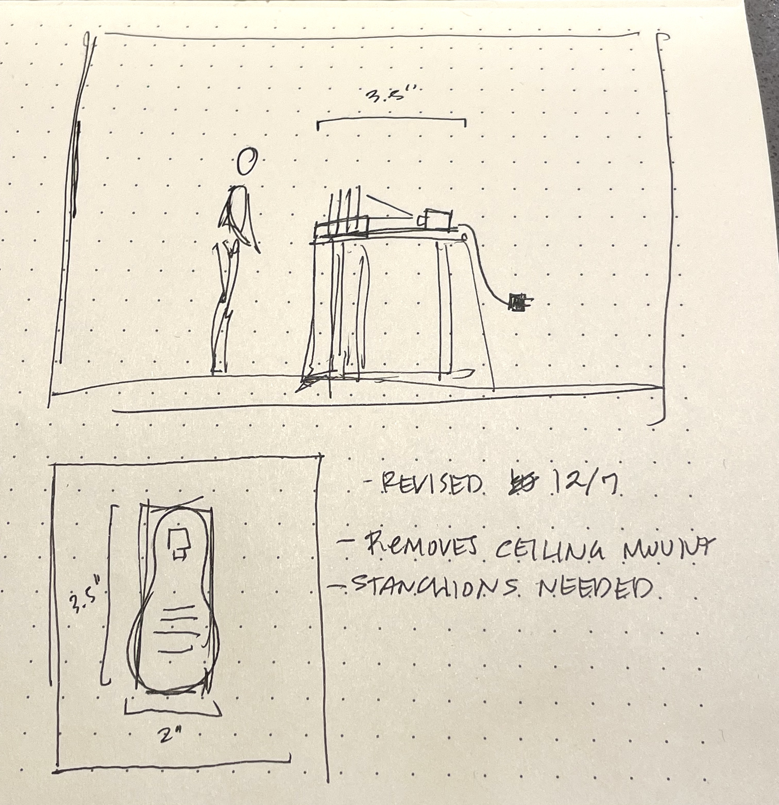
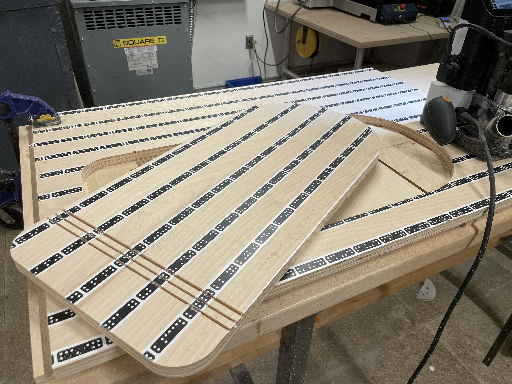

*Photograph on acetate, laser-cut acrylic, rear-projected hand-drawn video*

---

*What I Can Remember* is an exercise in retelling stories. It centers around a photograph, a memory captured in a moment. How much of a moment do you remember? What do you do to make it clear? What if it is never clear?

https://youtu.be/ywGGJQtFMoQ 

---

This project is an intervention on this memory, using the photograph as a canvas to explore the stories hidden inside it. In this piece, I write about my grandmother and the house we lived in. Memories are fuzzy, just as the acrylic surrounding this photo renders Through the use of projection, I bring both the photograph and the writing to life, letting the words play with the portrayed figures, and the frame surrounding them. some of the text. These writings are intentionally or serendiptiously obscured; moments that I don't remember well, or moments that are beginning to be lost to the effects of time. When the projection turns off, the piece reverts back to what it actually is; just a photograph.

https://media.giphy.com/media/PWa6SttVpEaUuNBrmB/giphy.gif

*What I Can Remember* consists of a transparency-printed photograph, translucent acrylic, and video of my handwriting rear-projected onto the piece. The handwriting is a single long recording of my own writing and drawing, created in Procreate. The body of the work is presented on a single custom plywood podium, designed to sit at eye level with a seated audience.

---

This project originated in a class with Simone Salvo entitled *Medium of Memory*. In this class, we explored differing ways of intervening on memories and objects to create art and storytelling. 

This project was shown at the [ITP/IMA Winter Show 2022](https://itp.nyu.edu/shows/winter2022/projects/) and my solo show, [Words to Remember By](https://leiac.me/content/2024/2024-01-01_Words-to-Remember-By/).

---
## Process 
Handwriting test, projecting white-on-black handwriting onto translucent acrylic. 

Sketch of the piece. 

Board cut on Shaper Origin. 

---
[ITP Interview Video](https://vimeo.com/813251002)

