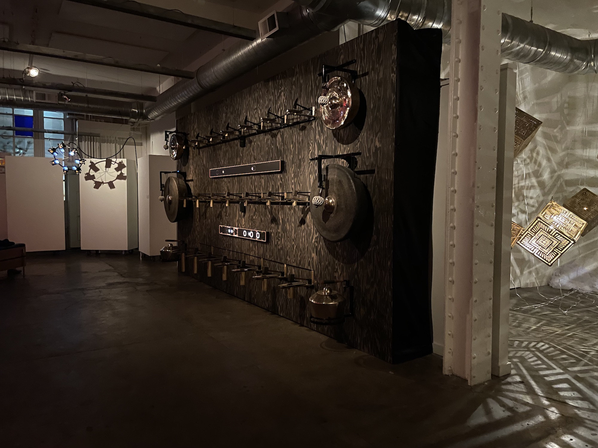

I spent about 45 minutes wandering a single room, listening to the ringing bells, mesmerized by droplets of light and cast shadows. 

This exhibition deserved way more attention than it got. Resonance in Light is a combined light-and-sound experiment with a core in meditation and sound bath work. While individual artists that contributed to this work are laudable on their own, I have rarely seen collaborative works so moving and in sync with each other, particularly when so far into their own mediums. 

Thoughts from the field notes: 

- The room as an instrument, that you enter in the middle of its playing. It does, as far as I know, have a beginning and end to the composition, but from my hour-long attendance I could not tell where those would have been.
- The meditative element is extremely strong, but even more interesting to me is the way it is translated into mediums beyond sound. The Gamelans and other instruments are placed spatially distant from each other, choreographed so that one will ring, and then another across the room. If you try to follow which ones are being rung, you end up only chasing the movement, seeing the wobble after it has been struck. But if you unfocus yourself, and let yourself ******notice****** movement rather than follow it, you can actually see the ringing.
- Each of the Gamelans were tastefully back-lit with an LED, which lit only when they were struck. This brought not only attention to which of the instruments was ringing, but also attention to the way they moved, with their shining surfaces reflecting light in ripples along the back wall.